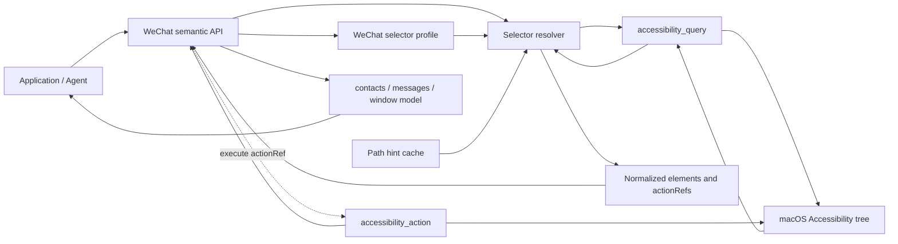
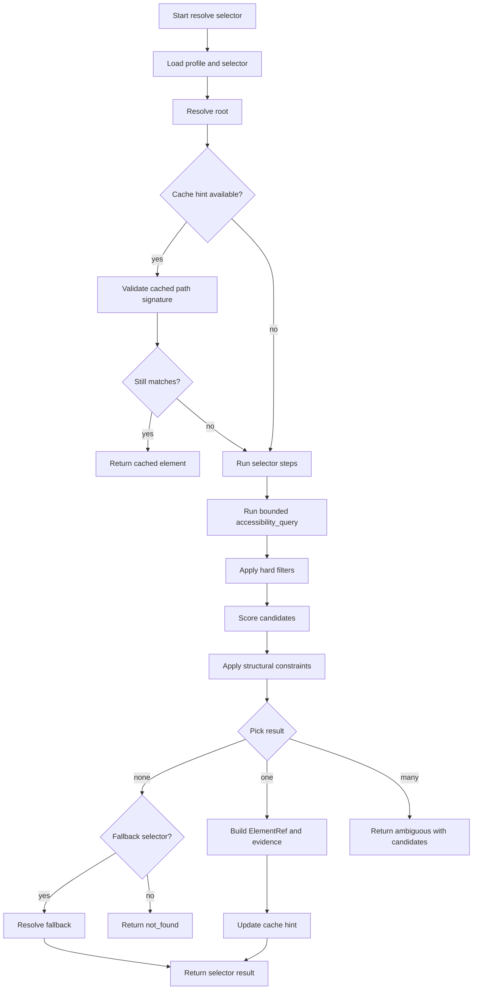
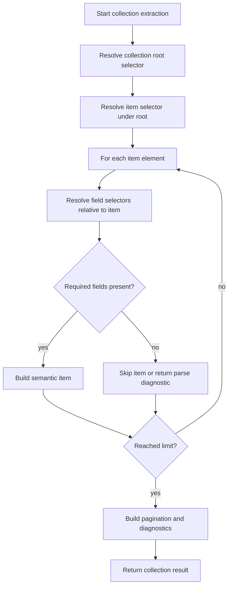
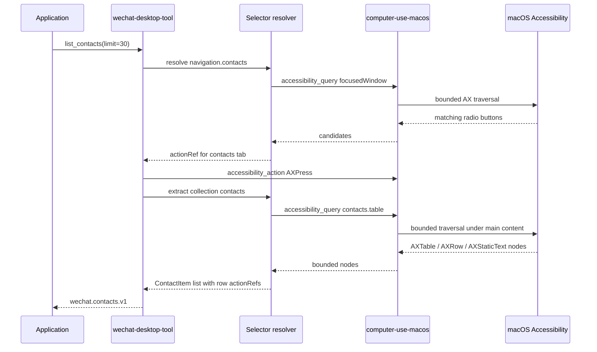

# Accessibility Selector Engine Technical Design

Status: design proposal.

Lifecycle phase: F0 intake and repository hygiene started.
Feature branch: `codex/accessibility-selector-engine`.
Branch base: `fed6523` on `main` after PR #2 was merged.
Phase document: this file.

This document defines the proposed selector/profile architecture for solving
macOS Accessibility graph search in a reusable way. The design is motivated by
WeChat Desktop, but the selector engine should belong to `computer-use-macos`
so other app adapters can reuse the same graph search, validation, and action
execution capabilities.

## F0 Intake And Repository Hygiene

- A dedicated feature branch has been created:
  `codex/accessibility-selector-engine`.
- The branch has been rebased from the temporary PR #2 stack onto `main` after
  PR #2 was merged.
- This phase is documentation-only. No package code, protocol schema, public
  API, or behavior is changed in F0.
- Local raw outputs, smoke reports, build artifacts, and generated lock files
  remain uncommitted unless a later phase explicitly turns a fixture into a
  reviewed test asset.
- The next phase is F1 requirement confirmation, followed by F2 consumer
  contract and technical design review before implementation.

## Problem

macOS Accessibility exposes a large tree-shaped graph. Absolute paths such as
`0/12/2/0/353/0/1` are useful diagnostics, but they are not stable enough to be
application contracts. UI structure can change across app versions, locales,
window layouts, and selected tabs.

Application developers need semantic, bounded results:

- visible contacts;
- visible conversations;
- message rows;
- named regions such as search box, navigation, main content, and composer;
- safe follow-up actions.

They should not need to interpret full raw AX trees.

## Goals

- Provide a generic selector resolver in `computer-use-macos`.
- Let app-specific packages define selector profiles without reimplementing AX
  graph traversal.
- Treat AX paths as cache hints, not stable identity.
- Support config overrides so app UI changes can often be handled without a
  package release.
- Return normalized element references, action references, diagnostics, and
  confidence scores.
- Keep raw Accessibility data out of public semantic API responses by default.

## Non-Goals

- Do not make `computer-use-macos` depend on WeChat or any product app.
- Do not make selector profiles decide business authorization.
- Do not guarantee a selector can survive arbitrary UI redesigns.
- Do not expose full raw AX trees as the primary integration surface.
- Do not replace app-specific semantic parsing where domain knowledge is
  required.

## Ownership

| Layer | Owns | Does Not Own |
| --- | --- | --- |
| `computer-use-macos` | Selector resolver, bounded AX queries, path hint validation, generic action execution, cache, diagnostics. | WeChat concepts, contact/message parsing, business authorization. |
| `wechat-desktop-tool` | WeChat selector profile, WeChat semantic models, contact/conversation/message extraction, WeChat failure kinds. | macOS traversal implementation, helper lifecycle, LLM decisions. |
| Application | User authorization, policy, audit, task state, profile override selection. | Low-level AX graph traversal. |

## Data Structures

The data structures below are proposal-level contracts. Exact implementation
can start as internal dataclasses and later become public protocol schemas after
API review.

### Selector Profile

A selector profile describes how to find app-specific UI landmarks and fields.
It can be packaged with an adapter and overridden by application config.

```python
@dataclass(frozen=True)
class AccessibilitySelectorProfile:
    schema_version: str
    profile_id: str
    profile_version: str
    app: AppIdentity
    locale_aliases: dict[str, list[str]]
    selectors: dict[str, SelectorDefinition]
    collections: dict[str, CollectionDefinition]
    actions: dict[str, ActionDefinition]
```

```python
@dataclass(frozen=True)
class AppIdentity:
    app_id: str
    bundle_ids: list[str]
    app_names: list[str]
    supported_locales: list[str]
    window_title_patterns: list[str]
```

Example TOML shape:

```toml
schema_version = "app-control.selector-profile.v1"
profile_id = "wechat.macos"
profile_version = "2026.07"

[app]
app_id = "wechat"
bundle_ids = ["com.tencent.xinWeChat"]
app_names = ["WeChat", "微信"]
supported_locales = ["zh-CN", "en-US"]

[locale_aliases]
contacts = ["通讯录", "__CONTACTS_EN__"]
chats = ["聊天", "__CHATS_EN__"]
favorites = ["收藏", "__FAVORITES_EN__"]
```

### Selector Definition

A selector locates one landmark or element set.

```python
@dataclass(frozen=True)
class SelectorDefinition:
    selector_id: str
    description: str | None
    root: SelectorRoot
    steps: list[SelectorStep]
    constraints: list[SelectorConstraint]
    pick: PickStrategy
    confidence: ConfidencePolicy
    fallbacks: list[str]
    cache: CachePolicy
```

```python
@dataclass(frozen=True)
class SelectorRoot:
    kind: Literal["focusedWindow", "frontmostApp", "selector", "axPath"]
    selector_id: str | None = None
    ax_path: str | None = None
```

```python
@dataclass(frozen=True)
class SelectorStep:
    scope: Literal["self", "children", "descendants"]
    max_depth: int
    limit: int
    time_budget_ms: int
    role_in: list[str]
    match: MatchRule
    relation: RelationRule | None
```

### Match Rules

Match rules combine hard filters and scoring signals.

```python
@dataclass(frozen=True)
class MatchRule:
    role: str | None
    role_in: list[str]
    attributes: dict[str, AttributeMatcher]
    actions_include: list[str]
    enabled: bool | None
    visible: bool | None
```

```python
@dataclass(frozen=True)
class AttributeMatcher:
    equals: JsonValue | None = None
    any_of: list[JsonValue] | None = None
    contains: str | None = None
    regex: str | None = None
    exists: bool | None = None
    alias_ref: str | None = None
```

Example selector shape:

```toml
[selectors.navigation.contacts]
description = "Contacts tab"
root = { kind = "focusedWindow" }
pick = "best"

[[selectors.navigation.contacts.steps]]
scope = "descendants"
max_depth = 2
limit = 40
time_budget_ms = 2000
role_in = ["AXRadioButton"]
actions_include = ["AXPress"]

[selectors.navigation.contacts.steps.match.attributes]
AXDescription = { alias_ref = "contacts" }
```

### Structural Constraints

Structural constraints let a selector identify regions by shape, not just text.

```python
@dataclass(frozen=True)
class SelectorConstraint:
    kind: Literal[
        "hasChildRole",
        "hasDescendantRole",
        "minChildren",
        "frameWithin",
        "rightOf",
        "below",
        "selected",
    ]
    value: JsonValue
    weight: float
    required: bool
```

Example:

```toml
[selectors.contacts.table]
description = "Visible contacts table"
root = { kind = "selector", selector_id = "regions.mainContent" }
pick = "largestArea"

[[selectors.contacts.table.steps]]
scope = "descendants"
max_depth = 3
limit = 80
time_budget_ms = 2500
role_in = ["AXTable"]

[[selectors.contacts.table.constraints]]
kind = "hasDescendantRole"
value = "AXRow"
required = true
weight = 0.35
```

### Collection Definition

A collection extracts repeated items from a resolved root.

```python
@dataclass(frozen=True)
class CollectionDefinition:
    collection_id: str
    root_selector_id: str
    item_selector: SelectorDefinition
    fields: dict[str, FieldDefinition]
    pagination: PaginationPolicy
    diagnostics: CollectionDiagnosticsPolicy
```

```python
@dataclass(frozen=True)
class FieldDefinition:
    source: Literal["self", "descendant", "attribute", "computed"]
    selector: SelectorDefinition | None
    attribute: str | None
    required: bool
    transform: str | None
```

Example:

```toml
[collections.contacts]
root_selector_id = "contacts.table"

[collections.contacts.item]
role = "AXRow"
scope = "children"
limit = 30

[collections.contacts.fields.displayName]
source = "descendant"
role = "AXStaticText"
attribute = "AXValue"
required = true
```

### Resolved Element

The selector resolver returns normalized elements instead of raw AX objects.

```python
@dataclass(frozen=True)
class ResolvedElement:
    element_ref: ElementRef
    selector_id: str
    label: str | None
    frame: Frame | None
    role: str
    actions: list[str]
    confidence: float
    evidence: SelectorEvidence
```

```python
@dataclass(frozen=True)
class ElementRef:
    kind: Literal["accessibilityElement"]
    snapshot_id: str
    ax_path: str
    role: str
    signature: ElementSignature
```

```python
@dataclass(frozen=True)
class ElementSignature:
    role: str
    attributes: dict[str, JsonValue]
    actions: list[str]
    ancestor_hints: list[str]
    frame_hash: str | None
```

### Selector Result

```python
@dataclass(frozen=True)
class SelectorResult:
    schema: Literal["app_control.selector_result.v1"]
    status: Literal["resolved", "not_found", "ambiguous", "stale", "failed"]
    selector_id: str
    profile_id: str
    profile_version: str
    snapshot_id: str | None
    elements: list[ResolvedElement]
    diagnostics: SelectorDiagnostics
```

```python
@dataclass(frozen=True)
class SelectorDiagnostics:
    tried_selectors: list[str]
    query_count: int
    node_count: int
    truncated: bool
    truncation_reason: str | None
    cache_status: Literal["hit", "miss", "stale", "disabled"]
    failure_kind: str | None
    message: str | None
```

### Action Reference

Action references can be returned by selector results or semantic APIs.

```python
@dataclass(frozen=True)
class ActionRef:
    schema: Literal["app_control.action_ref.v1"]
    id: str
    kind: str
    target: ElementRef
    action: str
    preconditions: list[ActionPrecondition]
    risk: Literal["read_only", "changes_focus", "changes_current_chat", "submits_text"]
    target_summary: str
```

```python
@dataclass(frozen=True)
class ActionPrecondition:
    kind: Literal["appFrontmost", "windowTitleMatches", "signatureMatches", "selectorStillMatches"]
    value: JsonValue
```

### Selector Cache Entry

```python
@dataclass(frozen=True)
class SelectorCacheEntry:
    profile_id: str
    profile_version: str
    selector_id: str
    app_bundle_id: str
    window_fingerprint: str
    element_ref: ElementRef
    created_at: str
    expires_at: str | None
```

The cache is only an optimization. A cached AX path must be validated against
the selector and signature before use.

## Data Flow



The main rule is that raw AX nodes flow upward only as bounded evidence.
Application-facing results flow upward as semantic models and action
references.

## Selector Resolution Flow



## Collection Extraction Flow



## WeChat Contacts Example

The contacts list should not be resolved by a fixed path. It should be resolved
by named selectors and a collection definition:



For the observed WeChat contact tree, the real contact name can appear at:

```text
AXTable -> AXRow -> AXCell -> AXStaticText.AXValue
```

The selector should identify the table by role and structure, then map
descendant static text back to the nearest row. The absolute path remains only
debug evidence.

## Search Algorithm

1. Load the selector profile selected for the app, locale, and app version.
2. Resolve the selector root.
3. Try a cached path hint if present.
4. Validate the cached element signature.
5. If cache validation fails, execute bounded selector steps.
6. Apply hard filters first: role, required attributes, required actions,
   enabled/visible state.
7. Score remaining candidates:
   - attribute match score;
   - action match score;
   - structural constraint score;
   - geometry and relative-position score;
   - locale alias score;
   - cached-path proximity score.
8. Pick according to selector policy:
   - `first`;
   - `best`;
   - `largestArea`;
   - `all`;
   - `nearestToAnchor`.
9. Return `not_found`, `ambiguous`, or resolved elements.
10. Update cache only after a candidate passes signature validation.

## Confidence Policy

Confidence should be explicit because AX data is not always complete.

```python
@dataclass(frozen=True)
class ConfidencePolicy:
    minimum: float
    attribute_weight: float
    action_weight: float
    structure_weight: float
    geometry_weight: float
    cache_weight: float
```

Recommended behavior:

- `confidence >= 0.85`: safe for read operations and focus-changing semantic
  actions.
- `0.65 <= confidence < 0.85`: return candidates or require semantic
  disambiguation.
- `confidence < 0.65`: treat as not found.

Mutating actions should additionally validate action-specific preconditions.

## Failure Kinds

Suggested new failure kinds for the generic selector layer:

- `selector_profile_invalid`
- `selector_profile_not_found`
- `selector_not_found`
- `selector_ambiguous`
- `selector_cache_stale`
- `selector_query_failed`
- `selector_query_truncated`
- `selector_field_missing`
- `selector_action_precondition_failed`
- `selector_action_failed`

Semantic packages can map these into app-specific failures when needed.

## Configuration

Default profiles should ship inside semantic packages. Application overrides
should be injected through configuration without repackaging.

Example config direction:

```toml
[selector_profiles.wechat]
enabled = true
path = "./profiles/wechat-macos.toml"
locale = "zh-CN"
```

Rules:

- Packaged defaults are used when no override is configured.
- Overrides must pass schema validation before use.
- Profile schema versions must be explicit.
- Profile version and selector id should be included in diagnostics.
- Overrides can change locators, labels, limits, and fallback order.
- Overrides should not change risky action policy without code review.

## API Direction

The generic package can add these operations after API review:

```python
resolve_selector_command(
    target_app="WeChat",
    bundle_id="com.tencent.xinWeChat",
    profile_id="wechat.macos",
    selector_id="contacts.table",
    variables={"locale": "zh-CN"},
)
```

```python
extract_collection_command(
    target_app="WeChat",
    bundle_id="com.tencent.xinWeChat",
    profile_id="wechat.macos",
    collection_id="contacts",
    limit=30,
)
```

Initial implementation can keep these internal to avoid prematurely freezing
the protocol.

## Performance Strategy

- Never start with a full window dump for list APIs.
- Resolve stable landmarks first, then query smaller regions.
- Prefer role filters and narrow attributes.
- Use `maxDepth`, `limit`, and `timeBudgetMs` on every query.
- Cache path hints with signature validation.
- Batch field extraction under one collection root when possible.
- Return truncation diagnostics and pagination hints.

For WeChat contacts, the preferred path is:

```text
focusedWindow
  -> navigation.contacts
  -> regions.mainContent
  -> contacts.table
  -> contacts.rows
  -> contacts.row.displayName
```

This avoids scanning the entire window for every item.

## Privacy And Safety

Accessibility attributes can contain contact names, message text, search input,
and draft content. Public semantic APIs should:

- return normalized fields only;
- hide raw attributes by default;
- include raw query evidence only in explicit debug mode;
- avoid logging raw message text unless the application opts in;
- separate read-only selectors from mutating actions.

Action references should always carry risk and preconditions.

## Testing Strategy

Unit tests should cover:

- profile schema validation;
- selector matching by role, attributes, actions, and aliases;
- cache hit validation and stale cache fallback;
- ambiguous candidate handling;
- collection extraction from nested row/cell/static text fixtures;
- failure diagnostics for truncation and missing fields.

WeChat tests should use fixture trees based on real samples such as
`examples/window-contact.json`, but must assert normalized output rather than
raw paths.

Manual smoke tests remain necessary for real macOS app behavior, but they
should not be the only correctness proof.

## Migration Plan

1. Add internal selector dataclasses and schema validation in
   `computer-use-macos`.
2. Implement selector resolution as a wrapper around existing
   `accessibility_query`.
3. Add path hint validation and diagnostics.
4. Add collection extraction.
5. Move WeChat hard-coded region lookup into a packaged WeChat selector
   profile.
6. Add config override support for selector profiles.
7. Update WeChat APIs to consume selector results and return the same semantic
   shapes.
8. Promote stable generic selector operations to public protocol commands after
   fixtures, docs, and migration notes are complete.

## Open Questions

- Whether selector profiles should live in `wechat-desktop-tool` package data
  or application config by default with packaged fallback.
- Whether generic selector operations should be public immediately or kept
  internal until WeChat migration proves the model.
- How much transform logic belongs in declarative profiles versus adapter code.
- Whether selector cache should be per process only or exposed through the
  local service.
- How to model locale fallback when AX labels differ by app version rather than
  system locale.
