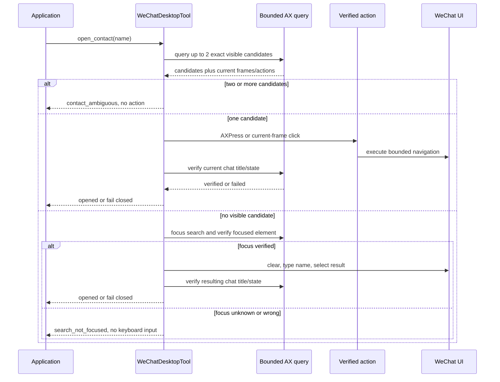
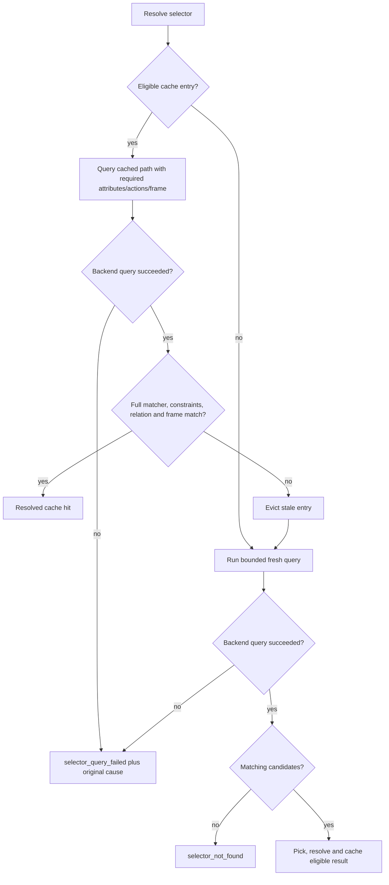
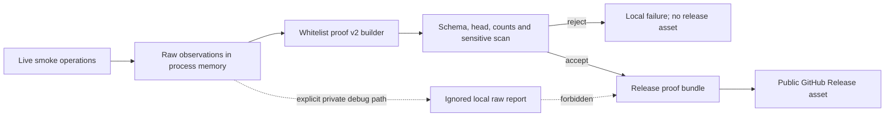

# Accessibility Selector Engine Review Remediation Design

- Status: Proposed F2 revision
- Written: 2026-07-12
- Feature branch: `codex/accessibility-selector-engine`
- Reviewed baseline: `07fa052db38cd89eb11dab7a6465ac6642b670d0`
- Blocking review:
  [`pr-review-macos-computer-use-3-07fa052.md`](./pr-review-macos-computer-use-3-07fa052.md)
- Historical design: [`design.md`](./design.md)

## Document Relationship

The historical `design.md` and `implementation-plan.md` remain unchanged as the
record of the design implemented at reviewed head `07fa052`. This document is a
separate remediation design. For the findings listed here, this document
supersedes the corresponding runtime, safety, compatibility, and release-proof
claims in the historical design.

This document defines proposed behavior. It does not claim that the remediation
is implemented or approved. A separately versioned implementation plan and a
new-head technical review are required before code work and merge readiness.

## Problem

The selector engine works on the tested happy paths, but the frozen PR review
identified 12 counterexamples not covered by CI. The failures cross package
boundaries:

- a read or navigation API can type or click when focus or target identity is
  not verified;
- a same-name match or stale cache can select the wrong UI element and expose
  another conversation;
- query failures, paging lookahead, and batch depth are represented
  incorrectly;
- helper and dependency metadata claim combinations that cannot run;
- release proof can pass with no extracted data and can publish private WeChat
  observations.

Green CI is therefore necessary but not sufficient. The remediation must make
the unsafe and incorrect states impossible or explicitly fail closed.

## Goals

1. Close `PRR-001` through `PRR-012` with deterministic counterexample tests.
2. Keep application-facing WeChat APIs semantic; do not expose raw AX trees.
3. Guarantee that contact navigation never types or clicks without verified
   focus and target evidence.
4. Preserve backend failure causes so callers can choose the correct recovery.
5. Keep collection results correct while retaining the less-than-three-second
   WeChat API performance target.
6. Make supported runtime and package-version combinations installable and
   testable from clean environments.
7. Publish only durable, head-bound, privacy-safe selector proof.

## Non-Goals

- Adding public `resolve_selector` or `extract_collection` protocol commands.
- Implementing selector-backed helper parity in this remediation PR.
- Adding a stable WeChat account or contact identifier that macOS
  Accessibility does not expose.
- Making search-based navigation submit messages.
- Publishing raw smoke observations for debugging or release proof.
- Solving all existing repository type-checking debt.

## Consumer Scenarios

### Safe contact navigation

An application opens a unique visible contact or uses verified WeChat search.
If search focus, target frame, post-click chat title, or contact uniqueness
cannot be established, the API returns a structured failure without typing,
pressing Return, clicking a coordinate, or reading messages.

### Actionable failure recovery

An application can distinguish an absent control from missing Accessibility
permission, a query timeout, or a transport failure. Only a successful query
with zero matching nodes becomes `selector_not_found`.

### Correct bounded collection page

An application requesting 30 contacts receives a resolved page with
`hasMore=true` when a 31st item is observed. Normal lookahead is not reported as
partial or truncated. Real time or traversal truncation remains explicit.

### Privacy-safe release evidence

A maintainer can attach selector proof to a public GitHub Release without
including contact names, conversation previews, message text, window titles,
socket/config paths, Python executable paths, or raw observations.

## Resolved Design Decisions

### D1: Helper is fail-fast for this MVP

Selector-backed WeChat operations support direct mode and the local socket
service backed by the direct macOS implementation. `computer_use.backend =
"helper"` is rejected while constructing a selector-backed WeChat tool.

The rejection is deliberate and documented. It replaces a late
`unsupported_operation` failure with an early configuration error. Full helper
`accessibility_query` and `accessibility_action` parity is a separate feature
requiring helper capability, authorization, signing, and real-app proof.

### D2: The compatible package set is version 0.2.0

The selector/config contract ships as one coordinated package set:

- `app-control-protocol==0.2.0` provides `WeChatConfig.selector_profile_path`;
- `computer-use-macos==0.2.0` provides `computer_use_macos.selectors`;
- `wechat-desktop-tool==0.2.0` requires both dependencies at `>=0.2.0`.

All three project versions and the WeChat dependency lower bounds change in the
same implementation slice. Clean-install tests must prove both the supported
0.2.0 set and rejection of an older incompatible dependency set.

### D3: Fixed screen coordinates are not executable targets

Packaged profile `screen_coordinates` values are removed from runtime
navigation. A coordinate fallback is allowed only when all of these conditions
hold:

1. the app and expected WeChat window are current;
2. a bounded query resolves the expected role and localized label;
3. the frame is current, finite, non-empty, and inside the verified window;
4. coordinate-click policy is enabled;
5. the click uses the center of that current frame;
6. a semantic postcondition confirms the requested navigation state.

Missing or stale frame evidence fails closed. Coordinate success alone is not
operation success.

### D4: Unknown search focus fails closed

Only `searchFocus.state == "verified"` permits clear, type, or Return commands.
Every `unknown` and `not_search` reason returns `search_not_focused`. The failure
includes a safe reason and recovery hint, but no raw focused-element dump.

### D5: Same-name contacts require caller disambiguation

Target lookup requests at least two exact-name candidates. Zero candidates may
enter the verified search fallback. One candidate may be opened. Two or more
candidates return `contact_ambiguous` before any action.

The response exposes semantic candidate summaries only. Because WeChat AX data
does not provide a stable account identifier, a title-only postcondition cannot
resolve same-name ambiguity. A future API may accept a candidate actionRef, but
the current `open_contact(name)` contract remains fail closed.

### D6: Cache is a hint, never proof

A cached AX path is queried again and evaluated by the same matcher,
constraints, required-actions, enabled/visible state, relation, and frame rules
as a fresh candidate. Any mismatch deletes the entry and performs a fresh
resolve.

Selectors with `pick = "all"` bypass the single-element cache in this revision.
This preserves cold/hot collection semantics until a multi-element cache model
is separately designed.

### D7: Query failure and empty result are different states

The normalized query outcome retains `available`, backend failure kind,
message, retryability, diagnostics, nodes, and snapshot id. A backend failure
returns selector status `failed` with `failureKind = selector_query_failed` and
the original cause in diagnostics. Only `available=true`, no backend failure,
and zero matches returns `selector_not_found`.

The WeChat semantic layer maps known causes to actionable top-level failures so
the application can distinguish permission, timeout, and transport recovery.

### D8: Pagination lookahead is not truncation

Collection extraction requests `N + 1` accepted candidates. A query ending with
`truncationReason = "limit"` after returning the lookahead item is a complete
page probe:

- return the first `N` accepted items;
- set `hasMore=true`;
- keep `status=resolved`;
- do not set `selector_query_truncated`.

Time-budget, traversal-budget, malformed-response, and field-extraction
truncation remain partial or failed according to whether complete items exist.

### D9: Batch extraction is bounded and degradable

Batch field depth is `min(8, item_step.max_depth + field_step.max_depth)`. The
normalizer must accept every generated batch request. Fields found in the batch
are cached by owning item path. Missing fields use an item-rooted fallback with
the field selector's own bounded depth.

This keeps correctness when a field lies below the batch depth while reducing
round trips for the common visible layout. Tests must prove that packaged
contacts, conversations, and messages execute the batch path and use fewer
queries than unconditional per-item extraction on representative fixtures.

### D10: Release proof is summary-only and schema-validated

The release artifact uses
`macos_computer_use.release.wechat_selector_engine_proof.v2`. The live runner
may hold raw observations in memory, but the default output is a sanitized proof
created from a field whitelist. Raw debug output requires an explicit private
path and is never accepted by the proof bundle.

The proof is bound to a 40-character source head SHA. Strict preflight verifies
schema, head, required checks, minimum collection evidence, count/evidence
consistency, and absence of forbidden keys or sensitive canaries.

## Finding Closure Matrix

| Finding | Revised contract | Planned proof |
| --- | --- | --- |
| `PRR-001` | Only proof v2 is bundleable; raw observations and sensitive fields are rejected. | Canary fixture containing contact, message, title, and absolute paths is absent from every generated asset. |
| `PRR-002` | Only verified search focus permits keyboard commands. | Every unknown reason produces no `type_text`, clear key, or Return command. |
| `PRR-003` | No fixed global coordinate execution; only current validated AX frame plus postcondition. | Moved/scaled window and stale/missing-frame tests fail closed or click the current center. |
| `PRR-004` | Query at least two exact matches and stop before action on ambiguity. | Two identical names return `contact_ambiguous` with zero click/read commands. |
| `PRR-005` | Helper backend rejected during selector-backed WeChat tool construction. | Config test proves deterministic fail-fast; docs list direct/local-service support only. |
| `PRR-006` | Cached candidates run the full fresh-candidate predicate. | Same-role path reuse, action loss, enabled/selected, relation, and frame changes invalidate cache. |
| `PRR-007` | Backend failure is preserved separately from successful empty query. | Permission, timeout, transport, and empty-result fixtures produce distinct recoveries. |
| `PRR-008` | Generated batch depth never exceeds 8; missing fields use bounded item-root fallback. | Normalizer-backed packaged-profile tests prove accepted batch queries and reduced query count. |
| `PRR-009` | Limit lookahead yields resolved `hasMore`; only real truncation is partial/failed. | N, N+1, larger-than-N+1, and time-budget cases cover status and diagnostics. |
| `PRR-010` | Coordinated 0.2.0 versions and `>=0.2.0` WeChat dependency floors. | Clean wheel installs validate supported set and reject old mixed versions. |
| `PRR-011` | Release test source path includes all three package sources and preflight checks the exact command. | Clean checkout executes the release test/build/preflight sequence unchanged. |
| `PRR-012` | Strict proof requires non-zero, count-consistent structural evidence and no failed step. | Zero, empty, mismatch, failed-step, wrong-head, and sensitive-field fixtures are rejected. |

## Package Ownership

| Owner | Responsibilities in this remediation |
| --- | --- |
| `app-control-protocol` | Carry the coordinated 0.2.0 config contract. No new selector protocol command. |
| `computer-use-macos` | Normalize query failures, validate cache hits, bound collection batch extraction, and distinguish pagination lookahead. |
| `wechat-desktop-tool` | Enforce focus and contact identity, remove fixed coordinate execution, validate postconditions, and fail fast for helper mode. |
| `examples/` | Produce privacy-safe selector proof v2 and optional explicitly private debug output. |
| `scripts/` | Validate and bundle only proof v2; enforce source-head and sensitive-field rules. |
| `.github/workflows/` | Run the exact clean source-path test command and upload only sanitized proof. |

`computer-use-macos` remains generic and must not import WeChat semantics.
`wechat-desktop-tool` may consume internal selector models through its existing
profile boundary. Protocol models remain unaware of WeChat window structure.

## Data Structures

### Revised `SelectorDiagnostics`

This remains an internal `computer-use-macos` model.

| Field | Change | Type | Required | Meaning |
| --- | --- | --- | --- | --- |
| `failure_kind` | Existing, clarified | `str | None` | No | Selector-level category such as `selector_query_failed`. |
| `message` | Existing, clarified | `str | None` | No | Sanitized selector-level message. |
| `cause_failure_kind` | New | `str | None` | No | Original backend permission, timeout, or transport failure. |
| `retryable` | New | `bool | None` | No | Backend recovery classification. |
| `truncated` | Existing, clarified | `bool` | Yes | True only when result completeness is unknown, not for completed lookahead. |
| `truncation_reason` | Existing, normalized | `str | None` | No | `time_budget`, `node_budget`, `depth_budget`, or other real truncation cause. |

### Internal `NormalizedQueryOutcome`

| Field | Type | Required | Validation |
| --- | --- | --- | --- |
| `available` | `bool` | Yes | Missing is treated as false for failed responses and true only for legacy successful payloads with nodes/diagnostics. |
| `snapshot_id` | `str | None` | No | Non-empty when present. |
| `nodes` | `tuple[Mapping, ...]` | Yes | Empty only means not found when `available=true` and no failure exists. |
| `diagnostics` | `Mapping` | Yes | Normalized to a mapping. |
| `failure_kind` | `str | None` | No | Original backend cause. |
| `message` | `str | None` | No | Length-bounded and safe for diagnostics. |
| `retryable` | `bool | None` | No | Preserved from backend response when available. |

### Semantic `ContactDisambiguationCandidate`

This object appears only inside a `contact_ambiguous` observation. It is not a
new top-level API method.

| Field | Type | Required | Privacy/compatibility rule |
| --- | --- | --- | --- |
| `displayName` | `str` | Yes | Requested visible name only. |
| `secondaryText` | `str | None` | No | Bounded visible context; omitted when unavailable. |
| `rowIndex` | `int` | Yes | Index in the current bounded result, not a stable identity. |
| `actionRef` | `ActionRef | None` | No | Returned only when its action and preconditions are executable. |

The API must not present `rowIndex` as a persistent contact id.

### `WeChatSelectorEngineProofV2`

| Field | Type | Required | Validation |
| --- | --- | --- | --- |
| `schema` | literal string | Yes | Must equal `macos_computer_use.release.wechat_selector_engine_proof.v2`. |
| `source.repository` | `str` | Yes | Exact expected repository. |
| `source.headSha` | 40-char lowercase hex | Yes | Must match the checked-out release source. |
| `source.generatedAt` | RFC 3339 string | Yes | Informational; must parse. |
| `source.packageVersions` | object | Yes | Exactly the three package names and coordinated versions. |
| `checks` | `dict[str, bool]` | Yes | Every required selector/safety check must be true. |
| `collections` | object | Yes | Contacts, conversations, and visible messages evidence. |
| `collections.*.count` | `int` | Yes | Must be at least the operation-specific minimum. |
| `collections.*.items` | array | Yes | Length must equal `count`; items contain structural booleans only. |
| `safety` | object | Yes | Title verified, stale action rejected, raw observation absent, sensitive scan passed. |
| `timingsMs` | `dict[str, int]` | Yes | Non-negative operation durations without local paths or identifiers. |
| `failedStep` | `null` | Yes | Any string fails strict proof. |

Forbidden proof fields include `observation`, `rawObservation`, `text`,
`messageText`, `contact`, `displayName`, `windowTitle`, `socketPath`,
`configPath`, `executable`, and absolute filesystem paths. The validator checks
keys recursively and scans string values for canaries and path patterns.

Example sanitized shape:

```json
{
  "schema": "macos_computer_use.release.wechat_selector_engine_proof.v2",
  "source": {
    "repository": "zhanghao1903/macos-computer-use",
    "headSha": "0123456789abcdef0123456789abcdef01234567",
    "generatedAt": "2026-07-12T00:00:00Z",
    "packageVersions": {
      "app-control-protocol": "0.2.0",
      "computer-use-macos": "0.2.0",
      "wechat-desktop-tool": "0.2.0"
    }
  },
  "checks": {
    "systemOpenWeChat": true,
    "readiness": true,
    "openWeChat": true,
    "inspectWindow": true,
    "listConversations": true,
    "openContact": true,
    "readVisibleMessages": true,
    "listContacts": true,
    "validProfileOverride": true,
    "invalidProfileFallback": true
  },
  "collections": {
    "contacts": {
      "requestedLimit": 30,
      "count": 1,
      "items": [{"semanticFieldsPresent": true}]
    },
    "conversations": {
      "requestedLimit": 30,
      "count": 1,
      "items": [{"semanticFieldsPresent": true, "actionable": true}]
    },
    "visibleMessages": {
      "requestedLimit": 30,
      "count": 1,
      "items": [{"nonEmptyTextObserved": true}]
    }
  },
  "safety": {
    "focusGatePassed": true,
    "targetPostconditionPassed": true,
    "expiredActionRefRejected": true,
    "frameDerivedCoordinatesOnly": true,
    "rawObservationIncluded": false,
    "sensitiveFieldScanPassed": true
  },
  "timingsMs": {
    "openWeChat": 500,
    "inspectWindow": 700,
    "listConversations": 900,
    "openContact": 1200,
    "readVisibleMessages": 1800,
    "listContacts": 1100
  },
  "failedStep": null
}
```

For conversation proof, `actionable=true` has two valid sources: an executable
`actionRef`, or the existing semantic `*.open` action id together with a
current element and finite positive frame. The second form means an application
can call the documented semantic open operation with the listed item; it does
not authorize the proof builder to invent an `AXPress` actionRef when the live
row does not expose `AXPress`.

## Data Flow

### Safe `open_contact`



### Selector resolution and cache validation



### Privacy-safe proof publication



## Object Lifecycles

### Cache entry

1. A fresh resolved candidate creates an in-memory entry for an eligible
   single-element selector.
2. TTL, profile version, app identity, and window fingerprint are checked.
3. A hit performs a current self query and full selector validation.
4. A mismatch, backend failure, expired TTL, or changed window deletes the
   entry.
5. Entries are never persisted across processes or published as proof.

### Contact candidate

1. A bounded current-window query creates zero, one, or at least two semantic
   candidate summaries.
2. Zero may enter verified search; one may become an action target; multiple
   enter `contact_ambiguous`.
3. Candidate actionRefs expire under the existing actionRef policy.
4. No candidate index or AX path is treated as durable identity.

### Release proof

1. The runner receives an explicit source head SHA and runs the smoke checklist.
2. Raw observations remain in memory unless private debug output is explicitly
   requested.
3. The whitelist builder emits proof v2 and rejects unexpected data.
4. Strict preflight validates proof against the current source head.
5. The proof bundle copies only the validated sanitized artifact.
6. Release assets remain durable; private debug artifacts remain ignored and
   have no release retention contract.

## Failure And Recovery Contract

| Condition | Result | Retryable | Caller recovery |
| --- | --- | --- | --- |
| Search focus unknown or wrong | `search_not_focused` | Yes | Restore WeChat/search focus and retry; no text was entered. |
| Same-name candidates | `contact_ambiguous` | Yes | Ask caller/user for a more specific target; no action was executed. |
| Current frame missing/stale | `wechat_navigation_failed` with safe reason | Yes | Refresh window state and retry; no fixed coordinate is used. |
| Accessibility permission missing | Selector failed with cause `missing_accessibility` | No until permission changes | Grant permission to the actual process/helper subject. |
| Accessibility timeout | Selector failed with timeout cause | Yes | Retry with bounded backoff or reduce query scope. |
| Transport failure | Selector failed with preserved transport cause | Yes when transport recovers | Restore service/transport before retrying. |
| Successful query, no match | `selector_not_found` | Yes | Refresh profile/map or move to expected view. |
| Completed N+1 lookahead | Resolved page, `hasMore=true` | Not applicable | Consume page; no error recovery. |
| Real query truncation with items | Partial collection | Yes | Retry narrower scope or smaller page. |
| Helper backend configured | Configuration error before operation | No | Use direct/local-service mode or a future helper-parity release. |
| Invalid or sensitive proof | Release preflight failure | No automatic publish | Regenerate sanitized proof from the exact release head. |

## Safety And Privacy Boundaries

- `open_contact`, list, and read operations never submit chat content.
- Search fallback emits keyboard commands only after positive focus evidence.
- Coordinate fallback remains policy-gated and must use a current AX frame.
- Every focus-changing action has a semantic postcondition.
- Ambiguous identity stops before clicking or reading.
- Raw AX data remains inside bounded internal processing and optional private
  diagnostics.
- Public release proof contains no names, messages, titles, local paths, tokens,
  command payloads, or raw observations.
- Proof privacy validation is deny-by-default: unknown fields fail schema
  validation rather than being copied through.

## Performance Contract

- Each public WeChat semantic API should complete within 3 seconds under the
  representative visible-window smoke environment.
- Cache validation uses one bounded self query and must not scan the full tree.
- Ambiguity lookup stops after the second accepted exact candidate.
- Batch queries always pass the client normalizer and are attempted before
  per-item fallback.
- Verification records query count and operation timing without recording
  sensitive semantic values.
- A performance optimization may not bypass focus, identity, frame, or
  postcondition checks.

## Compatibility And Migration

- Direct and local-service consumers keep the existing WeChat semantic methods.
- Helper-backed WeChat selector operations change from late failure to explicit
  configuration-time rejection. This is documented in migration notes.
- The package set moves together to 0.2.0. Installing only the new WeChat wheel
  with 0.1.x dependencies is unsupported and must fail dependency resolution.
- `selector_profile_path` remains optional. Invalid overrides continue to fall
  back only when the selector profile and control map activate atomically.
- Existing proof v1 may remain readable as a private diagnostic input, but it is
  never accepted as strict or bundleable release proof after this change.
- Rollback before release is a branch revert. After release, consumers can pin
  the coordinated 0.1.1 package set; mixed 0.1.x/0.2.x sets are unsupported.

## Observability

Safe diagnostics retain:

- selector id and profile version;
- query count, node count, cache status, and normalized truncation reason;
- selector-level failure and backend cause kind;
- operation timing;
- boolean postcondition results;
- release source head and package versions.

Safe diagnostics omit contact names, message text, conversation previews,
window titles, AX values, local filesystem paths, socket paths, and tokens.

## Test Strategy And Acceptance

### Unit and contract tests

- Add one deterministic negative test for every `PRR-001` through `PRR-012`.
- Add cache cold/hot equivalence tests, including `pick=all` bypass.
- Add unknown focus reason table tests that inspect the emitted command sequence.
- Add same-name candidate tests that prove no action/read command was emitted.
- Run packaged contacts, conversations, and messages through the real query
  normalizer and assert generated `maxDepth <= 8`.
- Add N, N+1, greater-than-N+1, timeout, and field-truncation collection tests.
- Add proof schema, wrong-head, zero-count, count mismatch, unknown-field,
  absolute-path, and sensitive-canary tests.

### Package and clean-environment tests

- Run all three package suites and root tests.
- Build all 0.2.0 wheels and install them together in a clean environment.
- Prove the WeChat wheel cannot resolve against the incompatible 0.1.x lower
  dependency set.
- Execute the release workflow's WeChat test command exactly as written from a
  clean checkout with no preinstalled workspace packages.
- Run release preflight and proof bundle tests with proof v2.

### Real macOS proof

After deterministic tests pass and desktop operation is explicitly authorized:

- move and resize the WeChat window before navigation;
- open a unique configured contact without sending a message;
- verify ambiguous/unknown-focus paths fail without keyboard or click actions;
- read a non-zero bounded contact, conversation, and visible-message sample;
- confirm each measured semantic API stays below 3 seconds;
- generate sanitized proof v2 and run the sensitive-field scan;
- keep any raw debug report private and outside the repository.

## Implementation Handoff Slices

The separate implementation plan should use these commit boundaries:

1. WeChat focus, coordinate, postcondition, and same-name safety
   (`PRR-002`, `PRR-003`, `PRR-004`).
2. Selector cache validation and backend failure propagation
   (`PRR-006`, `PRR-007`).
3. Collection batch and pagination correctness
   (`PRR-008`, `PRR-009`).
4. Helper fail-fast, coordinated dependency versions, and release source path
   (`PRR-005`, `PRR-010`, `PRR-011`).
5. Sanitized proof v2, strict validation, and release bundling
   (`PRR-001`, `PRR-012`).
6. Full F5 verification, migration docs, changelog refresh, and new-head F6
   review.

Each slice updates `implementation-notes.md`, runs its targeted tests, and is
committed and pushed separately. No code slice begins until the remediation
implementation plan is written and this design receives technical review.

## Deferred Follow-Ups

- Implement helper-side bounded AX query/action parity as its own feature.
- Design a multi-element cache before caching `pick=all` results.
- Consider an explicit candidate-selection API if WeChat exposes enough stable
  semantic context for safe same-name selection.
- Establish a scoped ruff/mypy baseline without making unrelated historical
  type debt a blocker for this remediation.

## F2 Exit Gate

F2 is complete only when:

- every blocking finding maps to a revised contract and acceptance test;
- the helper, dependency, proof privacy, focus, coordinate, cache, paging, and
  ambiguity decisions are independently reviewed;
- no public selector protocol command is introduced implicitly;
- the reviewer confirms this document is implementation-ready;
- the approved design commit is pushed before the F3 implementation plan is
  started.
