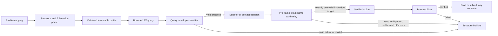
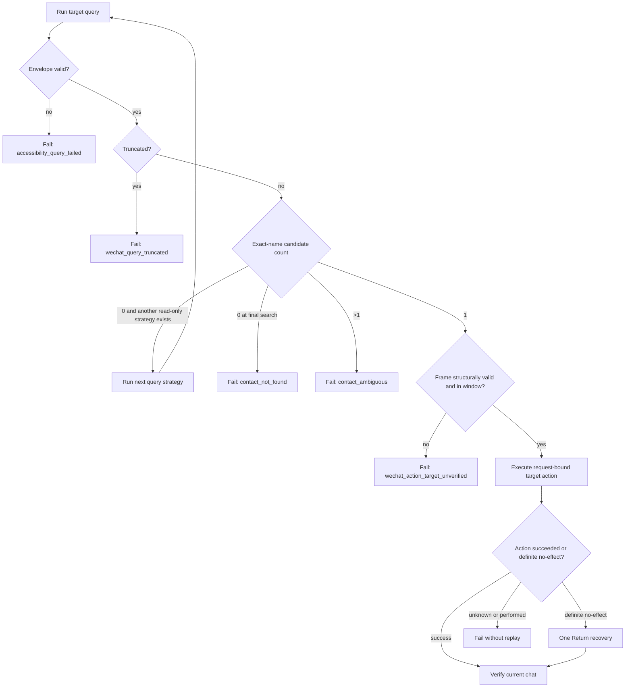

# Accessibility Selector Contract Remediation Design

- Status: Proposed F2 revision
- Written: 2026-07-17
- Feature branch: `codex/accessibility-selector-engine`
- Reviewed baseline: `eb543ec9eb3800de104dadeb5d2fbb1382d14416`
- Blocking review:
  [`pr-review-macos-computer-use-3-eb543ec.md`](./pr-review-macos-computer-use-3-eb543ec.md)
- Supersedes: the query-normalization and contact-target decision rules in
  earlier remediation documents for `PRR-039` through `PRR-043`

## Problem

The selector engine still loses decision-critical information at two trust
boundaries:

1. selector profile and query-result parsing silently normalize malformed or
   contradictory values into valid constraints and successful candidate sets;
2. WeChat contact targeting treats a failed, incomplete, malformed, empty, or
   offscreen result as permission to continue into another strategy or press
   Return.

Both behaviors are fail-open. In a composite `send_message` workflow they can
turn an unverified contact into the active conversation and submit caller text.

## Goals

1. Reject malformed selector profiles before any AX query or action.
2. Accept only structurally valid query envelopes, while preserving an
   explicitly defined legacy-success shape.
3. Preserve completeness and failure state across every configured root and
   WeChat target-selection strategy.
4. Require exactly one structurally valid, in-window search target before any
   target mutation.
5. Prove that every unsafe state executes zero click, Accessibility action,
   Return, draft, or submit operations.

## Non-Goals

- No new public command, protocol schema, CLI option, or failure kind.
- No stable WeChat contact identifier; same-name contacts remain ambiguous.
- No attempt to recover malformed lower-layer responses heuristically.
- No live WeChat message mutation as merge evidence.
- No change to collection pagination or selector cache policy outside the
  shared query-envelope validation they already consume.

## Consumer Contract

Existing APIs keep their signatures. The behavioral contract becomes stricter:

- malformed profile overrides are rejected and cannot replace packaged
  defaults;
- a malformed or contradictory query response becomes
  `selector_query_failed` in `computer-use-macos`;
- a failed, truncated, or malformed WeChat target query returns an existing
  structured failure before target mutation;
- search with zero, malformed, offscreen, or ambiguous exact-name candidates
  returns failure instead of pressing Return;
- Return remains available only as recovery after an exact candidate action
  supplies request-bound, definite no-effect evidence.

## Profile Input Contract

### Presence-sensitive `any_of`

`match.attributes.<name>.any_of` has three states:

| Input state | Result |
| --- | --- |
| Key absent | `AttributeMatcher.any_of = None`; no `any_of` constraint. |
| Present non-empty list/tuple | Parsed as an immutable tuple. |
| Present empty or wrong-type value | Profile rejected before activation. |

Parser truthiness must not erase the distinction between absent and malformed.

### Finite numeric values

Every floating-point profile value must satisfy `math.isfinite` during parsing
and validation. This includes confidence values, constraint weights, relation
distance, and all numeric members of frame-valued constraints. `nan`, `inf`,
and `-inf` are invalid even though TOML and Python mappings can represent them.

Validation remains defensive for callers that directly construct immutable
profile dataclasses instead of using the parser.

## Query Envelope Contract

The internal normalizer classifies an input before exposing nodes. It never
drops malformed entries or replaces malformed diagnostics with an empty map.

### Accepted success shapes

| Shape | Required fields | Optional fields |
| --- | --- | --- |
| Canonical v1 | `schema = macos.accessibility.query.v1`, `nodes` is a list/tuple of mappings, `diagnostics` is a mapping with Boolean `truncated` | `available = true`, `status = ok`, snapshot metadata |
| Legacy success | `nodes` is a list/tuple of mappings, `diagnostics` is a mapping with Boolean `truncated`; `schema` and `status` are absent | `available` may be absent or `true`; snapshot metadata |

Legacy inference is deliberately narrow. A partially modern envelope cannot
omit schema or change field types and then fall back to legacy behavior.

### Accepted failure shapes

A lower-layer failure may omit schema for compatibility, but its available,
status, and failure fields must be type-valid and semantically coherent:

- `available=false` cannot coexist with `status=ok`;
- `available=true` cannot coexist with `status=failed` or a failure kind;
- `status=failed` cannot coexist with `available=true`;
- every present failure-kind alias is a non-empty string and all copies agree;
- every present retryable copy is Boolean and all copies agree.

Failure nodes, if present, must still be a valid collection and cannot become
actionable because the normalized outcome is unsuccessful.

### Rejected envelopes

- unsupported or wrong-type schema;
- wrong-type `available` or `status`;
- contradictory success/failure fields;
- malformed or conflicting failure metadata;
- non-list node collection or any non-mapping node member;
- missing or non-mapping diagnostics on success;
- missing or non-Boolean `diagnostics.truncated` on success.

Rejected envelopes normalize to an unsuccessful outcome with selector-level
`selector_query_failed`; no candidate, cache entry, collection item, or action
target is produced.

## WeChat Contact Target Decision

Each decision query is classified before nodes are parsed:

| State | Meaning | Allowed continuation |
| --- | --- | --- |
| `complete` | Successful payload, valid nodes/diagnostics, `truncated=false`. | Candidate evaluation. |
| `complete_empty` | Complete and no exact-name candidate. | Next configured read-only root/strategy, except final search. |
| `truncated` | Boolean `truncated=true`. | None; return `wechat_query_truncated`. |
| `failed` | App-control query failed. | None; preserve mapped permission/timeout/transport failure. |
| `invalid` | Payload, nodes, diagnostics, or truncation evidence malformed/missing. | None; return `accessibility_query_failed`. |

For a multi-root control map, only `complete_empty` advances to the next root.
The first `failed`, `truncated`, or `invalid` result is final and cannot be
hidden by a later root.

For visible-row then search fallback, only a valid complete query with zero
exact-name candidates may proceed to search. Query failure or malformed
completeness evidence is final.

## Search Candidate Contract

The exact-name candidate set is evaluated before frame filtering:

1. zero candidates: `contact_not_found`; no Return;
2. two or more candidates: `contact_ambiguous`, including when some candidates
   are offscreen;
3. exactly one candidate: its element, AX path, role, and frame must be
   structurally valid;
4. the frame must contain finite numbers, positive width/height, and be inside
   the verified query-window frame;
5. only then may the candidate action run.

Invalid frame members are never coerced to zero. A candidate action may use one
Return recovery only when the existing shared no-replay policy proves the exact
request had definite no effect.

## Data Flow

## Target Selection Flow

## Compatibility And Migration

No caller migration is required. Integrations that depended on an empty search
result implicitly selecting WeChat's highlighted row will now receive
`contact_not_found`; they must provide a contact name that produces one valid
Accessibility candidate. Malformed custom selector profiles that previously
activated accidentally will now be rejected and fall back according to the
existing atomic profile-loading policy.

## Verification Contract

- Table-driven profile tests cover absent, valid, empty, falsey wrong-type, and
  non-finite values before query execution.
- Producer-to-resolver tests cover canonical, legacy, failed, malformed,
  contradictory, and version-skewed envelopes.
- WeChat tests cover every root and strategy with zero/one/multiple candidates,
  failed/truncated/missing/wrong-type diagnostics, malformed node collections,
  missing/malformed/offscreen frames, and mixed visible/offscreen ambiguity.
- Full `send_message` tests assert operation order and zero target action,
  Return, sensitive-text draft, and submit after every unsafe state.
- Full package, root, wheel, compile, release-preflight, and exact-head CI gates
  remain required.
