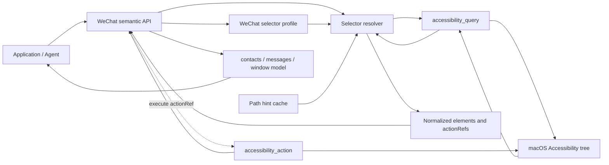
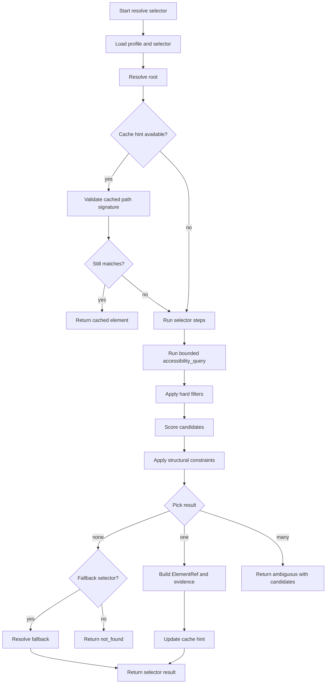
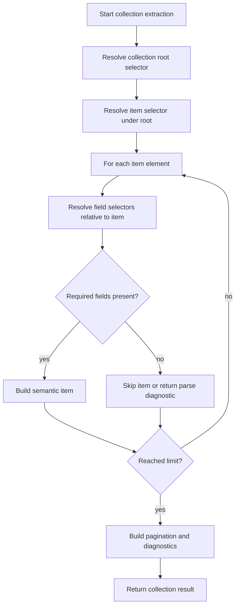
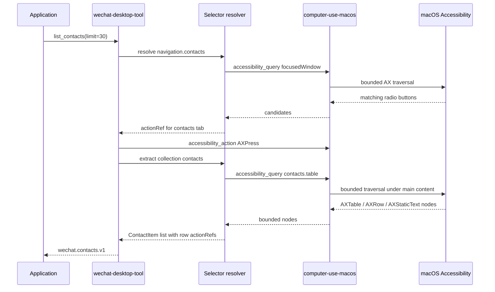

# Accessibility Selector Engine Technical Design

Status: design proposal, revised after technical review.

Lifecycle phase: F2 consumer contract and technical design revision.
Feature branch: `codex/accessibility-selector-engine`.
Branch base: `fed6523` on `main` after PR #2 was merged.
Feature directory: `docs/feature/accessibility-selector-engine/`.
Requirement artifact: `requirements.md`.
Design document: `design.md`.
Review artifact: `technical-review-2026-07-06.md`.
Review remediation: `technical-review-remediation-2026-07-08.md`.

This document defines the proposed selector/profile architecture for solving
macOS Accessibility graph search in a reusable way. The design is motivated by
WeChat Desktop, but the selector engine should belong to `computer-use-macos`
so other app adapters can reuse the same graph search, validation, and action
execution capabilities.

## F0 Intake And Repository Hygiene

- A dedicated feature branch has been created:
  `codex/accessibility-selector-engine`.
- The branch has been rebased from the temporary PR #2 stack onto `main` after
  PR #2 was merged.
- This phase is documentation-only. No package code, protocol schema, public
  API, or behavior is changed in F0.
- Local raw outputs, smoke reports, build artifacts, and generated lock files
  remain uncommitted unless a later phase explicitly turns a fixture into a
  reviewed test asset.
- The current phase is F2 design revision after architect review. The next
  phase is F3 implementation planning before code changes.

## Technical Review Response

The 2026-07-06 technical review failed the first design draft because the plan
was directionally sound but not ready for developer handoff. This revision
addresses the blocking review items before implementation starts:

- adds field-level contracts for proposed objects and TOML config shapes;
- defines all helper types referenced by the proposal;
- defines lifecycles for profiles, selector results, collection results,
  action references, and cache entries;
- resolves the open package-boundary and runtime decisions for the MVP;
- expands failure kinds with producer, recovery, retry, and caller behavior;
- splits the migration plan into implementation slices with modules, tests,
  rollout, rollback, and manual proof.

No package code or stable protocol schema is changed by this document. The MVP
remains internal to `computer-use-macos` and `wechat-desktop-tool` until fixture
coverage and real WeChat smoke proof are available.

### 2026-07-06 Review Gap Closure Matrix

This table is the handoff index for the failed review. Developers should use it
to verify that each implementation slice preserves the design decisions made to
close the review gaps.

| Review gap | Design closure | Implementation requirement | Acceptance evidence |
| --- | --- | --- | --- |
| Field-level contract incomplete. | `Field Contract Matrix` defines new/internal/future-public status, requiredness, defaults, owner, validation, and compatibility for each proposed object and TOML shape. | Slice 1 implements model validation from the matrix before resolver logic is added. Later slices must update the matrix or implementation plan when a field is revised or deferred. | Unit tests for required fields, defaults, unsupported schema versions, invalid references, invalid regexes, invalid cache policies, and risky actions. |
| Referenced types missing or undefined. | `Referenced Type Definitions` defines `JsonValue`, `PickStrategy`, `Frame`, `SelectorEvidence`, `ActionDefinition`, `CachePolicy`, `RelationRule`, `PaginationPolicy`, `CollectionDiagnosticsPolicy`, `CollectionResult`, and `PaginationState`. | Slice 1 creates package-private dataclasses/types for the helper types actually used by the MVP. Types not implemented in Slice 1 must be explicitly marked deferred in `implementation-plan.md`. | Type/model tests construct minimal and full profiles without developers inventing extra shapes. |
| Core object lifecycle incomplete. | `Core Object Lifecycle` defines profile, selector result, collection result, actionRef, and cache entry states, ownership, invalidation, and expiration. | Slices 1-4 add tests for invalid overrides, stale cache fallback, selector result states, partial collections, and actionRef precondition failure. | Verification records show lifecycle tests and real WeChat smoke for stale cache and precondition rejection before merge readiness. |
| Open questions were implementation-blocking. | `Resolved Architectural Decisions` fixes MVP decisions for profile storage, public API timing, transform ownership, cache locality, and locale fallback. | Implementation must follow the MVP decision table. Any change to public API timing, service-owned cache, override exposure, action risk, or WeChat semantic response shape requires design re-review. | PR/MR description states internal-only scope; public command/config slices include separate docs, tests, and migration notes. |
| Failure and recovery behavior under-specified. | `Failure Kinds And Recovery` maps each generic failure kind to producer, recoverability, retry policy, semantic mapping, and caller response. | Resolver and WeChat adapters preserve generic failure kinds in diagnostics while mapping to WeChat-specific failures. Automatic retries are limited to stale-cache fallback and explicitly transient query failure. | Unit tests cover failure mapping, ambiguity, not-found, truncation, missing fields, action preconditions, and retry limits. |
| Public API migration path too high-level. | `API Direction` and `Implementation Slices And Handoff Gates` keep selector commands internal until WeChat migration and parity proof pass. | Slices 1-5 must not add public protocol commands. Slice 6 is a separate public protocol proposal with docs, schemas, changelog, migration notes, and parity tests. | Release/merge readiness confirms no premature public schema/CLI/config exposure before the phase gate. |
| Direct/helper/service behavior not reconciled. | `Runtime Ownership` defines where profile loading, resolver state, cache, diagnostics, and action execution live across direct, helper, local-service, and future service-owned modes. | MVP resolver state stays in the Python caller process and uses the configured transport for underlying AX query/action operations. | Tests use fake transports for direct/service-like paths; public service-owned resolver requires later parity tests. |

## Problem

macOS Accessibility exposes a large tree-shaped graph. Absolute paths such as
`0/12/2/0/353/0/1` are useful diagnostics, but they are not stable enough to be
application contracts. UI structure can change across app versions, locales,
window layouts, and selected tabs.

Application developers need semantic, bounded results:

- visible contacts;
- visible conversations;
- message rows;
- named regions such as search box, navigation, main content, and composer;
- safe follow-up actions.

They should not need to interpret full raw AX trees.

## Goals

- Provide a generic selector resolver in `computer-use-macos`.
- Let app-specific packages define selector profiles without reimplementing AX
  graph traversal.
- Treat AX paths as cache hints, not stable identity.
- Support config overrides so app UI changes can often be handled without a
  package release.
- Return normalized element references, action references, diagnostics, and
  confidence scores.
- Keep raw Accessibility data out of public semantic API responses by default.

## Non-Goals

- Do not make `computer-use-macos` depend on WeChat or any product app.
- Do not make selector profiles decide business authorization.
- Do not guarantee a selector can survive arbitrary UI redesigns.
- Do not expose full raw AX trees as the primary integration surface.
- Do not replace app-specific semantic parsing where domain knowledge is
  required.

## Ownership

| Layer | Owns | Does Not Own |
| --- | --- | --- |
| `computer-use-macos` | Selector resolver, bounded AX queries, path hint validation, generic action execution, cache, diagnostics. | WeChat concepts, contact/message parsing, business authorization. |
| `wechat-desktop-tool` | WeChat selector profile, WeChat semantic models, contact/conversation/message extraction, WeChat failure kinds. | macOS traversal implementation, helper lifecycle, LLM decisions. |
| Application | User authorization, policy, audit, task state, profile override selection. | Low-level AX graph traversal. |

## Data Structures

The data structures below are proposal-level contracts. Exact implementation
can start as internal dataclasses and later become public protocol schemas after
API review.

### Selector Profile

A selector profile describes how to find app-specific UI landmarks and fields.
It can be packaged with an adapter and overridden by application config.

```python
@dataclass(frozen=True)
class AccessibilitySelectorProfile:
    schema_version: str
    profile_id: str
    profile_version: str
    app: AppIdentity
    locale_aliases: dict[str, list[str]]
    selectors: dict[str, SelectorDefinition]
    collections: dict[str, CollectionDefinition]
    actions: dict[str, ActionDefinition]
```

```python
@dataclass(frozen=True)
class AppIdentity:
    app_id: str
    bundle_ids: list[str]
    app_names: list[str]
    supported_locales: list[str]
    window_title_patterns: list[str]
```

Example TOML shape:

```toml
schema_version = "app-control.selector-profile.v1"
profile_id = "wechat.macos"
profile_version = "2026.07"

[app]
app_id = "wechat"
bundle_ids = ["com.tencent.xinWeChat"]
app_names = ["WeChat", "微信"]
supported_locales = ["zh-CN", "en-US"]

[locale_aliases]
contacts = ["通讯录", "__CONTACTS_EN__"]
chats = ["聊天", "__CHATS_EN__"]
favorites = ["收藏", "__FAVORITES_EN__"]
```

### Selector Definition

A selector locates one landmark or element set.

```python
@dataclass(frozen=True)
class SelectorDefinition:
    selector_id: str
    description: str | None
    root: SelectorRoot
    steps: list[SelectorStep]
    constraints: list[SelectorConstraint]
    pick: PickStrategy
    confidence: ConfidencePolicy
    fallbacks: list[str]
    cache: CachePolicy
```

```python
@dataclass(frozen=True)
class SelectorRoot:
    kind: Literal["focusedWindow", "frontmostApp", "selector", "axPath"]
    selector_id: str | None = None
    ax_path: str | None = None
```

```python
@dataclass(frozen=True)
class SelectorStep:
    scope: Literal["self", "children", "descendants"]
    max_depth: int
    limit: int
    time_budget_ms: int
    role_in: list[str]
    match: MatchRule
    relation: RelationRule | None
```

### Match Rules

Match rules combine hard filters and scoring signals.

```python
@dataclass(frozen=True)
class MatchRule:
    role: str | None
    role_in: list[str]
    attributes: dict[str, AttributeMatcher]
    actions_include: list[str]
    enabled: bool | None
    visible: bool | None
```

```python
@dataclass(frozen=True)
class AttributeMatcher:
    equals: JsonValue | None = None
    any_of: list[JsonValue] | None = None
    contains: str | None = None
    regex: str | None = None
    exists: bool | None = None
    alias_ref: str | None = None
```

Example selector shape:

```toml
[selectors.navigation.contacts]
description = "Contacts tab"
root = { kind = "focusedWindow" }
pick = "best"

[[selectors.navigation.contacts.steps]]
scope = "descendants"
max_depth = 2
limit = 40
time_budget_ms = 2000
role_in = ["AXRadioButton"]
actions_include = ["AXPress"]

[selectors.navigation.contacts.steps.match.attributes]
AXDescription = { alias_ref = "contacts" }
```

### Structural Constraints

Structural constraints let a selector identify regions by shape, not just text.

```python
@dataclass(frozen=True)
class SelectorConstraint:
    kind: Literal[
        "hasChildRole",
        "hasDescendantRole",
        "minChildren",
        "frameWithin",
        "rightOf",
        "below",
        "selected",
    ]
    value: JsonValue
    weight: float
    required: bool
```

Example:

```toml
[selectors.contacts.table]
description = "Visible contacts table"
root = { kind = "selector", selector_id = "regions.mainContent" }
pick = "largestArea"

[[selectors.contacts.table.steps]]
scope = "descendants"
max_depth = 3
limit = 80
time_budget_ms = 2500
role_in = ["AXTable"]

[[selectors.contacts.table.constraints]]
kind = "hasDescendantRole"
value = "AXRow"
required = true
weight = 0.35
```

### Collection Definition

A collection extracts repeated items from a resolved root.

```python
@dataclass(frozen=True)
class CollectionDefinition:
    collection_id: str
    root_selector_id: str
    item_selector: SelectorDefinition
    fields: dict[str, FieldDefinition]
    pagination: PaginationPolicy
    diagnostics: CollectionDiagnosticsPolicy
```

```python
@dataclass(frozen=True)
class FieldDefinition:
    source: Literal["self", "descendant", "attribute", "computed"]
    selector: SelectorDefinition | None
    attribute: str | None
    required: bool
    transform: str | None
```

Example:

```toml
[collections.contacts]
root_selector_id = "contacts.table"

[collections.contacts.item]
role = "AXRow"
scope = "children"
limit = 30

[collections.contacts.fields.displayName]
source = "descendant"
role = "AXStaticText"
attribute = "AXValue"
required = true
```

### Resolved Element

The selector resolver returns normalized elements instead of raw AX objects.

```python
@dataclass(frozen=True)
class ResolvedElement:
    element_ref: ElementRef
    selector_id: str
    label: str | None
    frame: Frame | None
    role: str
    actions: list[str]
    confidence: float
    evidence: SelectorEvidence
```

```python
@dataclass(frozen=True)
class ElementRef:
    kind: Literal["accessibilityElement"]
    snapshot_id: str
    ax_path: str
    role: str
    signature: ElementSignature
```

```python
@dataclass(frozen=True)
class ElementSignature:
    role: str
    attributes: dict[str, JsonValue]
    actions: list[str]
    ancestor_hints: list[str]
    frame_hash: str | None
```

### Selector Result

```python
@dataclass(frozen=True)
class SelectorResult:
    schema: Literal["app_control.selector_result.v1"]
    status: Literal["resolved", "not_found", "ambiguous", "stale", "failed"]
    selector_id: str
    profile_id: str
    profile_version: str
    snapshot_id: str | None
    elements: list[ResolvedElement]
    diagnostics: SelectorDiagnostics
```

```python
@dataclass(frozen=True)
class SelectorDiagnostics:
    tried_selectors: list[str]
    query_count: int
    node_count: int
    truncated: bool
    truncation_reason: str | None
    cache_status: Literal["hit", "miss", "stale", "disabled"]
    failure_kind: str | None
    message: str | None
```

### Action Reference

Action references can be returned by selector results or semantic APIs.

```python
@dataclass(frozen=True)
class ActionRef:
    schema: Literal["app_control.action_ref.v1"]
    id: str
    kind: str
    target: ElementRef
    action: str
    preconditions: list[ActionPrecondition]
    risk: Literal["read_only", "changes_focus", "changes_current_chat", "submits_text"]
    target_summary: str
    created_at: str
    expires_at: str | None
```

```python
@dataclass(frozen=True)
class ActionPrecondition:
    kind: Literal["appFrontmost", "windowTitleMatches", "signatureMatches", "selectorStillMatches"]
    value: JsonValue
```

### Selector Cache Entry

```python
@dataclass(frozen=True)
class SelectorCacheEntry:
    profile_id: str
    profile_version: str
    selector_id: str
    app_bundle_id: str
    window_fingerprint: str
    element_ref: ElementRef
    created_at: str
    expires_at: str | None
```

The cache is only an optimization. A cached AX path must be validated against
the selector and signature before use.

## Contract Status And MVP Boundary

All objects in this section are new proposal fields. None are changes to an
existing stable public protocol field. The first implementation slice must keep
these objects as internal Python dataclasses and package-private TOML schema
validation. Public protocol commands and JSON schemas are a later phase gate.

The compatibility rule for the MVP is:

- stable WeChat semantic API response shapes must not regress;
- generic selector result objects may change while they are internal;
- once a field is exposed through protocol schemas, it must be additive or have
  a migration note in `docs/migration-notes.md`;
- raw AX attributes remain debug evidence, not application-facing contracts.

## Referenced Type Definitions

These helper types are part of the proposal and must be implemented before the
resolver code is handed off.

```python
JsonValue = None | bool | int | float | str | list["JsonValue"] | dict[str, "JsonValue"]
PickStrategy = Literal["first", "best", "largestArea", "all", "nearestToAnchor"]
CacheMode = Literal["disabled", "read", "readWrite"]
```

```python
@dataclass(frozen=True)
class Frame:
    x: float
    y: float
    width: float
    height: float
```

```python
@dataclass(frozen=True)
class SelectorEvidence:
    matched_attributes: dict[str, JsonValue]
    matched_actions: list[str]
    matched_constraints: list[str]
    score_breakdown: dict[str, float]
    debug_attributes: dict[str, JsonValue] | None = None
```

`debug_attributes` is populated only when an explicit debug flag is enabled.
It must not be logged by default because Accessibility values can include
contact names, message text, and draft input.

```python
@dataclass(frozen=True)
class ActionDefinition:
    action_id: str
    selector_id: str
    ax_action: str
    risk: Literal["read_only", "changes_focus", "changes_current_chat", "submits_text"]
    preconditions: list[ActionPrecondition]
    enabled_by_default: bool
    description: str | None = None
```

MVP action definitions may describe read-only, focus-changing, and
current-chat-changing actions. Text submission remains owned by semantic
packages and caller authorization.

```python
@dataclass(frozen=True)
class CachePolicy:
    mode: CacheMode
    ttl_seconds: int | None
    validate_signature: bool
    key_attributes: list[str]
```

```python
@dataclass(frozen=True)
class RelationRule:
    anchor_selector_id: str
    relation: Literal["rightOf", "leftOf", "above", "below", "inside", "near"]
    max_distance: float | None = None
```

```python
@dataclass(frozen=True)
class PaginationPolicy:
    mode: Literal["none", "visibleWindow", "cursor"]
    default_limit: int
    max_limit: int
```

```python
@dataclass(frozen=True)
class CollectionDiagnosticsPolicy:
    include_skipped_count: bool
    include_field_failures: bool
    include_candidate_counts: bool
```

```python
@dataclass(frozen=True)
class CollectionResult:
    schema: Literal["app_control.collection_result.v1"]
    status: Literal["resolved", "partial", "not_found", "failed"]
    collection_id: str
    profile_id: str
    profile_version: str
    snapshot_id: str | None
    items: list[dict[str, JsonValue]]
    pagination: PaginationState
    diagnostics: SelectorDiagnostics
```

```python
@dataclass(frozen=True)
class PaginationState:
    limit: int
    returned: int
    has_more: bool
    next_cursor: str | None
```

## Field Contract Matrix

| Object / config | Field | New / changed | Required / default | Validation, owner, compatibility |
| --- | --- | --- | --- | --- |
| `AccessibilitySelectorProfile` | `schema_version` | New internal, future public | Required; no default | Must equal supported schema, initially `app-control.selector-profile.v1`; owned by `computer-use-macos`; incompatible versions rejected with `selector_profile_invalid`. |
| `AccessibilitySelectorProfile` | `profile_id` | New | Required | Stable app/profile identifier such as `wechat.macos`; owned by semantic package; included in diagnostics and cache keys. |
| `AccessibilitySelectorProfile` | `profile_version` | New | Required | Monotonic opaque version string; used for cache invalidation and override compatibility. |
| `AccessibilitySelectorProfile` | `app` | New | Required | Validates bundle/app/window identity through `AppIdentity`; generic layer validates shape only. |
| `AccessibilitySelectorProfile` | `locale_aliases` | New | Default `{}` | Values are ordered non-empty strings per alias; semantic package owns labels. |
| `AccessibilitySelectorProfile` | `selectors` | New | Required, non-empty | Keys must match selector ids; each selector validates recursively. |
| `AccessibilitySelectorProfile` | `collections` | New | Default `{}` | Collection ids must be unique and root selector ids must exist. |
| `AccessibilitySelectorProfile` | `actions` | New | Default `{}` | Action ids unique; action selector ids must exist; risky actions cannot bypass caller policy. |
| `AppIdentity` | `app_id` | New | Required | Lowercase semantic id; used for config override routing. |
| `AppIdentity` | `bundle_ids` | New | Required, non-empty | Each value must be a bundle id string; used before app-name fallback. |
| `AppIdentity` | `app_names` | New | Default `[]` | Fallback only when bundle id is unavailable. |
| `AppIdentity` | `supported_locales` | New | Default `[]` | Advisory; selector matching still follows explicit alias order. |
| `AppIdentity` | `window_title_patterns` | New | Default `[]` | Regex strings compiled at profile validation time. |
| `SelectorDefinition` | `selector_id` | New | Required | Unique within profile; should use dotted semantic ids such as `navigation.contacts`. |
| `SelectorDefinition` | `description` | New | Default `None` | Human diagnostics only, not matching logic. |
| `SelectorDefinition` | `root` | New | Required | Must resolve to focused window, frontmost app, another selector, or path hint. |
| `SelectorDefinition` | `steps` | New | Required, non-empty | Each step requires bounded depth, limit, and time budget. |
| `SelectorDefinition` | `constraints` | New | Default `[]` | Structural constraints evaluated after hard filters. |
| `SelectorDefinition` | `pick` | New | Default `best` | Must be one of `PickStrategy`; `all` returns multiple candidates. |
| `SelectorDefinition` | `confidence` | New | Default profile policy | Weights must be non-negative; minimum in `[0, 1]`. |
| `SelectorDefinition` | `fallbacks` | New | Default `[]` | References must exist and cannot form cycles. |
| `SelectorDefinition` | `cache` | New | Default read/write with TTL | Cache must validate signature unless mode is `disabled`. |
| `SelectorRoot` | `kind` | New | Required | One of `focusedWindow`, `frontmostApp`, `selector`, `axPath`. |
| `SelectorRoot` | `selector_id` | New | Required only for `selector` | Must reference an earlier resolvable selector. |
| `SelectorRoot` | `ax_path` | New | Optional path hint | Never stable identity; used only with signature validation. |
| `SelectorStep` | `scope` | New | Required | One of `self`, `children`, `descendants`. |
| `SelectorStep` | `max_depth` | New | Required | Integer `>= 0`; descendants must set a small bounded value. |
| `SelectorStep` | `limit` | New | Required | Integer `> 0`; protects large AX trees. |
| `SelectorStep` | `time_budget_ms` | New | Required | Integer `> 0`; per-step budget, not whole command timeout. |
| `SelectorStep` | `role_in` | New | Default `[]` | AX role allowlist; empty means no role prefilter. |
| `SelectorStep` | `match` | New | Required | Hard filters and attribute/action predicates. |
| `SelectorStep` | `relation` | New | Default `None` | Relative anchor rule; anchor selector must resolve first. |
| `MatchRule` | `role` | New | Default `None` | Shortcut for a single AX role; cannot conflict with `role_in`. |
| `MatchRule` | `role_in` | New | Default `[]` | Multiple-role allowlist. |
| `MatchRule` | `attributes` | New | Default `{}` | Attribute names are AX attribute strings; values are `AttributeMatcher`. |
| `MatchRule` | `actions_include` | New | Default `[]` | All listed AX actions must be present. |
| `MatchRule` | `enabled` | New | Default `None` | `None` means do not filter. |
| `MatchRule` | `visible` | New | Default `None` | Implemented through frame/window heuristics where AX visibility is absent. |
| `AttributeMatcher` | `equals` | New | Default `None` | Exact JSON scalar/list/dict match. |
| `AttributeMatcher` | `any_of` | New | Default `None` | Candidate value must equal one listed value. |
| `AttributeMatcher` | `contains` | New | Default `None` | String containment after scalar conversion. |
| `AttributeMatcher` | `regex` | New | Default `None` | Compiled at profile validation time. |
| `AttributeMatcher` | `exists` | New | Default `None` | `True` requires attribute present; `False` requires absent. |
| `AttributeMatcher` | `alias_ref` | New | Default `None` | Resolves to ordered `locale_aliases` values; missing alias rejects profile. |
| `SelectorConstraint` | `kind` | New | Required | Must be an implemented structural constraint kind. |
| `SelectorConstraint` | `value` | New | Required | Type depends on `kind`; schema validation checks kind/value pairs. |
| `SelectorConstraint` | `weight` | New | Default `1.0` | Float `>= 0`; only scoring if not required. |
| `SelectorConstraint` | `required` | New | Default `false` | Required constraints reject candidates on failure. |
| `CollectionDefinition` | `collection_id` | New | Required | Unique within profile. |
| `CollectionDefinition` | `root_selector_id` | New | Required | Must resolve before item extraction. |
| `CollectionDefinition` | `item_selector` | New | Required | Selector scoped to collection root. |
| `CollectionDefinition` | `fields` | New | Required, non-empty | Field names unique; required fields define item validity. |
| `CollectionDefinition` | `pagination` | New | Default visible window, limit 30 | Enforces caller limit and max limit. |
| `CollectionDefinition` | `diagnostics` | New | Default minimal | Controls non-sensitive parse diagnostics. |
| `FieldDefinition` | `source` | New | Required | One of `self`, `descendant`, `attribute`, `computed`. |
| `FieldDefinition` | `selector` | New | Required for `descendant`; else `None` | Relative selector must be bounded. |
| `FieldDefinition` | `attribute` | New | Required for `attribute` and most descendants | AX attribute to read, usually `AXValue` or `AXDescription`. |
| `FieldDefinition` | `required` | New | Default `false` | Missing required fields skip item or return partial result by policy. |
| `FieldDefinition` | `transform` | New | Default `None` | Only allowlisted transforms in generic layer; domain transforms stay in adapter code. |
| `ResolvedElement` | `element_ref` | New | Required | Opaque normalized reference, never raw AX object. |
| `ResolvedElement` | `selector_id`, `role`, `actions` | New | Required | Role/actions copied from bounded query result. |
| `ResolvedElement` | `label`, `frame` | New | Optional | Label is best-effort non-sensitive summary; frame optional if unavailable. |
| `ResolvedElement` | `confidence`, `evidence` | New | Required | Confidence in `[0, 1]`; evidence redacted unless debug enabled. |
| `ElementRef` | `kind`, `snapshot_id`, `ax_path`, `role`, `signature` | New | Required | Path is a cache hint tied to snapshot/signature, not stable identity. |
| `ElementSignature` | `role`, `attributes`, `actions`, `ancestor_hints`, `frame_hash` | New | Required except `frame_hash` optional | Signature attributes must be non-sensitive by default and sufficient for stale detection. |
| `SelectorResult` | `schema`, `status`, `selector_id`, `profile_id`, `profile_version`, `snapshot_id`, `elements`, `diagnostics` | New internal, future public | Required; `snapshot_id` optional | Status controls caller recovery; future public schema requires additive compatibility. |
| `SelectorDiagnostics` | `tried_selectors`, `query_count`, `node_count`, `truncated`, `truncation_reason`, `cache_status`, `failure_kind`, `message` | New | Required except nullable fields | Message must avoid raw message/contact text by default. |
| `CollectionResult` | `schema`, `status`, `collection_id`, `profile_id`, `profile_version`, `snapshot_id`, `items`, `pagination`, `diagnostics` | New | Required | Items are semantic field dictionaries; no raw AX nodes. |
| `ActionRef` | `schema`, `id`, `kind`, `target`, `action`, `preconditions`, `risk`, `target_summary` | New | Required | Revalidated before execution; applications must authorize risky actions. |
| `ActionRef` | `created_at` / JSON `createdAt` | New | Required on generated refs | RFC 3339 UTC timestamp; used for diagnostics and one-shot lifecycle auditing. Legacy caller-supplied refs without this field remain accepted. |
| `ActionRef` | `expires_at` / JSON `expiresAt` | New | Required on generated refs; optional on legacy input | RFC 3339 UTC timestamp or `None`; expired or malformed timestamps fail closed before backend action/fallback with `wechat_action_ref_expired` in the WeChat adapter. |
| `ActionPrecondition` | `kind`, `value` | New | Required | Supported kinds are explicit and fail closed on unknown values. |
| `SelectorCacheEntry` | `profile_id`, `profile_version`, `selector_id`, `app_bundle_id`, `window_fingerprint`, `element_ref`, `created_at`, `expires_at` | New | Required except `expires_at` optional | In-memory only for MVP; invalidated by profile/window/signature mismatch or TTL. |
| TOML override | `selector_profiles.<id>.enabled` | New config proposal | Default `true` | Disables an override without removing packaged defaults. |
| TOML override | `selector_profiles.<id>.path` | New config proposal | Optional | Local profile override path; must validate before activation. |
| TOML override | `selector_profiles.<id>.locale` | New config proposal | Optional | Selects alias order; does not infer labels from system locale alone. |

### Helper Type Field Matrix

The 2026-07-06 review specifically called out missing helper and policy type
contracts. These rows make the helper objects implementation-ready instead of
leaving developers to infer defaults from prose.

| Object / config | Field | New / changed | Required / default | Validation, owner, compatibility |
| --- | --- | --- | --- | --- |
| `ConfidencePolicy` | `minimum` | New internal, future public | Required; recommended default `0.85` for single-target selectors | Float in `[0, 1]`; owned by `computer-use-macos`; controls `not_found` versus resolved/ambiguous behavior. |
| `ConfidencePolicy` | `attribute_weight`, `action_weight`, `structure_weight`, `geometry_weight`, `cache_weight` | New | Required or profile default | Floats `>= 0`; at least one non-zero scoring signal is required when `pick = "best"`. |
| `Frame` | `x`, `y`, `width`, `height` | New | Required | Numeric macOS screen coordinates; width/height must be `>= 0`; optional in public results when AX frame is unavailable. |
| `SelectorEvidence` | `matched_attributes` | New | Default `{}` | Redacted by default; include only attributes used for matching unless debug mode is explicit. |
| `SelectorEvidence` | `matched_actions`, `matched_constraints` | New | Default `[]` | Names of matched AX actions and constraint ids/kinds; must not include raw message text. |
| `SelectorEvidence` | `score_breakdown` | New | Default `{}` | Values must be finite floats; used for diagnostics and tests, not caller authorization. |
| `SelectorEvidence` | `debug_attributes` | New | Default `None` | Populated only in explicit debug mode; never logged by default. |
| `ActionDefinition` | `action_id` | New | Required | Unique within profile actions; stable enough for tests but not a public capability id during MVP. |
| `ActionDefinition` | `selector_id` | New | Required | Must reference an existing selector whose result can produce a target `ElementRef`. |
| `ActionDefinition` | `ax_action` | New | Required | Must be present in the target element actions before execution. |
| `ActionDefinition` | `risk` | New | Required | One of documented action risk literals; unknown risks reject the profile. |
| `ActionDefinition` | `preconditions` | New | Default `[]` | All preconditions must pass immediately before execution. |
| `ActionDefinition` | `enabled_by_default` | New | Default `false` for mutating risks; `true` allowed for read/focus actions | Profiles cannot enable text submission by default during MVP. |
| `ActionDefinition` | `description` | New | Default `None` | Human diagnostics only; not used for matching or authorization. |
| `CachePolicy` | `mode` | New | Default `readWrite` for stable landmarks; `disabled` for volatile rows | Must be one of `disabled`, `read`, `readWrite`. |
| `CachePolicy` | `ttl_seconds` | New | Default `None` | Optional positive integer; `None` means profile/window/signature invalidation only. |
| `CachePolicy` | `validate_signature` | New | Default `true` | Must remain `true` unless cache mode is `disabled`; prevents path hints from becoming identity. |
| `CachePolicy` | `key_attributes` | New | Default non-sensitive selector-specific attributes | Attribute names must be readable through bounded query results; raw message text should not be a key. |
| `RelationRule` | `anchor_selector_id` | New | Required | Must reference a selector that resolves before this step; cycles are invalid. |
| `RelationRule` | `relation` | New | Required | One of `rightOf`, `leftOf`, `above`, `below`, `inside`, `near`. |
| `RelationRule` | `max_distance` | New | Default `None` | Optional positive float; required for `near` unless profile supplies a geometry default. |
| `PaginationPolicy` | `mode` | New | Default `visibleWindow` for collections | `cursor` is future-only until stable continuation semantics are designed. |
| `PaginationPolicy` | `default_limit` | New | Default `30` | Positive integer and `<= max_limit`; used when caller omits a limit. |
| `PaginationPolicy` | `max_limit` | New | Default `100` | Positive integer; protects large AX scans and smoke output size. |
| `CollectionDiagnosticsPolicy` | `include_skipped_count` | New | Default `true` | Safe diagnostic count; no raw skipped item values. |
| `CollectionDiagnosticsPolicy` | `include_field_failures` | New | Default `true` | Field names and counts only unless debug mode is explicit. |
| `CollectionDiagnosticsPolicy` | `include_candidate_counts` | New | Default `true` | Helps tune selectors and pagination without exposing raw AX payloads. |
| `PaginationState` | `limit`, `returned` | New | Required | Non-negative integers; `returned <= limit`. |
| `PaginationState` | `has_more` | New | Required | Best-effort for visible-window mode; true means more candidates may exist, not stable cursor availability. |
| `PaginationState` | `next_cursor` | New | Default `None` | Must remain `None` for MVP visible-window pagination. |

## Core Object Lifecycle

### Selector Profile Lifecycle

1. **Discovered**: `wechat-desktop-tool` exposes packaged profile metadata;
   application config may point to an override profile.
2. **Loaded**: profile TOML is parsed into raw dictionaries by the owning
   package or application.
3. **Validated**: `computer-use-macos` validates schema version, references,
   cycles, regexes, bounds, cache policy, and action risk fields.
4. **Active**: one validated profile is selected for a resolver instance.
   Packaged defaults are used when no valid override is configured.
5. **Rejected**: invalid overrides fail closed with `selector_profile_invalid`;
   callers can fall back to packaged defaults only when the override is marked
   optional.
6. **Superseded**: a higher `profile_version`, bundle id mismatch, or app
   version-specific override invalidates old cache entries.

Profiles are not mutated after validation. Updating a profile means loading a
new profile version and creating a new resolver state.

### Selector Result Lifecycle

1. **Requested**: caller provides `profile_id`, `selector_id`, optional locale,
   debug flag, and query budget.
2. **Resolving**: resolver checks cache, runs bounded queries, applies filters,
   scoring, constraints, and fallbacks.
3. **Resolved**: one or more `ResolvedElement` values satisfy confidence policy.
4. **Ambiguous**: candidates exceed pick policy or confidence cannot choose one.
5. **Not found**: no candidates pass filters/fallbacks.
6. **Stale**: a cached hint or action target fails signature validation.
7. **Failed**: profile, query, traversal, timeout, or validation errors prevent
   a trustworthy result.

Selector results are snapshots. They are not durable handles and must not be
used after focus, window, profile, or app-bundle changes without revalidation.

### Collection Result Lifecycle

1. **Root resolved**: collection root selector returns a valid element.
2. **Items selected**: item selector is evaluated under the root with limit and
   time budget.
3. **Fields extracted**: each field definition runs relative to the item.
4. **Item accepted**: all required fields are present and transforms succeed.
5. **Partial**: some items are skipped or optional fields are missing, but the
   result still contains usable items and diagnostics.
6. **Failed**: root selector, required field extraction, or query truncation
   prevents a reliable collection.

Pagination state is derived from the visible AX result. Cursor pagination is a
future extension and must not imply that macOS exposes stable off-screen rows.

### Action Reference Lifecycle

1. **Created**: actionRef is built from a selector result or semantic API.
2. **Presented**: caller receives action id, target summary, risk, and
   preconditions.
3. **Authorized**: application confirms that the user/task permits the risk.
4. **Prechecked**: executor revalidates app frontmost state, window title,
   selector signature, and target action availability.
5. **Executed**: `accessibility_action` runs the AX action.
6. **Rejected**: authorization or precondition fails.
7. **Stale/expired**: target no longer matches snapshot/signature or optional
   TTL has passed.

ActionRefs are one-shot recommendations, not permanent capabilities. Any
submits-text action remains app-authorized and semantic-package-owned.

### Cache Entry Lifecycle

1. **Created** after a selector resolves with sufficient confidence.
2. **Hit** when profile id/version, bundle id, window fingerprint, and selector
   id match.
3. **Validated** by reading the cached path and checking signature attributes.
4. **Stale** when signature, app/window fingerprint, profile version, or bundle
   id differs.
5. **Expired** when TTL passes.
6. **Refreshed** after a fresh selector run resolves a replacement target.
7. **Deleted** when resolver state is destroyed or profile is superseded.

MVP cache is in-memory only. No cache entry is persisted to disk or shared
across processes until a later public design explicitly covers persistence,
privacy, and invalidation.

## Data Flow



The main rule is that raw AX nodes flow upward only as bounded evidence.
Application-facing results flow upward as semantic models and action
references.

## Runtime Ownership

The MVP resolver is a library component in `computer-use-macos`. It consumes a
validated profile and calls existing `accessibility_query` and
`accessibility_action` operations through the configured client. This keeps
`computer-use-macos` generic and avoids making the local service protocol carry
new public selector commands too early.

| Runtime mode | Profile loading | Resolver state | Cache | Snapshot ids and diagnostics | ActionRef execution |
| --- | --- | --- | --- | --- | --- |
| Direct Python client | Application or semantic package passes packaged/override profile to resolver. | In the caller process. | In-memory per resolver instance. | Produced by bounded query observations and resolver diagnostics. | Application calls semantic package, which revalidates and executes through the direct client. |
| Helper transport | Same profile selection as direct mode; helper remains generic. | In the Python process using the helper transport. | In-memory per resolver instance. | Same as direct mode; helper only performs underlying AX operations. | Semantic package revalidates before sending helper-backed action command. |
| Local socket service | For MVP, selector resolver remains in the Python client using the service client as transport. | In the Python client, not inside the socket service. | In-memory per resolver instance. | Service returns underlying query/action observations; resolver wraps diagnostics. | Semantic package revalidates and sends action via service client. |
| Future public selector commands | Service may own resolver and cache after protocol review. | In service process. | Service-owned, still non-persistent by default. | Must match direct-mode result schema. | Service must enforce the same precondition checks and risk metadata. |

This ownership means direct, helper, and local-service clients can produce the
same semantic results without adding public protocol fields in the first slice.
The later public-command phase must add parity tests before moving resolver
state into the service.

## Selector Resolution Flow



Failure branches are part of the contract:

- profile load or validation failure returns `selector_profile_invalid` before
  any AX query runs;
- cache validation failure marks the cache entry stale and falls through to a
  fresh bounded query;
- query timeout or truncation returns diagnostics and only returns partial
  results when the selector or collection policy allows partial output;
- fallback exhaustion returns `selector_not_found` with the tried selector ids;
- ambiguous results return candidates only with redacted evidence unless debug
  mode is enabled.

## Collection Extraction Flow



Collection extraction uses the same failure model. A missing required field
skips one item when the collection policy allows partial results; otherwise it
returns `selector_field_missing`. Truncation under the root selector returns a
partial collection only when pagination diagnostics can tell the caller that
more visible rows may exist.

The collection engine must apply the caller `limit` to accepted semantic items,
not to raw candidate nodes. Candidate rows can include section headers, system
rows, placeholders, or partially rendered rows that fail required fields. The
extractor should continue scanning bounded candidates until it has either
accepted `limit` items or exhausted the visible candidate window. When an
adapter expects noisy leading rows, it may request a bounded overscan limit and
then trim the semantic result back to the caller limit.

## WeChat Contacts Example

The contacts list should not be resolved by a fixed path. It should be resolved
by named selectors and a collection definition:



For the observed WeChat contact tree, the real contact name can appear at:

```text
AXTable -> AXRow -> AXCell -> AXStaticText.AXValue
```

The selector should identify the table by role and structure, then map
descendant static text back to the nearest row. The absolute path remains only
debug evidence.

WeChat-specific row classification remains in `wechat-desktop-tool`, not in
the generic selector engine. The generic collection can extract row candidates,
required fields, frames, and action references, but the semantic adapter decides
whether a row is a contact, a section header, or a special entry such as
"新的朋友". The current contact-list policy treats small separator/header rows
as non-contact rows and continues filling the requested page from later visible
rows.

Opening a contact should focus the packaged `regions.searchBox` selector before
typing. The preferred path is a safe Accessibility selector click using the
resolved search-box role and label, followed by an Accessibility-backed focus
verification. If System Events cannot resolve that element, the adapter may
attempt a verified `AXSetFocus` accessibility action against the resolved AX
path. If that still does not focus a text input, the WeChat adapter falls back
to the configured search hotkey. A raw coordinate click is allowed only as a
last-resort, config-gated fallback using the selector element's frame center;
it must still be followed by the same focus verification before any text is
typed.

## Search Algorithm

1. Load the selector profile selected for the app, locale, and app version.
2. Resolve the selector root.
3. Try a cached path hint if present.
4. Validate the cached element signature.
5. If cache validation fails, execute bounded selector steps.
6. Apply hard filters first: role, required attributes, required actions,
   enabled/visible state.
7. Score remaining candidates:
   - attribute match score;
   - action match score;
   - structural constraint score;
   - geometry and relative-position score;
   - locale alias score;
   - cached-path proximity score.
8. Pick according to selector policy:
   - `first`;
   - `best`;
   - `largestArea`;
   - `all`;
   - `nearestToAnchor`.
9. Return `not_found`, `ambiguous`, or resolved elements.
10. Update cache only after a candidate passes signature validation.

## Confidence Policy

Confidence should be explicit because AX data is not always complete.

```python
@dataclass(frozen=True)
class ConfidencePolicy:
    minimum: float
    attribute_weight: float
    action_weight: float
    structure_weight: float
    geometry_weight: float
    cache_weight: float
```

Recommended behavior:

- `confidence >= 0.85`: safe for read operations and focus-changing semantic
  actions.
- `0.65 <= confidence < 0.85`: return candidates or require semantic
  disambiguation.
- `confidence < 0.65`: treat as not found.

Mutating actions should additionally validate action-specific preconditions.

## Failure Kinds And Recovery

Generic selector failures use `failure_kind` in `SelectorDiagnostics`. Semantic
packages can map them into app-specific failures, but they must preserve the
generic failure kind in debug diagnostics.

| Failure kind | Producer | Recoverable | Retry behavior | Semantic mapping | Expected caller response |
| --- | --- | --- | --- | --- | --- |
| `selector_profile_not_found` | Profile loader | Usually no | Retry only after config/package change. | `wechat_profile_not_found` or generic setup error. | Install package profile or fix config path. |
| `selector_profile_invalid` | Profile validator | Usually no | Retry only after profile edit. | `wechat_profile_invalid`. | Reject override, optionally fall back to packaged default if configured optional. |
| `selector_not_found` | Resolver after filters/fallbacks | Yes | Retry after switching app tab, focusing window, or changing locale/profile. | `wechat_region_not_found`, `wechat_contact_list_not_found`. | Observe current window or ask user/app to navigate. |
| `selector_ambiguous` | Resolver pick policy | Yes | Retry with narrower selector, relation anchor, or caller disambiguation. | `wechat_selector_ambiguous`. | Present candidates or tighten profile; do not auto-click. |
| `selector_cache_stale` | Cache validator | Yes | Resolver should run fresh query automatically once. | Usually hidden unless fresh query also fails. | No caller action unless repeated, then invalidate profile/cache. |
| `selector_query_failed` | Underlying `accessibility_query` | Maybe | Retry once only for transient timeout; do not spin on permission failures. | Existing macOS/accessibility failure kind plus selector context. | Check permissions, app focus, or service readiness. |
| `selector_query_truncated` | Query budget enforcement | Maybe | Retry with narrower root or explicit higher limit; not with full-window dump. | `wechat_query_truncated`. | Use pagination, refine selector, or show partial data with diagnostics. |
| `selector_field_missing` | Collection field extraction | Maybe | Retry after profile update or app navigation. | `wechat_contact_field_missing`, `wechat_message_field_missing`. | Treat collection as partial or ask for profile fixture update. |
| `selector_action_ref_expired` | Action executor | Yes | Re-observe or re-list to obtain a fresh actionRef; do not execute backend or fallback. | `wechat_action_ref_expired`. | Rebuild the actionRef from the current window model before asking for user/app confirmation. |
| `selector_action_precondition_failed` | Action executor | Yes | Re-resolve selector and rebuild actionRef; do not reuse stale ref. | `wechat_action_precondition_failed`. | Re-observe and ask for user/app confirmation when risk changed. |
| `selector_action_failed` | Underlying `accessibility_action` | Maybe | Retry only if AX reports transient failure and preconditions still pass. | Existing action failure plus selector context. | Report failure; avoid repeated mutating actions without confirmation. |

Retry limits are intentionally conservative. The resolver may do one automatic
cache-stale fallback to a fresh query. All other retries are caller-driven so
applications can preserve audit and user confirmation boundaries.

## Configuration

Default profiles should ship inside semantic packages. Application overrides
should be injected through configuration without repackaging.

Example config direction:

```toml
[selector_profiles.wechat]
enabled = true
path = "./profiles/wechat-macos.toml"
locale = "zh-CN"
```

Rules:

- Packaged defaults are used when no override is configured.
- Overrides must pass schema validation before use.
- Profile schema versions must be explicit.
- Profile version and selector id should be included in diagnostics.
- Overrides can change locators, labels, limits, and fallback order.
- Overrides should not change risky action policy without code review.

## API Direction

MVP generic selector operations are internal library calls in
`computer-use-macos`. They are used by `wechat-desktop-tool` to prove the model
without freezing a public protocol too early.

The generic package can add public command builders and protocol operations
only after the WeChat migration and parity tests pass. Candidate future public
operations are:

```python
resolve_selector_command(
    target_app="WeChat",
    bundle_id="com.tencent.xinWeChat",
    profile_id="wechat.macos",
    selector_id="contacts.table",
    variables={"locale": "zh-CN"},
)
```

```python
extract_collection_command(
    target_app="WeChat",
    bundle_id="com.tencent.xinWeChat",
    profile_id="wechat.macos",
    collection_id="contacts",
    limit=30,
)
```

Until that phase gate is reached:

- no new public JSON schema is added;
- no local-service selector command is required;
- existing WeChat semantic APIs keep their current caller-facing shapes;
- design changes remain compatible by updating internal dataclasses and tests.

## Performance Strategy

- Never start with a full window dump for list APIs.
- Resolve stable landmarks first, then query smaller regions.
- Prefer role filters and narrow attributes.
- Use `maxDepth`, `limit`, and `timeBudgetMs` on every query.
- Cache path hints with signature validation.
- Batch field extraction under one collection root when possible.
- Return truncation diagnostics and pagination hints.

For WeChat contacts, the preferred path is:

```text
focusedWindow
  -> navigation.contacts
  -> regions.mainContent
  -> contacts.table
  -> contacts.rows
  -> contacts.row.displayName
```

This avoids scanning the entire window for every item.

## Privacy And Safety

Accessibility attributes can contain contact names, message text, search input,
and draft content. Public semantic APIs should:

- return normalized fields only;
- hide raw attributes by default;
- include raw query evidence only in explicit debug mode;
- avoid logging raw message text unless the application opts in;
- separate read-only selectors from mutating actions.

Action references should always carry risk and preconditions.

## Testing Strategy

Unit tests should cover:

- profile schema validation;
- selector matching by role, attributes, actions, and aliases;
- cache hit validation and stale cache fallback;
- ambiguous candidate handling;
- collection extraction from nested row/cell/static text fixtures;
- failure diagnostics for truncation and missing fields.

WeChat tests should use fixture trees based on real samples such as
`examples/window-contact.json`, but must assert normalized output rather than
raw paths.

Manual smoke tests remain necessary for real macOS app behavior, but they
should not be the only correctness proof.

## Resolved Architectural Decisions

| Decision | Resolution for MVP | Rationale | Later phase gate |
| --- | --- | --- | --- |
| Profile storage | Packaged default profiles live in semantic packages such as `wechat-desktop-tool`; applications may inject validated override profiles by config. | Keeps `computer-use-macos` generic and lets WeChat own labels/semantics. | Add override packaging docs and validation tests before public config release. |
| Public API timing | Generic selector commands stay internal until WeChat migration proves the model. | Avoids freezing unstable protocol fields. | Public protocol proposal requires fixture tests, local-service parity tests, docs, and migration notes. |
| Transform ownership | Generic profiles support only allowlisted scalar transforms such as `strip`, `firstText`, `joinText`, and `toBool`; domain transforms stay in semantic adapters. | Prevents declarative profiles from becoming unreviewed code. | Add transform registry only after security review. |
| Cache locality | Cache is in-memory per resolver instance. Direct/helper/local-service clients keep cache in the Python process that owns the resolver. | Avoids cross-process persistence, privacy, and invalidation complexity. | Service-owned cache requires a public selector-command design and parity tests. |
| Locale fallback | Profiles define explicit alias order per semantic token. System locale can choose an alias group, but app-version profile data controls labels. | AX labels differ by app version and app language; system locale alone is not reliable. | Add app-version-specific profile metadata after real fixture drift is observed. |

## Implementation Slices And Handoff Gates

### Slice 1: Internal Contract And Profile Validation

- Package boundary: `computer-use-macos` only.
- Candidate modules:
  - `packages/computer-use-macos/src/computer_use_macos/selectors/models.py`
  - `packages/computer-use-macos/src/computer_use_macos/selectors/profile.py`
  - `packages/computer-use-macos/src/computer_use_macos/selectors/validation.py`
- Work:
  - add internal dataclasses for profile, selector, result, collection, action
    reference, cache entry, and diagnostics;
  - validate TOML/dict profile shapes, references, cycles, bounds, regexes,
    cache policies, and action risks;
  - keep exports package-private unless explicitly approved later.
- Tests:
  - profile schema validation;
  - invalid references and cycles;
  - alias resolution;
  - risky action definitions fail closed.
- Rollback:
  - remove selector package modules; no public API migration required.

### Slice 2: Resolver Over Bounded Accessibility Queries

- Package boundary: `computer-use-macos` only.
- Candidate modules:
  - `selectors/resolver.py`
  - `selectors/matching.py`
  - `selectors/cache.py`
  - `selectors/diagnostics.py`
- Work:
  - resolve roots, steps, match rules, constraints, confidence, fallback, and
    cache validation;
  - call existing `accessibility_query` through configured clients;
  - return internal `SelectorResult` with redacted evidence by default.
- Tests:
  - match by role, attributes, actions, aliases, and relation anchors;
  - cache hit, stale cache fallback, and disabled cache;
  - ambiguous/not_found/truncated diagnostics;
  - no full-window dump required for collection-style selectors.
- Rollback:
  - disable resolver use in semantic packages and fall back to existing scoped
    queries.

### Slice 3: Collection Extraction

- Package boundary: `computer-use-macos` only.
- Candidate modules:
  - `selectors/collections.py`
  - `selectors/transforms.py`
- Work:
  - resolve collection roots and item selectors;
  - extract field definitions with required/optional policy;
  - enforce visible-window pagination limits and diagnostics;
  - keep transform set allowlisted and scalar.
- Tests:
  - nested row/cell/static-text fixtures;
  - missing required fields;
  - partial collection behavior;
  - transform allowlist and rejection of unknown transforms.
- Rollback:
  - keep selector resolver and remove collection integration points.

### Slice 4: WeChat Profile And Semantic Migration

- Package boundary: `wechat-desktop-tool` consumes `computer-use-macos`
  selector internals without creating a reverse dependency.
- Candidate modules:
  - `packages/wechat-desktop-tool/src/wechat_desktop_tool/profiles/wechat-macos.toml`
  - `wechat_desktop_tool/window_model.py`
  - `wechat_desktop_tool/tool.py`
  - `wechat_desktop_tool/observations.py`
- Work:
  - move contacts/navigation/message-region lookup into packaged profile
    selectors and collections;
  - keep current WeChat semantic response shapes;
  - map generic failure kinds to WeChat failure diagnostics;
  - return actionRefs only for read/focus/current-chat changes unless caller
    explicitly uses existing send-message flows.
- Tests:
  - fixture tests based on real WeChat contact and message samples;
  - `list_contacts`, `list_conversations`, `read_visible_messages`, and
    `open_contact` remain shape-compatible;
  - selector failure kinds map to expected WeChat failures.
- Manual proof:
  - real WeChat smoke for contacts list, conversation list, visible messages,
    stale cache fallback, and actionRef precondition failure.
- Rollback:
  - feature flag profile-backed lookup off and restore existing scoped query
    implementations.

### Slice 5: Config Overrides

- Package boundary: `app-control-protocol` only if config shape becomes public;
  otherwise keep override loading in application/semantic package.
- Candidate modules:
  - `packages/app-control-protocol/src/app_control_protocol/config.py`
  - `packages/computer-use-macos/src/computer_use_macos/client.py`
  - package README/API docs after public approval.
- Work:
  - add optional `selector_profiles` config only after design approval;
  - validate override path, profile id, locale, and fallback behavior;
  - ensure invalid optional overrides can fall back to packaged defaults.
- Tests:
  - config parsing;
  - invalid override rejection;
  - packaged fallback;
  - no raw profile content in normal logs.
- Rollback:
  - remove config parsing while keeping packaged profiles.

### Slice 6: Public Protocol Proposal

- Phase gate: only after Slices 1-5 pass automated tests and real WeChat smoke.
- Work:
  - propose public command builders and JSON schemas for `resolve_selector` and
    `extract_collection`;
  - add direct/helper/local-service parity tests;
  - update `docs/api.md`, package READMEs, migration notes, and changelog.
- Rollback:
  - keep selector support internal and expose only semantic WeChat APIs.

## Verification And Acceptance Criteria

- Automated unit tests cover profile validation, matching, cache lifecycle,
  failure recovery, collection extraction, and WeChat fixture extraction.
- SDK/example tests cover each semantic WeChat API that migrates to selectors.
- Package-boundary tests confirm `computer-use-macos` does not import
  `wechat-desktop-tool`.
- Release preflight passes after public docs or protocol/config examples change.
- Real macOS smoke proof verifies WeChat contact listing, conversation listing,
  visible message extraction, profile override failure, stale cache fallback,
  and actionRef precondition rejection.
- No generated raw AX captures, local smoke outputs, build artifacts, or
  private message/contact dumps are committed as release proof.
