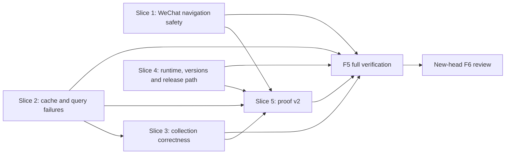

# Accessibility Selector Engine Review Remediation Implementation Plan

- Status: Proposed F3 implementation plan
- Written: 2026-07-12
- Feature branch: `codex/accessibility-selector-engine`
- Approved F2 design:
  [`design-remediation-2026-07-12.md`](./design-remediation-2026-07-12.md)
- F2 technical review:
  [`technical-review-remediation-2026-07-12.md`](./technical-review-remediation-2026-07-12.md)
- Frozen blocking review:
  [`pr-review-macos-computer-use-3-07fa052.md`](./pr-review-macos-computer-use-3-07fa052.md)

## F3 Handoff Status

The remediation design passed F2 technical review. This document translates
that design into exact files, fields, tests, commit boundaries, and rollback
steps. It does not change the approved architecture and does not authorize code
until this F3 artifact is reviewed and pushed.

The historical `implementation-plan.md` remains the plan used for reviewed head
`07fa052`. This file is the implementation plan for the 12 review blockers.

## Scope

In scope:

- close `PRR-001` through `PRR-012`;
- enforce fail-closed WeChat focus, target, frame, and ambiguity behavior;
- repair selector cache, backend failure, batch, and pagination contracts;
- reject unsupported helper-backed selector construction;
- coordinate the package suite at version `0.2.0`;
- repair the clean release test path;
- replace strict selector smoke proof v1 with privacy-safe proof v2;
- update developer, migration, publishing, verification, and release records.

Out of scope:

- public `resolve_selector` or `extract_collection` commands;
- helper-side AX query/action parity;
- durable WeChat contact ids or a candidate-selection API;
- multi-element selector caching;
- broad mypy/ruff cleanup;
- release publication, tagging, or PyPI upload.

## Package Boundaries

| Owner | Allowed changes | Forbidden changes |
| --- | --- | --- |
| `app-control-protocol` | Coordinated version and existing config coverage. | WeChat UI semantics or selector resolver implementation. |
| `computer-use-macos` | Generic query normalization, selector cache, collection extraction, AX limits. | Imports from `wechat-desktop-tool`. |
| `wechat-desktop-tool` | WeChat focus, target identity, mapped navigation, semantic failure mapping, selector/control-map profile. | New generic AX backend implementation. |
| `examples/` | Live runner and sanitized proof-v2 projection. | Default persistence of raw WeChat observations. |
| `scripts/` | Strict proof validation/bundling and release workflow checks. | Acceptance of unknown proof fields or raw observation passthrough. |
| `.github/workflows/` | Exact clean test paths and strict source-SHA validation. | Uploading private raw smoke output. |

## Approved Field Implementation Matrix

### Selector and query diagnostics

| Object | Field | Change | Type | Required | Default | Owner | Validation | Compatibility |
| --- | --- | --- | --- | --- | --- | --- | --- | --- |
| `SelectorDiagnostics` | `failure_kind` | Clarify | `str | None` | No | `None` | `selectors/models.py` | Non-empty when present. | Internal additive semantics; `selector_query_failed` denotes backend failure. |
| `SelectorDiagnostics` | `message` | Clarify | `str | None` | No | `None` | `selectors/models.py` | Length-bounded sanitized text. | Existing callers remain valid. |
| `SelectorDiagnostics` | `cause_failure_kind` | Add | `str | None` | No | `None` | `selectors/models.py` | Non-empty when present; copied from backend. | Internal additive field. |
| `SelectorDiagnostics` | `retryable` | Add | `bool | None` | No | `None` | `selectors/models.py` | Boolean when present. | Internal additive field. |
| `SelectorDiagnostics` | `truncated` | Clarify | `bool` | Yes | `False` | `selectors/models.py` | True only when result completeness is unknown. | Normal limit lookahead no longer reports an error. |
| `SelectorDiagnostics` | `truncation_reason` | Clarify | `str | None` | No | `None` | `selectors/models.py` | Normalized reason when true. | Existing field, stricter semantics. |
| `NormalizedQueryOutcome` | `available` | Add internal object | `bool` | Yes | Derived | `selectors/resolver.py` | False when backend says unavailable; legacy success is true only with valid query shape. | No public protocol change. |
| `NormalizedQueryOutcome` | `snapshot_id` | Add internal object | `str | None` | No | `None` | `selectors/resolver.py` | Non-empty when present. | Replaces untyped mapping access. |
| `NormalizedQueryOutcome` | `nodes` | Add internal object | `tuple[Mapping, ...]` | Yes | `()` | `selectors/resolver.py` | Sequence of normalized nodes. | Empty means not found only after successful query. |
| `NormalizedQueryOutcome` | `diagnostics` | Add internal object | `Mapping[str, Any]` | Yes | `{}` | `selectors/resolver.py` | Mapping only. | Internal. |
| `NormalizedQueryOutcome` | `failure_kind` | Add internal object | `str | None` | No | `None` | `selectors/resolver.py` | Preserve backend cause. | Internal. |
| `NormalizedQueryOutcome` | `message` | Add internal object | `str | None` | No | `None` | `selectors/resolver.py` | Length-bounded. | Internal. |
| `NormalizedQueryOutcome` | `retryable` | Add internal object | `bool | None` | No | `None` | `selectors/resolver.py` | Boolean when present. | Internal. |

`NormalizedQueryOutcome` may be a private frozen dataclass in `resolver.py`.
It does not need export from `computer_use_macos.selectors`.

### WeChat construction and ambiguity

| Object | Field | Change | Type | Required | Default | Owner | Validation | Compatibility |
| --- | --- | --- | --- | --- | --- | --- | --- | --- |
| `WeChatDesktopConfig` | `computer_use_backend` | Add | `str` | Yes | `"direct"` | `wechat_desktop_tool/models.py` | Trimmed non-empty value; normalized lowercase for comparison. | Additive constructor field; existing direct callers keep behavior. |
| `ContactDisambiguationCandidate` | `displayName` | Add semantic detail | `str` | Yes | None | `wechat_desktop_tool/tool.py` | Non-empty, bounded visible value. | Returned only with `contact_ambiguous`. |
| `ContactDisambiguationCandidate` | `secondaryText` | Add semantic detail | `str | None` | No | Omitted | `wechat_desktop_tool/tool.py` | Bounded and sanitized. | Optional additive detail. |
| `ContactDisambiguationCandidate` | `rowIndex` | Add semantic detail | `int` | Yes | None | `wechat_desktop_tool/tool.py` | `>=0`, current result only. | Explicitly not a durable contact id. |
| `ContactDisambiguationCandidate` | `actionRef` | Add semantic detail | mapping or omitted | No | Omitted | `wechat_desktop_tool/tool.py` | Include only when action/preconditions are executable. | Optional; current name-only API still fails closed. |

`WeChatDesktopConfig.from_app_control_config` copies
`app_config.computer_use.backend`. `WeChatDesktopTool.__init__` rejects
`computer_use_backend == "helper"` with a configuration `ValueError` before
loading profiles or issuing commands. Direct constructor callers injecting a
helper transport must provide matching config; this responsibility is
documented as an advanced-constructor constraint.

### Release proof v2

| Object | Field | Type | Required | Default | Owner | Validation | Compatibility |
| --- | --- | --- | --- | --- | --- | --- | --- |
| `proof` | `schema` | literal string | Yes | None | example + preflight | Exact v2 literal. | v1 is never strict/bundleable. |
| `proof.source` | `repository` | `str` | Yes | None | example + preflight | Exact repository slug. | New strict requirement. |
| `proof.source` | `headSha` | `str` | Yes | None | example + preflight | Exactly 40 lowercase hex and equals expected source SHA. | New strict requirement. |
| `proof.source` | `generatedAt` | RFC 3339 `str` | Yes | Current UTC | example | Parseable UTC timestamp. | Additive. |
| `proof.source` | `packageVersions` | mapping | Yes | None | example + preflight | Exactly three package names, each `0.2.0`. | Tied to coordinated release. |
| `proof` | `checks` | `dict[str, bool]` | Yes | None | example + preflight | Exact required check set; every value true. | Replaces raw operation envelopes. |
| `proof` | `collections` | mapping | Yes | None | example + preflight | Exact contacts/conversations/visibleMessages keys. | Summary-only evidence. |
| collection evidence | `requestedLimit` | `int` | Yes | `30` | example | `1..30`. | No semantic values. |
| collection evidence | `count` | `int` | Yes | None | example + preflight | `1..requestedLimit`. | Zero is invalid strict proof. |
| collection evidence | `items` | array | Yes | None | example + preflight | `len(items) == count`; structural booleans only. | No names or text. |
| `proof` | `safety` | mapping | Yes | None | example + preflight | Exact safe keys; every value true except `rawObservationIncluded=false`. | New strict safety evidence. |
| `proof` | `timingsMs` | `dict[str, int]` | Yes | None | example + preflight | Required operations, each `0..3000`. | Enforces feature performance target. |
| `proof` | `failedStep` | `null` | Yes | `null` | example + preflight | Any non-null value fails. | Existing concept, stricter type. |

Exact numeric evidence thresholds:

| Collection | Minimum count | Maximum/request limit | Item evidence shape |
| --- | ---: | ---: | --- |
| `contacts` | 1 | 30 | `{"semanticFieldsPresent": true}` |
| `conversations` | 1 | 30 | `{"semanticFieldsPresent": true, "actionable": true}` |
| `visibleMessages` | 1 | 30 | `{"nonEmptyTextObserved": true}` |

Exact required safety fields:

- `focusGatePassed = true`: no text command ran without verified search focus;
- `targetPostconditionPassed = true`;
- `expiredActionRefRejected = true`;
- `frameDerivedCoordinatesOnly = true`;
- `rawObservationIncluded = false`;
- `sensitiveFieldScanPassed = true`.

Exact required `checks` keys, with every value `true`:

- `systemOpenWeChat`;
- `readiness`;
- `openWeChat`;
- `inspectWindow`;
- `listConversations`;
- `openContact`;
- `readVisibleMessages`;
- `listContacts`;
- `validProfileOverride`;
- `invalidProfileFallback`.

Exact required `timingsMs` keys, each an integer from `0` through `3000`:

- `openWeChat`;
- `inspectWindow`;
- `listConversations`;
- `openContact`;
- `readVisibleMessages`;
- `listContacts`.

Forbidden keys are checked recursively and include `observation`,
`rawObservation`, `contact`, `displayName`, `text`, `messageText`,
`windowTitle`, `socketPath`, `configPath`, `executable`, `token`, and `axPath`.
String values are rejected when they contain configured canaries or absolute
POSIX/macOS user paths.

## Slice Dependency Flow



Slices 1 and 2 may be implemented independently. Slice 3 starts after Slice 2
so it can consume normalized query-failure semantics. Slice 5 starts only after
Slices 1 through 4 because it proves their final contracts.

## Global Implementation Rules

- Every slice begins from the pushed feature branch and ends with targeted
  tests, an `implementation-notes.md` update, one scoped commit, and push.
- Do not stage unrelated dirty skill, README, example output, build directory,
  token, raw smoke JSON, or package-local lock files.
- Preserve the existing public WeChat method names and command schemas.
- No list/read/open path may submit text.
- No performance optimization may bypass focus, identity, frame, cache, or
  postcondition validation.
- New error details are semantic and bounded; raw AX nodes remain internal.
- Update tests before or with each behavior change so every PR finding has a
  named regression.

## Slice 1: WeChat Navigation Safety

Findings: `PRR-002`, `PRR-003`, `PRR-004`.

### Files

- `packages/wechat-desktop-tool/src/wechat_desktop_tool/tool.py`
- `packages/wechat-desktop-tool/src/wechat_desktop_tool/control_map.py`
- `packages/wechat-desktop-tool/src/wechat_desktop_tool/profiles/wechat-macos.toml`
- `packages/wechat-desktop-tool/tests/test_tool.py`
- `packages/wechat-desktop-tool/tests/test_profiles.py`
- `docs/wechat-desktop-tool.md`
- `docs/migration-notes.md`
- `docs/feature/accessibility-selector-engine/implementation-notes.md`

### Implementation tasks

1. Change `_search_focus_failure` so only `state == "verified"` returns no
   failure. Every `unknown` reason and `not_search` returns
   `search_not_focused` before clear/type/Return commands are built.
2. Keep `_search_focus_assessment` reasons, but expose only bounded semantic
   focus evidence.
3. Change `_query_mapped_conversation_target` from `limit=1` to `limit=2` and
   preserve both exact candidates through `_conversation_rows_from_cells`.
4. Ensure `_open_contact` calls `_contact_ambiguous_failure` before generating
   an actionRef or search fallback when two candidates remain.
5. Remove `_execute_mapped_control_direct_coordinate_click` from execution and
   remove runtime use of `screen_coordinates` from the packaged control map.
6. Query the candidate AX path first; validate app/window, role, localized
   label, enabled state, finite positive frame, and frame containment.
7. Use `AXPress` when executable. Use the current AX frame center only when
   coordinate policy is enabled and `AXPress` is unavailable or rejected.
8. Treat click success as provisional. Verify selected navigation state or
   current chat title before returning success.
9. Do not publish actionRefs with an `AXPress` precondition when the queried row
   has no executable `AXPress`; preserve existing snapshot/signature
   preconditions for any fallback actionRef.

### Required regression tests

Add or rename tests in `test_tool.py` so the finding is visible in the test
name:

- `test_open_contact_unknown_search_focus_never_types_or_presses_return` with a
  subtest for every current unknown reason;
- `test_open_contact_same_name_mapped_candidates_fail_before_action`;
- `test_mapped_navigation_ignores_packaged_screen_coordinates`;
- `test_mapped_navigation_click_uses_current_validated_frame_center`;
- `test_mapped_navigation_missing_or_stale_frame_fails_closed`;
- `test_mapped_navigation_requires_semantic_postcondition`;
- `test_row_without_axpress_does_not_publish_unexecutable_axpress_action_ref`.

Update existing coordinate-first tests to assert query-first ordering instead
of preserving the unsafe behavior.

### Targeted command

```bash
PYTHONPATH=packages/app-control-protocol/src:packages/computer-use-macos/src:packages/wechat-desktop-tool/src \
  .venv/bin/python -m unittest discover \
  -s packages/wechat-desktop-tool/tests -p 'test_tool.py'
```

### Acceptance

- no unknown-focus fixture emits clear, type, Return, click, or read commands;
- two same-name rows emit no action/read command;
- every coordinate originates from a current validated AX frame;
- operation success requires a semantic postcondition;
- existing unique-contact and under-three-second paths remain testable.

### Rollback and commit

- Rollback: revert Slice 1 as one commit; do not restore fixed coordinates
  independently.
- Commit: `fix: fail closed WeChat contact navigation`
- Push immediately after targeted tests pass.

## Slice 2: Selector Cache And Query Failure Semantics

Findings: `PRR-006`, `PRR-007`.

### Files

- `packages/computer-use-macos/src/computer_use_macos/selectors/models.py`
- `packages/computer-use-macos/src/computer_use_macos/selectors/diagnostics.py`
- `packages/computer-use-macos/src/computer_use_macos/selectors/resolver.py`
- `packages/computer-use-macos/src/computer_use_macos/selectors/matching.py`
- `packages/computer-use-macos/tests/test_selectors.py`
- `packages/wechat-desktop-tool/src/wechat_desktop_tool/tool.py`
- `packages/wechat-desktop-tool/tests/test_tool.py`
- `docs/feature/accessibility-selector-engine/implementation-notes.md`

### Implementation tasks

1. Replace mapping-only `_normalize_query_payload` output with private
   `NormalizedQueryOutcome` while accepting current wrapped and unwrapped
   payload shapes.
2. Preserve `available`, backend `failureKind`, message, retryability,
   diagnostics, nodes, and snapshot id.
3. Stop selector traversal immediately on a failed backend outcome. Return
   `status="failed"`, `failure_kind="selector_query_failed"`, and the backend
   cause fields.
4. Return `selector_not_found` only after a successful query with no matching
   candidate.
5. Centralize candidate evaluation so fresh and cached candidates use the same
   matcher, required actions, enabled/visible checks, constraints, relation,
   and frame rules.
6. Build cached self-query attributes from matcher attributes, constraint
   requirements, cache key attributes, role/actions, enabled/visible/selected,
   and frame needs.
7. On cache mismatch, action loss, relation/frame change, or expired entry,
   delete the cache entry and fresh-resolve.
8. Bypass the current single-entry cache when `selector.pick == "all"`.
9. Map known query causes through WeChat operations without collapsing
   permission/timeout/transport states into `contact_not_found` or generic
   selector absence.

### Required regression tests

- same-role cached path with changed label/matcher;
- required action removed;
- enabled, visible, selected, relation, and frame constraint changed;
- `pick=all` cold/hot equivalence;
- missing Accessibility permission;
- Accessibility query timeout;
- helper/transport failure payload;
- successful empty result;
- WeChat list/open mapping preserves actionable cause and recovery.

### Targeted commands

```bash
PYTHONPATH=packages/app-control-protocol/src:packages/computer-use-macos/src \
  .venv/bin/python -m unittest discover \
  -s packages/computer-use-macos/tests -p 'test_selectors.py'

PYTHONPATH=packages/app-control-protocol/src:packages/computer-use-macos/src:packages/wechat-desktop-tool/src \
  .venv/bin/python -m unittest discover \
  -s packages/wechat-desktop-tool/tests -p 'test_tool.py'
```

### Acceptance

- stale cache never returns `cache_status=hit`;
- fresh and cache-hit candidates satisfy identical predicates;
- permission, timeout, transport, and not-found results remain distinct;
- no public selector protocol schema changes.

### Rollback and commit

- Rollback: revert the diagnostics/model/resolver/semantic mapping together so
  no caller receives fields unsupported by the resolver.
- Commit: `fix: validate selector cache and query failures`
- Push immediately after targeted tests pass.

## Slice 3: Collection Batch And Pagination Correctness

Findings: `PRR-008`, `PRR-009`.

### Files

- `packages/computer-use-macos/src/computer_use_macos/client.py`
- `packages/computer-use-macos/src/computer_use_macos/selectors/collections.py`
- `packages/computer-use-macos/src/computer_use_macos/selectors/models.py`
- `packages/computer-use-macos/tests/test_selectors.py`
- `packages/computer-use-macos/tests/test_package.py`
- `packages/wechat-desktop-tool/tests/test_profiles.py`
- `docs/feature/accessibility-selector-engine/implementation-notes.md`

### Implementation tasks

1. Define one internal maximum AX query depth constant with value `8` and use it
   in both query normalization and collection batch planning. Place it in the
   narrowest dependency-neutral module; do not import the client from selectors.
2. Generate batch depth with `min(8, item_depth + field_depth)` and pass every
   request through the same normalizer used by the real client.
3. Cache batch values by owning item path. Run item-rooted field fallback only
   for missing values, with the field selector's own depth and limit.
4. Track batch and fallback query counts separately in local extraction logic,
   then expose their sum through existing diagnostics.
5. Classify `truncationReason="limit"` with at least `effective_limit + 1`
   accepted candidates as completed lookahead, not incomplete extraction.
6. Return the first N items, `has_more=true`, `status="resolved"`, and no
   `selector_query_truncated` for completed lookahead.
7. Keep time-budget and other real truncation as `partial` when complete items
   exist and `failed` otherwise.

### Required regression tests

- packaged contacts depth `8+3`, conversations `6+3`, and messages `6+3`
  produce normalized batch requests with `maxDepth<=8`;
- representative packaged-profile fixtures execute at least one batch query;
- representative batch query count is lower than unconditional per-row field
  extraction;
- missing deep field falls back from the item root without losing correctness;
- N items: resolved, no more;
- N+1 and greater than N+1: resolved, `hasMore=true`, no truncation failure;
- time-budget truncation: partial/failed as appropriate;
- count and pagination fields remain internally consistent after skipped rows.

### Targeted commands

```bash
PYTHONPATH=packages/app-control-protocol/src:packages/computer-use-macos/src \
  .venv/bin/python -m unittest discover \
  -s packages/computer-use-macos/tests -p 'test_selectors.py'

PYTHONPATH=packages/app-control-protocol/src:packages/computer-use-macos/src:packages/wechat-desktop-tool/src \
  .venv/bin/python -m unittest discover \
  -s packages/wechat-desktop-tool/tests -p 'test_profiles.py'
```

### Acceptance

- no generated request can fail the current depth normalizer;
- normal pagination never reports partial/truncated;
- true incomplete extraction remains diagnosable;
- packaged collection query count and timings are recorded for F5.

### Rollback and commit

- Rollback: revert the shared limit and extractor changes together; do not keep
  a capped query without the correctness fallback.
- Commit: `fix: bound selector collection extraction`
- Push immediately after targeted tests pass.

## Slice 4: Runtime Support, Dependency Floors, And Release Test Path

Findings: `PRR-005`, `PRR-010`, `PRR-011`.

### Files

- `packages/app-control-protocol/pyproject.toml`
- `packages/computer-use-macos/pyproject.toml`
- `packages/wechat-desktop-tool/pyproject.toml`
- `packages/wechat-desktop-tool/src/wechat_desktop_tool/models.py`
- `packages/wechat-desktop-tool/src/wechat_desktop_tool/tool.py`
- `packages/app-control-protocol/tests/test_config.py`
- `packages/wechat-desktop-tool/tests/test_tool.py`
- `tests/test_package_boundary.py`
- `tests/test_release_preflight.py`
- `scripts/release_preflight.py`
- `scripts/wheel_check.py`
- `.github/workflows/release.yml`
- `uv.lock`
- `docs/wechat-desktop-tool.md`
- `docs/migration-notes.md`
- `docs/publishing.md`
- `CHANGELOG.md`
- `docs/feature/accessibility-selector-engine/implementation-notes.md`

### Implementation tasks

1. Set all package project versions to `0.2.0`.
2. Set `computer-use-macos` to `app-control-protocol>=0.2.0`.
3. Set `wechat-desktop-tool` to `app-control-protocol>=0.2.0` and
   `computer-use-macos>=0.2.0`.
4. Regenerate only the tracked workspace `uv.lock`; never add the package-local
   untracked lock file.
5. Add `computer_use_backend` to `WeChatDesktopConfig`, populate it from shared
   config, and reject helper mode at tool construction as defined above.
6. Update helper/runtime docs to state that this feature supports direct and
   direct-backed local-service modes only.
7. Add `packages/computer-use-macos/src` to the release workflow's WeChat test
   `PYTHONPATH`.
8. Extend workflow preflight to assert the exact release WeChat source path,
   not only the CI source path.
9. Extend clean wheel/install checks to verify the 0.2.0 package set and
   dependency metadata.
10. Add migration and Unreleased records for helper fail-fast and coordinated
    dependency floors.

### Required regression tests

- shared config copies direct/helper backend into WeChat config;
- helper config raises before any app-control call;
- direct and local-service paths retain construction behavior;
- package boundary tests require `>=0.2.0` metadata;
- mixed new WeChat with 0.1.x dependencies is rejected;
- all three 0.2.0 wheels install and import together;
- release workflow exact WeChat test command succeeds in a clean source-path
  environment;
- preflight fails when `computer-use-macos/src` is removed from release YAML.

### Targeted commands

```bash
PYTHONPATH=packages/app-control-protocol/src \
  .venv/bin/python -m unittest discover \
  -s packages/app-control-protocol/tests -p 'test_config.py'

PYTHONPATH=packages/app-control-protocol/src:packages/computer-use-macos/src:packages/wechat-desktop-tool/src \
  .venv/bin/python -m unittest discover \
  -s packages/wechat-desktop-tool/tests -p 'test_tool.py'

PYTHONPATH=packages/app-control-protocol/src:packages/computer-use-macos/src:packages/wechat-desktop-tool/src \
  .venv/bin/python -m unittest tests.test_package_boundary tests.test_release_preflight

.venv/bin/python scripts/wheel_check.py
```

Also run the four test commands from `.github/workflows/release.yml` exactly,
from a process with workspace packages absent from site-packages.

### Acceptance

- every allowed dependency combination imports and constructs successfully;
- every incompatible older combination fails resolution or the explicit
  compatibility test before runtime import;
- helper mode fails at configuration, not deep inside an operation;
- release source-path tests collect successfully in a clean checkout.

### Rollback and commit

- Rollback: revert versions, dependency floors, lock, helper contract, workflow,
  docs, and changelog as one coordinated slice.
- Commit: `fix: align selector runtime compatibility`
- Push immediately after targeted, wheel, and release-command tests pass.

## Slice 5: Privacy-Safe Strict Release Proof

Findings: `PRR-001`, `PRR-012`.

### Files

- `examples/wechat_selector_engine_smoke_test.py`
- `tests/test_sdk_examples.py`
- `scripts/release_preflight.py`
- `scripts/release_proof_bundle.py`
- `tests/test_release_preflight.py`
- `.github/workflows/release.yml`
- `docs/publishing.md`
- `docs/release-checklist.md`
- `docs/wechat-smoke.md`
- `CHANGELOG.md`
- `docs/feature/accessibility-selector-engine/implementation-notes.md`

### Implementation tasks

1. Split the smoke runner into live operation collection and a whitelist
   `_build_selector_proof_v2` projection.
2. Make sanitized proof v2 the only default output. Add an explicitly named
   private debug option only if existing diagnostics still need raw output.
3. Require `--head-sha` for release-grade output; validate 40 lowercase hex.
4. Emit the exact checks, collection evidence, safety fields, timings, package
   versions, and null `failedStep` defined above.
5. Do not emit the target contact, names, message text, titles, command ids,
   service/config paths, Python executable, tokens, AX paths, or operation
   observations.
6. Add recursive strict validation for exact keys, types, source head, numeric
   thresholds, item/count consistency, forbidden keys, absolute paths, and
   canary values.
7. Add `--expected-source-sha` to strict preflight and proof bundle. The release
   workflow passes `${{ github.sha }}`.
8. Reject proof v1 for `wechat_selector_engine_smoke` strict proof.
9. Validate proof v2 before copying. `_copy_asset` must never receive an
   unvalidated selector report.
10. Update publishing docs so only sanitized v2 is attached to GitHub Release;
    private raw output has no bundle or retention path.

### Required regression tests

- SDK smoke succeeds while its output contains no raw observations;
- contacts, conversations, and messages each require count `>=1`;
- count zero, missing items, count/items mismatch, count above requested limit,
  or structural false values fail;
- non-null `failedStep` fails;
- wrong/malformed head SHA fails;
- unknown key or forbidden key at any depth fails;
- contact, message, title, absolute-path, token, and AX-path canaries never occur
  in output/bundle assets;
- proof v1 cannot satisfy strict proof;
- valid v2 satisfies strict preflight and bundle generation;
- bundle rejects invalid proof before copying any selector asset.

### Targeted commands

```bash
PYTHONPATH=packages/app-control-protocol/src:packages/computer-use-macos/src:packages/wechat-desktop-tool/src \
  .venv/bin/python -m unittest tests.test_sdk_examples

PYTHONPATH=packages/app-control-protocol/src:packages/computer-use-macos/src:packages/wechat-desktop-tool/src \
  .venv/bin/python -m unittest tests.test_release_preflight

.venv/bin/python scripts/release_preflight.py
```

### Acceptance

- valid proof is source-bound, non-zero, count-consistent, and privacy-safe;
- every reviewer can inspect the public asset without access to private
  observations;
- no invalid selector proof is copied into a release bundle;
- release strict preflight fails closed on any unknown or sensitive content.

### Rollback and commit

- Rollback: revert runner, validator, bundler, workflow, docs, and changelog
  together. Do not restore proof v1 as a public release asset.
- Commit: `fix: sanitize selector release proof`
- Push immediately after targeted and default preflight tests pass.

## F5 Integration Verification

### Automated commands

Run after all five slices:

```bash
PYTHONPATH=packages/app-control-protocol/src:packages/computer-use-macos/src:packages/wechat-desktop-tool/src \
  .venv/bin/python -m unittest discover -s tests

PYTHONPATH=packages/app-control-protocol/src \
  .venv/bin/python -m unittest discover -s packages/app-control-protocol/tests

PYTHONPATH=packages/app-control-protocol/src:packages/computer-use-macos/src \
  .venv/bin/python -m unittest discover -s packages/computer-use-macos/tests

PYTHONPATH=packages/app-control-protocol/src:packages/computer-use-macos/src:packages/wechat-desktop-tool/src \
  .venv/bin/python -m unittest discover -s packages/wechat-desktop-tool/tests

.venv/bin/python -m compileall -q packages examples scripts tests
.venv/bin/python scripts/release_preflight.py
.venv/bin/python scripts/wheel_check.py
git diff --check origin/main...HEAD
```

Run release workflow commands exactly from a clean environment before F5 is
marked complete. Record command, Python version, commit SHA, duration, and
result in `verification.md`.

### Authorized real macOS proof

Real WeChat proof is deferred until deterministic tests pass and the user
explicitly authorizes desktop interaction.

The smoke must:

1. use a moved or resized WeChat window;
2. open a unique configured contact without sending a message;
3. list at least 1 contact and 1 conversation;
4. read at least 1 and at most 30 visible messages;
5. record each measured public semantic API at `<=3000 ms`;
6. confirm target postcondition and expired actionRef rejection;
7. generate proof v2 for the exact tested head;
8. scan proof and bundle for sensitive canaries;
9. keep any private raw debug artifact outside the repository and release
   bundle.

### F5 documentation commit

Update:

- `docs/feature/accessibility-selector-engine/verification.md`;
- `docs/feature/accessibility-selector-engine/implementation-notes.md`;
- developer/migration/publishing docs changed by the slices;
- `CHANGELOG.md` under `Unreleased` with scenario-focused fixes.

Commit and push verification/documentation separately after all checks pass.
Suggested commit: `docs: verify selector review remediation`.

## Finding-To-Test Closure Ledger

| Finding | Implementation slice | Mandatory automated proof | Manual proof |
| --- | --- | --- | --- |
| `PRR-001` | 5 | Sensitive canary and bundle rejection tests. | Inspect generated public proof asset. |
| `PRR-002` | 1 | Unknown-focus command-sequence table. | Optional focus-loss smoke after authorization. |
| `PRR-003` | 1 | Query-first/frame-center/postcondition tests. | Moved/resized window smoke. |
| `PRR-004` | 1 | Two identical candidates, zero actions. | No real duplicate contact required. |
| `PRR-005` | 4 | Helper config construction fail-fast. | No signed helper smoke in this feature. |
| `PRR-006` | 2 | Full cache invalidation matrix. | None. |
| `PRR-007` | 2 | Permission/timeout/transport/empty result matrix. | Permission probe recorded if authorized. |
| `PRR-008` | 3 | Normalizer-backed packaged batch and query-count tests. | Timing captured by live collections. |
| `PRR-009` | 3 | N/N+1/larger/time-budget page matrix. | None. |
| `PRR-010` | 4 | Clean wheel dependency matrix. | TestPyPI proof belongs to F7. |
| `PRR-011` | 4 | Exact clean release command and workflow mutation test. | GitHub release event belongs to F7. |
| `PRR-012` | 5 | Zero/mismatch/failed-step/wrong-head strict negatives. | Valid proof-v2 strict preflight. |

No finding may be marked closed from a green broad suite alone; its named
counterexample must pass.

## Rollout And Rollback

Rollout:

1. keep PR #3 draft throughout F4/F5;
2. implement and push slices in dependency order;
3. run full F5 and authorized smoke;
4. produce a new frozen-head PR review;
5. restore merge-ready only when all 12 findings are explicitly closed;
6. perform version tag and publishing work only in F7 with explicit direction.

Rollback:

- before merge, revert the failing slice commit and its implementation-notes
  entry;
- never cherry-pick version floors without all coordinated package versions;
- never retain proof-v2 workflow changes without the validator/bundler changes;
- after a future release, consumers rollback by pinning the complete 0.1.1
  package set, not a mixed 0.1.x/0.2.x set.

## F3 Exit Gate

F3 is complete when:

- this implementation plan is independently reviewed;
- all fields include type, required state, default, owner, validation, and
  compatibility behavior;
- all 12 findings map to named tests and one implementation slice;
- proof minimums and timing limits are numeric;
- slice files, commands, commit boundaries, docs, and rollback are explicit;
- no approved F2 architecture decision has changed;
- the reviewed F3 commit is pushed before Slice 1 code begins.
