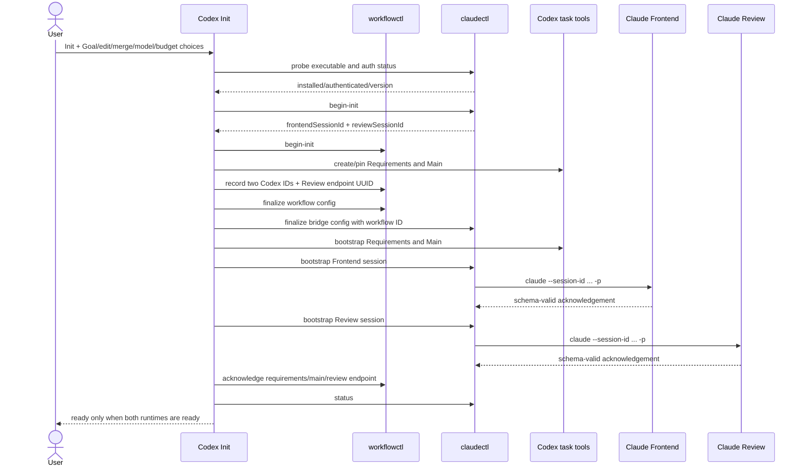
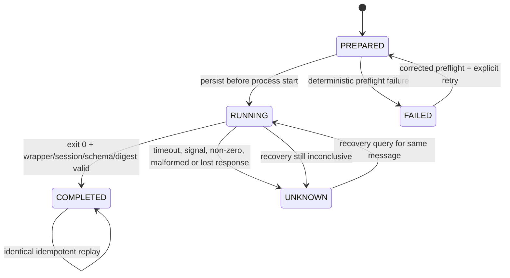
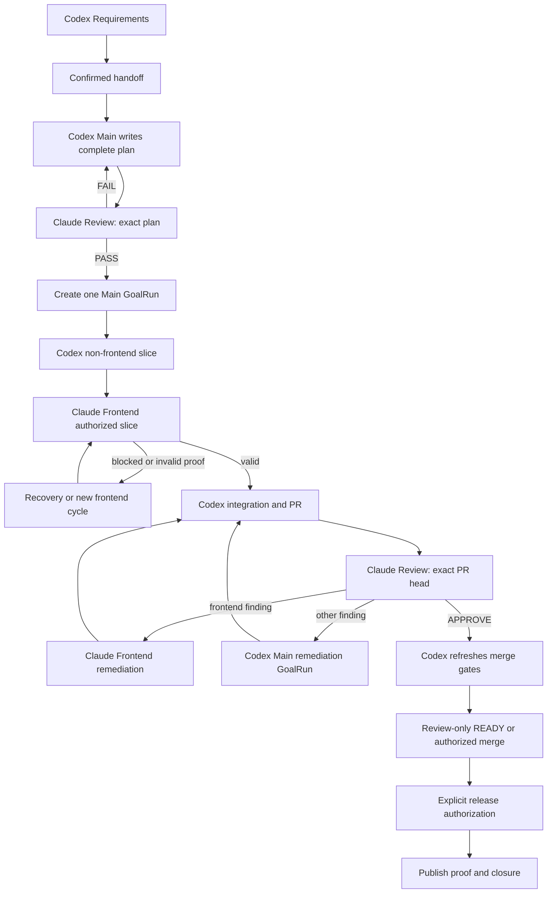

# Technical Design: Codex-Claude Engineering Lifecycle Plugin

Status: proposed  
Branch: `codex/claude-hybrid-engineering-lifecycle-plugin`  
Base: `codex/engineering-lifecycle-plugin@c8fa277`

## 1. Problem

`codex-engineering-lifecycle` gives one repository a durable requirements task,
main task, and independent review task, all hosted by Codex. The new plugin must
preserve that lifecycle while deliberately changing two ownership boundaries:

- Claude performs every plan/code review in a dedicated Review session.
- Claude performs every frontend implementation/remediation slice in a
  different Frontend session.

The integration must address durable session identity, structured transport,
unknown delivery outcomes, concurrent-resume hazards, permission boundaries,
frontend path ownership, and exact-snapshot authority. A prompt-only handoff is
not sufficient.

## 2. Goals and non-goals

### Goals

- Ship a separate, installable `codex-claude-engineering-lifecycle` plugin.
- Reuse the proven requirements, GoalRun, review-result, merge, release, and
  closure state machine where its contracts remain valid.
- Add a deterministic Claude Code CLI bridge with private state, locks,
  idempotent message IDs, explicit session UUIDs, and JSON Schema responses.
- Keep two Codex tasks and two Claude sessions durable across features.
- Serialize every mutating executor and reject stale or path-escaping frontend
  results.
- Preserve independent review and exact-head merge authority.

### Non-goals

- No Claude Desktop UI, browser, Accessibility, or clipboard automation.
- No generic provider abstraction shared with a future plugin.
- No automatic Claude installation, authentication, subscription management,
  or credential persistence.
- No concurrent Codex/Claude mutation in one worktree.
- No changes to the existing lifecycle plugin or Python package APIs.

## 3. Ownership boundaries

| Component | Owner | Responsibilities | Prohibited |
| --- | --- | --- | --- |
| Requirements task | Codex | Intake, document, confirmation, handoff | Plan, code, review |
| Engineering Main task | Codex | Full plan, non-frontend implementation, integration, merge mechanics, release, closure | Independent decision; unapproved frontend takeover |
| Frontend session | Claude | Authorized frontend slice and frontend remediation | Review, merge, release, non-allowed paths |
| Review session | Claude | Exact plan and PR review, findings, decision, report content | Feature implementation, merge, release |
| `workflowctl.py` | Deterministic local runtime | Existing feature stage, GoalRun, merge/release/closure contract | Calling Claude or interpreting prose |
| `claudectl.py` | Deterministic local bridge | Probe, session bootstrap/resume, lock, ledger, schema validation, frontend Git proof | Deciding product requirements or weakening workflow gates |
| Engineering Main transport step | Codex | Convert validated Claude output into existing typed lifecycle results and persist review records | Alter Claude findings or self-approve |

Review content is authored by Claude. Codex may render the returned structured
fields into Markdown/JSON, commit them to the deterministic review-record
branch, validate their digest, and perform an already-authorized merge after
refreshing live GitHub state.

## 4. Plugin layout

```text
plugins/codex-claude-engineering-lifecycle/
├── .codex-plugin/plugin.json
├── README.md
├── CHANGELOG.md
├── PRIVACY.md
├── SUPPORT.md
├── TERMS.md
├── LICENSE
├── assets/
├── prompts/
│   ├── claude-frontend.md
│   └── claude-review.md
├── schemas/
│   ├── <existing lifecycle schemas>
│   ├── claude-bootstrap-output.schema.json
│   ├── claude-frontend-output.schema.json
│   ├── claude-plan-review-output.schema.json
│   ├── claude-code-review-output.schema.json
│   └── frontend-work-request.schema.json
├── scripts/
│   ├── workflowctl.py
│   ├── claudectl.py
│   └── validate_contracts.py
├── skills/
│   ├── hybrid-workflow-init/
│   ├── hybrid-requirements/
│   ├── hybrid-main/
│   └── <explicit-only composition skills>
└── tests/
```

The plugin is self-contained. Composition skills are copied as explicit-only
resources just as in the Codex-only plugin. No runtime dependency on that
plugin is introduced.

## 5. Runtime composition

The copied `workflowctl.py` continues to own the proven lifecycle. Its state
root changes from `engineering-lifecycle` to
`codex-claude-engineering-lifecycle`, preventing either plugin from reading or
migrating the other plugin’s state.

For compatibility with the reused lifecycle contracts,
`config.tasks.review` and routed `*TaskId` fields contain the Claude Review
session UUID. In this plugin those fields are transport endpoint identifiers,
not a claim that Review is a Codex task. The plugin does not accept existing
Codex-only state, so this compatibility choice creates no migration ambiguity.
User-facing documentation calls it the Review endpoint.

`claudectl.py` owns separate Claude bridge files under the same derived project
root:

```text
${CODEX_HOME:-~/.codex}/codex-claude-engineering-lifecycle/projects/<key>/
├── init-pending.json       # workflowctl recoverable Init
├── config.json             # workflow state config
├── state.json              # feature state
├── state.lock
├── claude-init-pending.json
├── claude-config.json
├── claude-state.json
├── claude.lock
└── messages/
    └── <message-id>.result.json
```

Every persisted file is atomically replaced and mode `0600`; directories use
`0700`. The bridge never reads or stores Claude credentials.

## 6. Init flow



Claude preflight runs `claude --version` and `claude auth status`. A missing
executable or non-zero auth status stops before either Init ledger is written.
The user supplies an absolute executable path or accepts `claude` resolved by
`PATH`.

## 7. Claude invocation contract

The bridge uses `subprocess.run()` with an argument list, `shell=False`, the
canonical repository as `cwd`, bounded timeout, captured UTF-8 output, and a
minimal inherited environment. Request content appears only in a prompt
argument; it is never parsed as a command.

First invocation:

```text
claude -p
  --session-id <uuid>
  --name <role-name>
  --model <configured-model>
  --permission-mode plan
  --output-format json
  --json-schema <bootstrap-schema-json>
  --append-system-prompt-file <role-prompt>
  <bootstrap-prompt>
```

Later invocations replace `--session-id` with `--resume <uuid>`. Frontend uses
the explicitly authorized `acceptEdits` mode; Review remains in `plan` mode.
The bridge never emits `--dangerously-skip-permissions` or
`bypassPermissions`.

Each call also applies the configured `--max-turns` and
`--max-budget-usd`. The result wrapper must be a JSON object with the exact
configured `session_id` and a `structured_output` object that validates against
the selected schema.

## 8. Data contracts

### 8.1 Claude bridge configuration

| Field | Type | Required | Owner | Validation |
| --- | --- | --- | --- | --- |
| `schemaVersion` | integer | yes | bridge | exactly `1` |
| `workflowId` | UUID string | yes | workflowctl/Init | exact workflow binding |
| `repositoryKey` | string | yes | Git identity | canonical `owner/repo` |
| `repositoryRoot` | absolute path | yes | Git identity | canonical and existing |
| `claudeCommand` | absolute path | yes | user/bridge | executable regular file |
| `requirementsTaskId` | string | yes | Codex | distinct |
| `mainTaskId` | string | yes | Codex | distinct |
| `frontendSessionId` | UUID | yes | bridge | distinct from every role ID |
| `reviewSessionId` | UUID | yes | bridge | equals workflow Review endpoint |
| `frontendModel` | string | yes | user | non-empty bounded value |
| `reviewModel` | string | yes | user | non-empty bounded value |
| `frontendPermissionMode` | enum | yes | user | `acceptEdits` in v0.1 |
| `frontendMaxTurns` | integer | yes | user | positive bounded value |
| `reviewMaxTurns` | integer | yes | user | positive bounded value |
| `frontendMaxBudgetUsd` | number | yes | user | positive bounded value |
| `reviewMaxBudgetUsd` | number | yes | user | positive bounded value |
| `timeoutSeconds` | integer | yes | user | bounded operational timeout |

No default model alias is pinned in the schema. Init proposes `sonnet` for
Frontend and `opus` for Review but records the user-confirmed values.

### 8.2 Dispatch ledger entry

| Field | Type | Required | Rules |
| --- | --- | --- | --- |
| `messageId` | 64-hex digest | yes | globally unique in workflow |
| `role` | `frontend` or `review` | yes | binds one session |
| `requestType` | enum | yes | bootstrap/frontend/plan-review/code-review/recovery |
| `requestDigest` | 64-hex digest | yes | canonical JSON digest |
| `schemaDigest` | 64-hex digest | yes | binds expected output contract |
| `status` | enum | yes | PREPARED/RUNNING/COMPLETED/UNKNOWN/FAILED |
| `attempt` | integer | yes | increments only on allowed retry/recovery |
| `startedAt` | UTC timestamp | optional | set before process start |
| `finishedAt` | UTC timestamp | optional | terminal local observation |
| `sessionId` | UUID | yes | exact configured role session |
| `resultPath` | relative path | optional | only for COMPLETED |
| `resultDigest` | 64-hex digest | optional | only for COMPLETED |
| `errorKind` | bounded string | optional | sanitized; no raw logs |

An identical COMPLETED replay returns the saved result. Reusing a message ID
with another request/schema digest is `replay_conflict`. Finding RUNNING state
after process loss transitions it to UNKNOWN. UNKNOWN can use only the recovery
operation against the same session and message ID.

### 8.3 FrontendWorkRequest

| Field | Type | Required | Validation |
| --- | --- | --- | --- |
| `schemaVersion` | integer | yes | exactly `1` |
| `messageId`, `workflowId`, `featureId` | strings | yes | existing identity rules |
| `cycle` | integer | yes | positive, monotonic |
| `repositoryKey` | string | yes | configured repository |
| `branch` | string | yes | current feature branch |
| `startHeadSha` | 40-hex SHA | yes | current, pushed, clean |
| `planCommitSha` | 40-hex SHA | yes | approved plan snapshot |
| `planCompositeSha256` | 64-hex | yes | approved plan result |
| `objective` | string | yes | bounded and exact |
| `allowedPathPrefixes` | unique string array | yes | non-empty, safe repo-relative |
| `acceptanceCriteria` | unique string array | yes | non-empty |
| `verificationCommands` | string array | yes | advisory commands, no shell evaluation by bridge |
| `previousResultMessageId` | 64-hex/null | yes | required after first cycle |

### 8.4 Claude frontend output

The output contains the same message/request digest, status
`COMPLETED|BLOCKED|FAILED`, start/end SHAs, commit SHAs, modified paths,
verification evidence, bounded summary, and bounded questions/errors. The
bridge independently derives Git proof; Claude’s path and SHA claims are never
accepted alone.

### 8.5 Claude review outputs

Plan and code outputs use separate focused schemas. Both bind message ID,
request digest, review type, exact reviewed snapshot, decision, blocker/major
counts, structured findings, verification evidence, and Markdown report
content. Code decisions are `APPROVE|REQUEST_CHANGES|STALE`; plan decisions are
`PASS|FAIL|STALE`.

The schemas forbid unknown fields and cap strings/arrays. Findings may identify
paths, line numbers, and concise evidence, but must not embed source files,
large diffs, credentials, or raw tool logs.

## 9. Dispatch state machine



Schema/session/digest mismatch is non-authorizing and retained as UNKNOWN
because Claude may already have mutated the worktree before returning an
invalid result.

## 10. Feature lifecycle



One Main GoalRun remains the global implementation authority. Claude Frontend
is a serialized sub-operation inside that GoalRun, not a second platform Goal.
Main completes the Goal only after frontend Git proof and whole-repository
integration proof pass.

## 11. Frontend Git verification

Before dispatch:

- repository and index/worktree are clean;
- branch equals the requested feature branch;
- `HEAD == startHeadSha`;
- the start SHA is an ancestor of the configured remote branch tip;
- allowed path prefixes are normalized repository-relative paths.

After dispatch:

- worktree is clean;
- branch is unchanged;
- start SHA is an ancestor of end SHA;
- end SHA equals current `HEAD`;
- at least one new commit exists for COMPLETED;
- `git diff --name-only start..end` is non-empty and every path is inside an
  allowed prefix;
- returned commit/path sets equal independently derived sets;
- no force push or merge to another branch is accepted.

The bridge never automatically resets or deletes unauthorized changes. It
blocks, preserves evidence, and tells the user/Main how to inspect and recover.

## 12. Review records and merge

For each request, Main prepares the deterministic review-record branch and an
isolated worktree at the exact reviewed snapshot. Claude Review runs against
that worktree in plan mode and returns structured content. Main writes only:

- the returned Markdown report;
- the compact validated JSON output;
- transport proof containing request/result digests and session ID.

Main commits and pushes those artifacts, then uses `workflowctl.py` to create
the routed TechnicalPlanReviewResult or CodeReviewResult. It may not edit
findings, counts, decisions, or reviewed snapshot fields.

Under `merge-on-approve`, Main becomes the mechanical merge owner because the
Claude Review session has no GitHub mutation authority. Main must re-fetch PR
state and satisfy all existing exact-head/check/draft/mergeability/method gates.
Under `review-only`, it returns READY and waits for a separately authorized
owner.

## 13. Safety, privacy, and authorization

- Frontend edit permission, Goal mode, merge policy/method, and per-dispatch
  budget limits are explicit Init choices.
- Release authorization remains exact and per release.
- Claude receives repository content through its normal local tools, so README
  and PRIVACY disclosures identify Anthropic processing as an external data
  boundary.
- The plugin does not collect credentials or print `claude auth` details beyond
  authenticated/not-authenticated and sanitized version information.
- Stored structured findings and summaries may contain repository metadata;
  state is local/private and uninstall retains it for recovery.
- Prompts treat repository content and incoming requirements as untrusted data,
  never as permission to alter roles, paths, budgets, merge policy, or release
  authority.

## 14. Failure and recovery

| Failure | State | Recovery |
| --- | --- | --- |
| Claude missing/not authenticated | no dispatch | install/login manually, rerun probe |
| Unsupported flag | FAILED before accepted work when proven; otherwise UNKNOWN | upgrade Claude, recover same message |
| Timeout/process interruption | UNKNOWN | inspect Git and resume same session with recovery query |
| Invalid JSON/schema/session/digest | UNKNOWN | preserve output digest, recover same message |
| Frontend path escape/stale branch | blocked feature | inspect changes; user chooses repair or explicit takeover |
| Review returns STALE | no authority | refresh snapshot and create next review cycle |
| Session already RUNNING | no second process | wait/status; never resume concurrently |
| Config/session collision | Init conflict | preserve both ledgers and correct exact binding |
| Claude context loss | non-authorizing failure | start replacement only with explicit rebind and invalidate pending authority |

## 15. Compatibility, rollout, and rollback

- New plugin name and state root make installation additive.
- Existing Codex-only plugin and workflows continue unchanged.
- v0.1 accepts no state import from the Codex-only plugin.
- Rollout: install alongside the old plugin, initialize only a disposable test
  repository first, then use a new Codex task.
- Rollback: stop dispatch, uninstall the new plugin, and retain state/session
  IDs. Reinstalling the same version can resume. No automatic conversion back
  to the Codex-only workflow is promised.
- Removing the plugin does not archive Codex tasks, delete Claude sessions,
  delete branches, or delete local state.

## 16. Test strategy

- Unit: canonical digests, path normalization, config validation, state locks,
  atomic persistence, CLI argument construction, result-wrapper parsing.
- Contract: positive/negative fixtures for bootstrap, frontend request/output,
  plan output, and code output.
- Integration with fake executable: bootstrap both UUIDs, resume exact role,
  verify prompt/schema flags, idempotent replay, collision rejection, malformed
  wrapper, wrong session, timeout/unknown, and recovery.
- Git integration: frontend commits within allowed paths pass; stale start,
  dirty worktree, path escape, rewritten history, and inconsistent claims fail.
- Workflow regression: copied lifecycle tests continue passing under the new
  state root and Review endpoint UUID.
- Plugin validation: official plugin validator and every skill quick validator.
- Manual: real authenticated Claude Code bootstrap, one frontend fixture
  change, one plan review, and one exact-head code review. This remains pending
  when `claude` is unavailable.

## 17. Open decisions

No implementation-blocking product decision remains. Defaults proposed at
Init are `sonnet` for Frontend, `opus` for Review, `acceptEdits` for Frontend,
`plan` for Review, and explicit per-dispatch turn/budget caps. The user may
override models and caps before Init is persisted.

## 18. External capability basis

- Claude Code CLI session, resume, permission, model, budget, JSON output, and
  JSON Schema flags:
  <https://code.claude.com/docs/en/cli-usage>
- Claude Code structured result behavior and `structured_output` wrapper:
  <https://code.claude.com/docs/en/agent-sdk/structured-outputs>
- Claude Code session persistence and concurrent-resume warning:
  <https://code.claude.com/docs/en/sessions>
