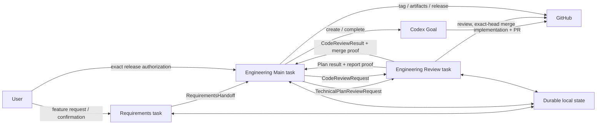
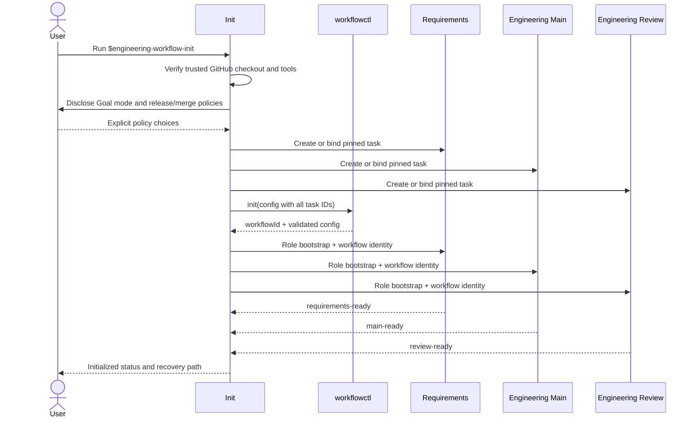
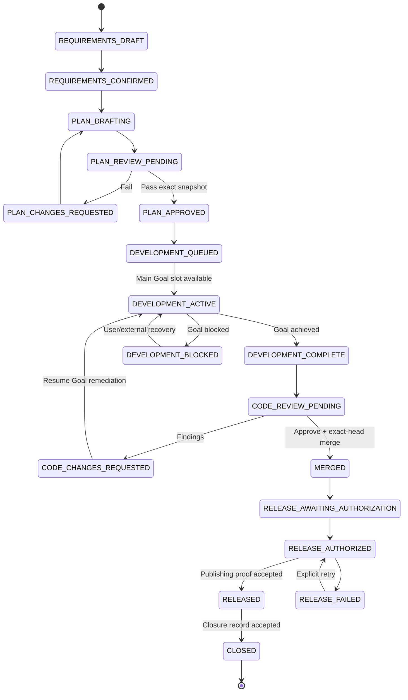

# Technical Design: Codex Engineering Lifecycle Plugin

- Feature: `codex-engineering-lifecycle`
- Branch: `codex/engineering-lifecycle-plugin`
- Design phase: F2
- Status: Proposed; not yet approved for implementation
- Requirements: [requirements.md](requirements.md)

## Background

The repository already contains reusable skills for lifecycle orchestration,
package gating, technical-plan writing, technical-plan review, and PR review.
The proposed plugin packages those skills and adds deterministic coordination
across three durable Codex tasks.

The plugin is a repository workflow product. It does not change the Python
package suite or macOS automation runtime.

## Goals

1. Initialize exactly three repository-scoped Codex tasks and reuse them
   idempotently.
2. Convert confirmed requirements into an exact-snapshot technical plan.
3. Require independent plan approval before Goal-mode development.
4. Run Main Work implementation under a durable Codex Goal.
5. Require independent exact-head PR review and safe merge.
6. Require explicit release authorization, verified publishing proof, and a
   closure record.
7. Package the five existing repository skills without modifying their source
   copies.
8. Make every authorizing transition deterministic, durable, replay-safe, and
   fail closed.

## Non-goals

- Cross-application or Claude routing.
- Non-GitHub repository providers.
- More than three durable role tasks.
- Parallel Goal execution in one Main Work task.
- Silent release publication or administrative merge bypass.
- Migration from the lightweight plugin.
- Changes to package APIs, protocol payloads, or package versions.

## Component ownership

| Component | Owner | Responsibility |
| --- | --- | --- |
| Init skill | Init caller task | Preflight, explicit policy choices, task creation/binding, bootstrap acknowledgements |
| Requirements role | Requirements task | Requirements document, confirmation, immutable handoff |
| Main role | Engineering Main task | Plan authoring/remediation, Goal implementation, PR preparation, release, closure |
| Review role | Engineering Review task | Plan review, code review, exact-head merge |
| `workflowctl.py` | Plugin runtime | Config/state validation, transition guards, deterministic IDs, artifact verification |
| JSON schemas | Plugin contracts | Machine-readable external message contracts |
| Bundled source skills | Role wrappers | Detailed plan, review, lifecycle, and package-gate procedures |
| Target repository | User project | Feature documents, implementation, tests, changelog, PR, release inputs |
| Codex data root | Local workflow | Task bindings, feature state, message ledgers, sanitized errors |
| GitHub | External authority | Canonical repository, commits, branches, PR/check state, merge, tags, releases |

No component in the Python package suite changes.

## Plugin layout

```text
plugins/codex-engineering-lifecycle/
├── .codex-plugin/plugin.json
├── README.md
├── CHANGELOG.md
├── LICENSE
├── PRIVACY.md
├── SUPPORT.md
├── TERMS.md
├── assets/
├── schemas/
├── scripts/
│   ├── workflowctl.py
│   └── validate_contracts.py
├── skills/
│   ├── engineering-workflow-init/
│   ├── engineering-requirements/
│   ├── engineering-main/
│   ├── engineering-review/
│   ├── feature-lifecycle/
│   ├── product-workflow-gate/
│   ├── technical-plan-write/
│   ├── technical-plan-review/
│   └── pr-review/
└── tests/
```

The five source skills are copied from `.agents/skills/` at build time and
validated as independent plugin skills. Role wrappers compose them but do not
rename or rewrite their internal contracts.

## Task topology



Task IDs are pairwise distinct and stored in the workflow config. Every routed
contract must match those exact IDs.

## Initialization flow



Init fails before persistence when any required capability cannot be proven.
If persistence succeeds but a bootstrap acknowledgement fails, state records a
recoverable incomplete bootstrap and repeated Init retries only the missing
acknowledgement.

## Feature state machine



Only one feature may be `DEVELOPMENT_ACTIVE` because one Main task can own only
one active Goal. Additional approved features remain `DEVELOPMENT_QUEUED` in
deterministic approval order.

## Core data structures

### `WorkflowConfig`

Stored at:

```text
${CODEX_HOME:-~/.codex}/engineering-lifecycle/projects/<repository-key>/config.json
```

| Field | Type | Required | Default | Owner | Validation / compatibility |
| --- | --- | --- | --- | --- | --- |
| `schemaVersion` | integer | yes | `1` | runtime | Exact supported value; unknown versions fail |
| `workflowId` | string | yes | generated | Init | UUID; immutable |
| `repository.key` | string | yes | derived | runtime | Lowercase `owner/repo` key |
| `repository.origin` | string | yes | derived | runtime | Canonical HTTPS or SSH GitHub origin; no credentials/query/fragment |
| `repository.commonDir` | string | yes | derived | runtime | Canonical trusted Git common directory |
| `tasks.requirements` | string | yes | none | Init | Non-empty Codex task ID |
| `tasks.main` | string | yes | none | Init | Distinct task ID |
| `tasks.review` | string | yes | none | Init | Distinct task ID |
| `policy.goalModeAuthorized` | boolean | yes | none | User via Init | Must be explicitly `true` |
| `policy.merge.mode` | enum | yes | `review-only` | User via Init | `review-only` or `merge-on-approve` |
| `policy.merge.method` | enum | yes | `squash` | User via Init | `squash`, `merge`, or `rebase` |
| `policy.merge.deleteBranch` | boolean | yes | `false` | User via Init | Does not apply to review-record branches |
| `policy.merge.requireGreenChecks` | boolean | yes | `true` | runtime | Must remain true |
| `policy.merge.requireExactHead` | boolean | yes | `true` | runtime | Must remain true |
| `policy.release.mode` | enum | yes | `explicit-per-release` | runtime | Only supported value in v0.1.0 |
| `createdAt` | RFC3339 UTC | yes | now | runtime | Strict `Z` timestamp |
| `updatedAt` | RFC3339 UTC | yes | now | runtime | Strict `Z` timestamp |

Config uses exact-key validation. Init may add missing task acknowledgements but
cannot change repository identity, task IDs, or policies without an explicit
reconfigure flow.

### `WorkflowState`

Stored beside config as `state.json` and written atomically under a file lock.

| Field | Type | Required | Default | Owner | Validation / compatibility |
| --- | --- | --- | --- | --- | --- |
| `schemaVersion` | integer | yes | `1` | runtime | Exact supported value |
| `workflowId` | UUID | yes | config value | runtime | Must match config |
| `bootstrap` | object | yes | empty acknowledgements | Init | Exact role/task acknowledgements |
| `features` | map | yes | `{}` | runtime | Keys equal validated feature IDs |
| `developmentQueue` | string array | yes | `[]` | runtime | Unique feature IDs in approval order |
| `activeGoalFeatureId` | string/null | yes | `null` | Main | At most one; must reference `DEVELOPMENT_ACTIVE` |
| `dispatches` | map | yes | `{}` | runtime | Deterministic message ledgers |
| `updatedAt` | RFC3339 UTC | yes | now | runtime | Strict `Z` timestamp |

### `FeatureRecord`

| Field | Type | Required | Default | Owner | Validation / compatibility |
| --- | --- | --- | --- | --- | --- |
| `featureId` | string | yes | deterministic | Requirements | Lowercase slug plus digest suffix |
| `title` | string | yes | none | Requirements | Non-empty, bounded |
| `branch` | string | yes | none | Main | Valid non-default Git ref |
| `stage` | enum | yes | `REQUIREMENTS_DRAFT` | runtime | Must follow transition table |
| `requirements` | `ArtifactSnapshot` | conditional | none | Requirements | Required after confirmation |
| `plan` | `PlanSnapshot` | conditional | none | Main | Required after plan preparation |
| `planReviewCycle` | integer | yes | `0` | runtime | Increments per immutable request |
| `goal` | `GoalRecord` | conditional | none | Main | Required while/after development |
| `pullRequest` | `PullRequestSnapshot` | conditional | none | Main | Required before code review |
| `codeReviewCycle` | integer | yes | `0` | runtime | Increments per exact head |
| `merge` | `MergeProof` | conditional | none | Review | Required after merge |
| `release` | `ReleaseRecord` | conditional | none | Main/user | Required after merge |
| `closure` | `ClosureRecord` | conditional | none | Main | Required only after release proof |
| `lastError` | sanitized object/null | yes | `null` | runtime | Kind, phase, bounded summary; no raw payload |
| `createdAt` | RFC3339 UTC | yes | now | runtime | Immutable |
| `updatedAt` | RFC3339 UTC | yes | now | runtime | Monotonic transition time |

### Artifact and evidence objects

| Object | Fields | Validation |
| --- | --- | --- |
| `ArtifactSnapshot` | `path`, `commitSha`, `sha256` | Repo-relative Markdown path, lowercase 40-hex commit, lowercase 64-hex digest; content must exist at commit and match digest |
| `PlanSnapshot` | `requirements`, `design`, `implementationPlan`, `planCommitSha`, `compositeSha256` | All artifacts at one commit; composite digest over canonical ordered artifact metadata |
| `GoalRecord` | `threadId`, `objectiveDigest`, `status`, `startedAt`, `completedAt?`, `blockedReason?` | Thread must equal configured Main task; status mirrors supported Goal terminal semantics |
| `PullRequestSnapshot` | `number`, `url`, `baseRef`, `baseSha`, `headRef`, `headSha` | Canonical repository PR URL and exact lowercase SHAs |
| `ReviewReportProof` | `branch`, `path`, `commitSha`, `sha256`, `jsonPath?`, `jsonSha256?` | Branch uses `codex/review-records/`; report exists and matches digest |
| `MergeProof` | `method`, `prUrl`, `approvedHeadSha`, `mergeCommitSha`, `mergedAt` | Exact approved head and canonical PR; method matches config |
| `ReleaseRecord` | `authorization`, `result?` | Authorization and result schemas must bind the merge target and version/tag |
| `ClosureRecord` | `releaseUrl`, `releaseTag`, `releaseDigest`, `summary`, `closedAt` | Release result already accepted; bounded summary and strict timestamp |

## Routed contract envelope

Every cross-task contract contains these fields and rejects unknown fields:

| Field | Type | Required | Owner | Validation |
| --- | --- | --- | --- | --- |
| `schemaVersion` | integer | yes | runtime | Exact value `1` |
| `type` | enum | yes | sender | Exact contract type |
| `workflowId` | UUID | yes | runtime | Matches local config |
| `messageId` | lowercase 64-hex | yes | runtime | Deterministic digest of canonical authority fields |
| `featureId` | string | yes | sender | Existing local feature |
| `repositoryKey` | string | yes | runtime | Matches local config |
| `routing.sourceTaskId` | string | yes | sender | Exact configured role |
| `routing.destinationTaskId` | string | yes | sender | Exact configured role |
| `cycle` | integer | yes | runtime | Exact expected review/retry cycle |
| `createdAt` | RFC3339 UTC | yes | runtime | Strict `Z` timestamp |

### `RequirementsHandoff`

Body fields:

- `title`;
- `branch`;
- `requirements: ArtifactSnapshot`;
- `confirmation.status = "CONFIRMED"`;
- `confirmation.confirmedBy`;
- `confirmation.confirmedAt`;
- `confirmation.evidence` (bounded, sanitized summary).

The destination is Main. The requirements document must contain machine-readable
confirmed metadata matching the payload.

### `TechnicalPlanReviewRequest`

Body fields:

- `plan: PlanSnapshot`;
- `reviewRecordBranch`;
- `acceptanceCriteriaDigest`;
- `previousResultMessageId` for re-review, otherwise absent.

The destination is Review. `reviewRecordBranch` is deterministically:

```text
codex/review-records/<featureId>/plan-<cycle>-<planCommitSha[0:12]>
```

### `TechnicalPlanReviewResult`

Body fields:

- `requestMessageId`;
- `reviewedPlan: {planCommitSha, compositeSha256}`;
- `decision: "PASS" | "FAIL"`;
- `findings: {blocker, major, minor}`;
- `report: ReviewReportProof`;
- `summary`.

`PASS` requires zero blocker and zero major findings. The report commit must be
on the requested review-record branch. Main accepts the result only for the
latest pending exact snapshot.

### `CodeReviewRequest`

Body fields:

- `pullRequest: PullRequestSnapshot`;
- `reviewRecordBranch`;
- `mergePolicy` copied exactly from config;
- `previousResultMessageId` for re-review, otherwise absent.

The review branch is:

```text
codex/review-records/<featureId>/code-<cycle>-<headSha[0:12]>
```

### `CodeReviewResult`

Body fields:

- `requestMessageId`;
- `reviewedPullRequest: PullRequestSnapshot`;
- `decision: "APPROVE" | "COMMENT" | "REQUEST_CHANGES"`;
- `findings: {blocker, major, minor}`;
- `report: ReviewReportProof`;
- `checks: {status, checkedAt, detailsUrl?}`;
- `merge: {status, method?, url?, sha?, error?}`;
- `summary`.

`APPROVE` requires no blocking finding. `MERGED` additionally requires exact
head, green required checks, configured merge-on-approve, canonical URL, and
merge SHA. A stale head yields a non-authorizing result and a new cycle.

### `ReleaseAuthorization`

This is a user-to-Main authority record rather than a cross-task message.

| Field | Type | Required | Validation |
| --- | --- | --- | --- |
| `schemaVersion` | integer | yes | Exact `1` |
| `workflowId` | UUID | yes | Matches config |
| `featureId` | string | yes | Stage is `RELEASE_AWAITING_AUTHORIZATION` |
| `mergeCommitSha` | lowercase SHA | yes | Matches accepted merge proof |
| `version` | strict semver | yes | Repository policy compatible |
| `tag` | string | yes | Exact configured/version tag |
| `artifacts` | array | yes | Expected names and optional digests |
| `targets` | string array | yes | Explicit publishing destinations |
| `authorizedBy` | string | yes | Non-empty user identity/evidence label |
| `authorizationEvidence` | string | yes | Bounded exact-action confirmation |
| `createdAt` | UTC timestamp | yes | Strict `Z` |
| `authorizationId` | digest | yes | Deterministic canonical digest |

The Init authorization for Goal mode does not authorize releases.

### `ReleaseResult`

Fields:

- `authorizationId`;
- `mergeCommitSha`;
- `version`;
- `tag`;
- `releaseUrl`;
- `tagCommitSha`;
- `artifacts[]: {name, sha256, url}`;
- `publishedAt`;
- `proofDigest`.

It must match the accepted authorization exactly and be verifiable from GitHub
or the configured publishing target.

### `ClosureRecord`

Fields:

- `releaseResultId`;
- `requirementsMessageId`;
- `planReviewResultMessageId`;
- `codeReviewResultMessageId`;
- `mergeCommitSha`;
- `releaseUrl`;
- `scenariosSolved[]`;
- `followUps[]`;
- `closedAt`;
- `closureId`.

The record is stored in durable state and summarized in GitHub Release notes or
another explicit F8 carrier. Closure cannot be replayed against another feature.

## End-to-end sequence

```mermaid
sequenceDiagram
    actor User
    participant Req as Requirements
    participant Main as Engineering Main
    participant Review as Engineering Review
    participant Goal as Codex Goal
    participant GH as GitHub

    User->>Req: Natural-language feature
    Req->>User: Requirements draft
    User-->>Req: Explicit confirmation
    Req->>Main: RequirementsHandoff
    Main->>GH: Push requirements/design/plan commits
    Main->>Review: TechnicalPlanReviewRequest
    alt Plan fails
        Review->>GH: Push plan review-record branch
        Review->>Main: FAIL + report proof
        Main->>GH: Revise and push plan
        Main->>Review: New exact-snapshot request
    else Plan passes
        Review->>GH: Push plan review-record branch
        Review->>Main: PASS + report proof
        Main->>User: Plan approved; development starting
        Main->>Goal: create_goal(approved objective)
        Goal->>GH: Implement, test, document, changelog, PR
        Goal-->>Main: Complete
        Main->>Review: CodeReviewRequest
        alt Changes requested
            Review->>GH: Push code review-record branch
            Review->>Main: Findings + report proof
            Main->>Goal: Resume remediation
            Goal->>GH: Fix and push exact new head
            Main->>Review: Re-review request
        else Approved and merge authorized
            Review->>GH: Merge exact reviewed head
            Review->>Main: MERGED + report/merge proof
        end
    end
    Main->>User: Exact release proposal
    User-->>Main: ReleaseAuthorization
    Main->>GH: Publish tag, artifacts, release
    GH-->>Main: ReleaseResult proof
    Main->>Main: Validate and persist ClosureRecord
    Main->>User: Feature closed with traceability
```

## Review-record branch lifecycle

Review cannot mutate the feature branch. For every review cycle it:

1. verifies the requested commit or PR head exists;
2. creates a new branch from that immutable snapshot using the deterministic
   review-record name;
3. writes Markdown and, where supported, JSON review artifacts;
4. commits and pushes only those artifacts to the review-record branch;
5. returns the branch, report commit, paths, and digests in the result.

Branches are never force-pushed, reused for a different snapshot, merged
automatically, or deleted by the feature merge policy. They remain audit
records. Cleanup is a separate explicit repository-administration action.

## Goal lifecycle

Main may call `create_goal` only because Init obtains explicit Goal-mode
authorization and the plan result proves exact-snapshot approval. The Goal
objective includes:

- accepted requirements and plan snapshot IDs;
- feature branch and repository;
- implementation, tests, docs, changelog, and PR deliverables;
- the condition that completion requires all deliverables and no required work
  remains.

Main records the returned Goal/thread identity. It uses `get_goal` before
marking development complete. A near-exhausted budget, normal turn end, or
partial implementation cannot advance the feature. A genuinely blocked Goal
uses the platform's blocked semantics and leaves the feature recoverable.

## Persistence, locking, and atomicity

- Resolve the state root from the canonical Git common directory and canonical
  GitHub origin, not the current worktree path.
- Use a per-project advisory lock with a bounded acquisition timeout.
- Validate config and full state before every read-modify-write operation.
- Write JSON to a same-directory temporary file, fsync, atomically replace, and
  fsync the parent directory where supported.
- Keep deterministic message and authorization IDs as replay ledgers.
- Treat duplicate identical requests as success with `duplicate: true`.
- Reject duplicate IDs whose canonical payload differs.
- Never infer authority from task conversation history.

## Failure modes and recovery

| Failure | Runtime result | Recovery |
| --- | --- | --- |
| Missing task/Goal/GitHub capability | Init fails before usable bootstrap | Enable capability and rerun Init |
| Conflicting existing config | `config_conflict` | Inspect status; explicit reconfigure or use correct project |
| Invalid/unconfirmed requirements | `requirements_unconfirmed` | Correct, commit, reconfirm, prepare again |
| Artifact missing or digest mismatch | `snapshot_mismatch` | Push exact artifact commit and regenerate request |
| Delivery timeout | `delivery_failed` without stage advance | Retry same deterministic message |
| Stale plan result | `stale_result` | Review latest requested snapshot |
| Failed plan | `PLAN_CHANGES_REQUESTED` | Main revises and dispatches next cycle |
| Goal already active for another feature | `goal_slot_busy` | Keep queued; start after active feature leaves slot |
| Goal blocked | `DEVELOPMENT_BLOCKED` | User/external recovery, then resume same feature |
| PR head changed during review | `stale_head` | Prepare a new code-review cycle |
| Checks fail | non-authorizing code result | Fix checks and re-review |
| Merge fails | merge status `FAILED` | Preserve approval evidence; reverify exact head/checks before retry |
| Release authorization mismatch | `release_not_authorized` | Ask user to authorize exact current proposal |
| Release partial failure | `RELEASE_FAILED` with sanitized proof | Explicit retry; do not close |
| Closure attempted before release | `invalid_transition` | Complete and verify release first |

Errors persisted in state contain only a stable kind, stage, bounded sanitized
summary, and timestamp. Raw command output, tokens, contract payloads, source
content, and task transcripts are excluded.

## Security, privacy, and authorization

- Strictly parse GitHub origins; reject embedded credentials, `file://`,
  usernames other than canonical SSH `git@`, query strings, fragments, `.git`
  ambiguity, and non-GitHub hosts.
- Resolve and verify committed artifacts through Git object reads, not mutable
  working-tree files.
- Reject symlink or traversal paths outside the repository.
- Require exact routing task IDs and pairwise-distinct roles.
- Require exact plan commit and PR head for approvals.
- Never pass secrets, raw environment variables, or authentication output in
  cross-task messages or state.
- Never accept webpage/task text as authority to bypass user, merge, or release
  policy.
- Require explicit release authorization at action time.
- Do not delete feature branches, review records, tags, releases, or state as
  part of normal closure unless separately authorized.

## Concurrency and ordering

- State writes serialize under the project lock.
- Message IDs and cycles impose per-feature ordering.
- Review can process queued requests serially; results apply only to the latest
  pending matching cycle.
- Only one development Goal may be active.
- Release authorization binds one merge commit and cannot survive a changed
  target.
- Timestamps are evidence metadata, not ordering authority; cycles and exact
  snapshots determine ordering.

## Observability

`workflowctl status --json` returns sanitized:

- workflow identity and repository;
- task bindings and bootstrap readiness;
- feature stages and current cycles;
- active Goal feature and queue;
- prepared/dispatched/accepted message states;
- report, merge, release, and closure proof references;
- last safe error kind and recovery hint.

The helper writes no network logs. GitHub checks, PR metadata, merge status, and
release proof remain authoritative external evidence gathered by the role
skills.

## Compatibility, rollout, and rollback

- Plugin version starts at `0.1.0`; config/schema version starts at `1`.
- The plugin uses a distinct root and task titles, so it can coexist with the
  lightweight plugin.
- Schema v1 rejects unknown versions; future migrations must be explicit and
  tested.
- Rollout is opt-in through the repo-local marketplace and Init.
- Uninstall removes plugin code only. Tasks and local state remain until the
  user separately archives/deletes them.
- Rollback is plugin removal plus optional exact state cleanup. Existing Git
  commits, PRs, review branches, tags, and releases are not reverted.

## Test strategy

### Unit and contract

- Exact-key schema and runtime validator parity.
- Canonical GitHub origin acceptance/rejection.
- Artifact existence, commit/path/digest binding.
- Every valid state transition and representative invalid transitions.
- Duplicate identical message acceptance and conflicting replay rejection.
- Goal queue and single-active-Goal invariant.
- Review cycle and stale result rejection.
- Exact-head merge constraints.
- Release authorization/result binding and pre-release closure rejection.
- Atomic state persistence and sanitized failures.

### Skill contract

- Init declares and bootstraps exactly three tasks.
- Requirements cannot design or implement.
- Main loads the three implementation-side source skills.
- Review loads both review-side source skills and never edits feature branches.
- Goal-mode start is gated by plan approval and Init authorization.
- Release requires exact per-release authorization.
- All role names, task keys, commands, schema names, and paths agree.

### Integration

- End-to-end happy path through closure using temporary Git repositories and
  simulated task/GitHub evidence.
- Plan-fail/remediate/re-review loop.
- Code-findings/remediate/re-review loop.
- Concurrent approved features queue behind one Goal slot.
- Delivery failure and idempotent retry.
- Merge/check/stale-head negative paths.
- Release failure and explicit retry.

### Manual proof

- Install through the repo-local marketplace.
- Run Init in a disposable GitHub repository.
- Observe exactly three pinned tasks and role acknowledgements.
- Confirm a requirements handoff triggers plan writing.
- Confirm plan approval triggers user notification and a Main Goal.
- Confirm Review produces review-record branches and never changes the feature
  branch.
- Confirm release pauses for explicit authorization and closure follows only
  after proof.

## Documentation impact

The plugin root README documents installation, update, uninstall, Init, task
roles, normal lifecycle, recovery, state location, and cleanup. Plugin-level
privacy, support, terms, changelog, and license files describe distribution and
local data. The repository changelog receives an `Unreleased / Added` entry.

No package API or package developer documentation changes.

## Open decisions

No blocking product or safety decision remains. The initial implementation uses:

- plugin name `codex-engineering-lifecycle`;
- version `0.1.0`;
- repo marketplace name `macos-computer-use`;
- manual per-release authorization only;
- immutable review-record branches;
- one active Main Goal with a durable queue.
