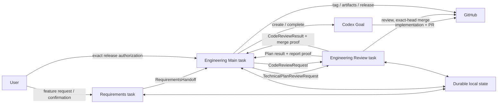
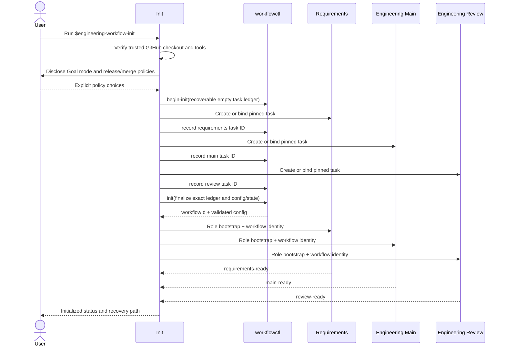
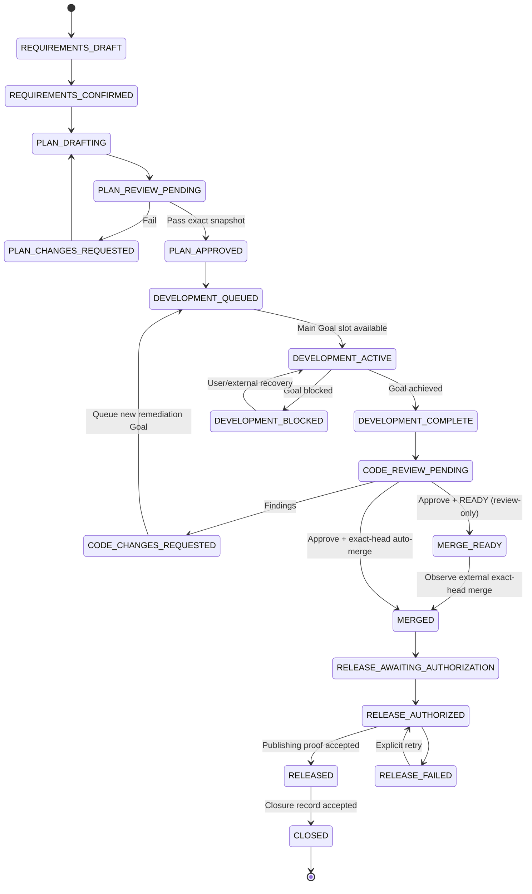

# Technical Design: Codex Engineering Lifecycle Plugin

- Feature: `codex-engineering-lifecycle`
- Branch: `codex/engineering-lifecycle-plugin`
- Design phase: F2
- Status: Proposed; not yet approved for implementation
- Requirements: [requirements.md](requirements.md)

## Background

The repository already contains reusable skills for lifecycle orchestration,
package gating, technical-plan writing, technical-plan review, and PR review.
The proposed plugin packages those skills and adds deterministic coordination
across three durable Codex tasks.

The plugin is a repository workflow product. It does not change the Python
package suite or macOS automation runtime.

## Goals

1. Initialize exactly three repository-scoped Codex tasks and reuse them
   idempotently.
2. Convert confirmed requirements into an exact-snapshot technical plan.
3. Require independent plan approval before Goal-mode development.
4. Run Main Work implementation under a durable Codex Goal.
5. Require independent exact-head PR review and safe merge.
6. Require explicit release authorization, verified publishing proof, and a
   closure record.
7. Package the five existing repository skills without modifying their source
   copies.
8. Make every authorizing transition deterministic, durable, replay-safe, and
   fail closed.

## Non-goals

- Cross-application or Claude routing.
- Non-GitHub repository providers.
- More than three durable role tasks.
- Parallel Goal execution in one Main Work task.
- Silent release publication or administrative merge bypass.
- Migration from the lightweight plugin.
- Changes to package APIs, protocol payloads, or package versions.

## Component ownership

| Component | Owner | Responsibility |
| --- | --- | --- |
| Init skill | Init caller task | Preflight, explicit policy choices, task creation/binding, bootstrap acknowledgements |
| Requirements role | Requirements task | Requirements document, confirmation, immutable handoff |
| Main role | Engineering Main task | Plan authoring/remediation, Goal implementation, PR preparation, release, closure |
| Review role | Engineering Review task | Plan review, code review, exact-head merge |
| `workflowctl.py` | Plugin runtime | Config/state validation, transition guards, deterministic IDs, artifact verification |
| JSON schemas | Plugin contracts | Machine-readable external message contracts |
| Bundled source skills | Role wrappers | Detailed plan, review, lifecycle, and package-gate procedures |
| Target repository | User project | Feature documents, implementation, tests, changelog, PR, release inputs |
| Codex data root | Local workflow | Task bindings, feature state, message ledgers, sanitized errors |
| GitHub | External authority | Canonical repository, commits, branches, PR/check state, merge, tags, releases |

No component in the Python package suite changes.

## Plugin layout

```text
plugins/codex-engineering-lifecycle/
├── .codex-plugin/plugin.json
├── README.md
├── CHANGELOG.md
├── LICENSE
├── PRIVACY.md
├── SUPPORT.md
├── TERMS.md
├── assets/
├── schemas/
├── scripts/
│   ├── workflowctl.py
│   └── validate_contracts.py
├── skills/
│   ├── engineering-workflow-init/
│   ├── engineering-requirements/
│   ├── engineering-main/
│   ├── engineering-review/
│   ├── feature-lifecycle/
│   ├── product-workflow-gate/
│   ├── technical-plan-write/
│   ├── technical-plan-review/
│   └── pr-review/
└── tests/
```

The five source skills are copied from `.agents/skills/` at build time and
validated as independent plugin skills. Their `SKILL.md` and referenced runtime
resources remain byte-identical. Their packaged `agents/openai.yaml` receives
one intentional metadata overlay:

```yaml
policy:
  allow_implicit_invocation: false
```

This keeps all five directly usable through explicit `$skill-name` invocation
while preventing role tasks from triggering composition skills outside their
wrapper. Tests allow only that semantic metadata difference. The four role
wrappers remain implicitly invocable. Regardless of skill invocation, only
`workflowctl` can authorize a state transition, and it requires the configured
source task ID.

## Task topology



Task IDs are pairwise distinct and stored in the workflow config. Every routed
contract must match those exact IDs.

## Initialization flow



Init writes `init-pending.json` before creating any task and records each
returned ID immediately. Interrupted Init therefore resumes from recorded roles
instead of recreating tasks. A config-written/state-missing crash window is
reconstructed with the same workflow ID and task/policy binding. Each role has
a bootstrap-only exception to emit strict `EngineeringRoleReady` JSON before
global readiness; runtime rejects feature work until all three acknowledgements
are durable.

## Feature state machine



Only one feature may be `DEVELOPMENT_ACTIVE` because one Main task can own only
one active Goal. Additional approved or remediation features remain
`DEVELOPMENT_QUEUED` in deterministic queue-entry order. Every transition from
the queue into active development creates a new immutable `GoalRun`; a completed
Goal is never reopened.

## Core data structures

### `WorkflowConfig`

Stored at:

```text
${CODEX_HOME:-~/.codex}/engineering-lifecycle/projects/<repository-key>/config.json
```

Before finalization, the same directory contains an exact-key
`init-pending.json` with repository identity, workflow ID, policy, and the
incrementally recorded task map. Finalization removes it only after both config
and state validate.

| Field | Type | Required | Default | Owner | Validation / compatibility |
| --- | --- | --- | --- | --- | --- |
| `schemaVersion` | integer | yes | `1` | runtime | Exact supported value; unknown versions fail |
| `workflowId` | string | yes | generated | Init | UUID; immutable |
| `repository.key` | string | yes | derived | runtime | Lowercase `owner/repo` key |
| `repository.origin` | string | yes | derived | runtime | Canonical HTTPS or SSH GitHub origin; no credentials/query/fragment |
| `repository.commonDir` | string | yes | derived | runtime | Canonical trusted Git common directory |
| `tasks.requirements` | string | yes | none | Init | Non-empty Codex task ID |
| `tasks.main` | string | yes | none | Init | Distinct task ID |
| `tasks.review` | string | yes | none | Init | Distinct task ID |
| `policy.goalModeAuthorized` | boolean | yes | none | User via Init | Must be explicitly `true` |
| `policy.merge.mode` | enum | yes | `review-only` | User via Init | `review-only` or `merge-on-approve` |
| `policy.merge.method` | enum | yes | `squash` | User via Init | `squash`, `merge`, or `rebase` |
| `policy.merge.deleteBranch` | boolean | yes | `false` | User via Init | Does not apply to review-record branches |
| `policy.merge.requireGreenChecks` | boolean | yes | `true` | runtime | Must remain true |
| `policy.merge.requireExactHead` | boolean | yes | `true` | runtime | Must remain true |
| `policy.release.mode` | enum | yes | `explicit-per-release` | runtime | Only supported value in v0.1.0 |
| `createdAt` | RFC3339 UTC | yes | now | runtime | Strict `Z` timestamp |
| `updatedAt` | RFC3339 UTC | yes | now | runtime | Strict `Z` timestamp |

Config uses exact-key validation. Init may add missing task acknowledgements but
cannot change repository identity, task IDs, or policies without an explicit
reconfigure flow.

### `WorkflowState`

Stored beside config as `state.json` and written atomically under a file lock.

| Field | Type | Required | Default | Owner | Validation / compatibility |
| --- | --- | --- | --- | --- | --- |
| `schemaVersion` | integer | yes | `2` | runtime | v1 is migrated once under the state lock; unknown/newer versions fail |
| `workflowId` | UUID | yes | config value | runtime | Must match config |
| `bootstrap` | object | yes | empty acknowledgements | Init | Exact role/task acknowledgements |
| `features` | map | yes | `{}` | runtime | Keys equal validated feature IDs |
| `developmentQueue` | string array | yes | `[]` | runtime | Unique feature IDs in approval order |
| `activeGoal` | object/null | yes | `null` | Main | `{featureId, goalRunId}`; at most one and must reference the single ACTIVE or BLOCKED run occupying the slot |
| `dispatches` | map | yes | `{}` | runtime | Deterministic message ledgers |
| `updatedAt` | RFC3339 UTC | yes | now | runtime | Strict `Z` timestamp |

### `FeatureRecord`

| Field | Type | Required | Default | Owner | Validation / compatibility |
| --- | --- | --- | --- | --- | --- |
| `featureId` | string | yes | deterministic | Requirements | Lowercase slug plus digest suffix |
| `title` | string | yes | none | Requirements | Non-empty, bounded |
| `branch` | string | yes | none | Main | Valid non-default Git ref |
| `stage` | enum | yes | `REQUIREMENTS_DRAFT` | runtime | Must follow transition table |
| `requirements` | `ArtifactSnapshot` | conditional | none | Requirements | Required after confirmation |
| `plan` | `PlanSnapshot` | conditional | none | Main | Required after plan preparation |
| `planReviewCycle` | integer | yes | `0` | runtime | Increments per immutable request |
| `goalRuns` | `GoalRun` array | yes | `[]` | Main | Ordered immutable run ledger; at most one ACTIVE/BLOCKED slot occupant |
| `pullRequest` | `PullRequestSnapshot` | conditional | none | Main | Required before code review |
| `codeReviewCycle` | integer | yes | `0` | runtime | Increments per exact head |
| `merge` | `MergeProof` | conditional | none | Review | Required after merge |
| `release` | `ReleaseRecord` | conditional | none | Main/user | Required after merge |
| `closure` | `ClosureRecord` | conditional | none | Main | Required only after release proof |
| `lastError` | sanitized object/null | yes | `null` | runtime | Kind, phase, bounded summary; no raw payload |
| `createdAt` | RFC3339 UTC | yes | now | runtime | Immutable |
| `updatedAt` | RFC3339 UTC | yes | now | runtime | Monotonic transition time |

### Artifact and evidence objects

| Object | Fields | Validation |
| --- | --- | --- |
| `ArtifactSnapshot` | `path`, `commitSha`, `sha256` | Repo-relative Markdown path, lowercase 40-hex commit, lowercase 64-hex digest; content must exist at commit and match digest |
| `PlanSnapshot` | `requirements`, `design`, `implementationPlan`, `planCommitSha`, `compositeSha256` | All artifacts at one commit; composite digest over canonical ordered artifact metadata |
| `GoalRun` | `goalRunId`, `purpose`, `reviewCycle`, `threadId`, `authorityMessageId`, `objectiveDigest`, `status`, `startedAt`, `completedAt?`, `blockedReason?`, `usage?` | Deterministic run ID; purpose is `INITIAL_IMPLEMENTATION` or `CODE_REMEDIATION`; thread equals Main; one ACTIVE or BLOCKED run occupies the global slot |
| `PullRequestSnapshot` | `number`, `url`, `baseRef`, `baseSha`, `headRef`, `headSha` | Canonical repository PR URL and exact lowercase SHAs |
| `ReviewReportProof` | `branch`, `path`, `commitSha`, `sha256`, `jsonPath?`, `jsonSha256?` | Branch uses `codex/review-records/`; report exists and matches digest |
| `MergeProof` | `method`, `prUrl`, `approvedHeadSha`, `mergeCommitSha`, `mergedAt` | Exact approved head and canonical PR; method matches config |
| `ReleaseRecord` | `authorization`, `result?`, `lastSubmission?`, `submissions?` | Authorization, cumulative result, the exact last accepted submission, and ordered immutable submission history must bind the merge target and version/tag |
| `ClosureRecord` | `releaseTargets`, `releaseTag`, `releaseDigest`, `summary`, `closedAt` | Every authorized release target succeeded; bounded summary and strict timestamp |

## Routed contract envelope

Every cross-task contract contains these fields and rejects unknown fields:

| Field | Type | Required | Owner | Validation |
| --- | --- | --- | --- | --- |
| `schemaVersion` | integer | yes | runtime | Exact value `1` |
| `type` | enum | yes | sender | Exact contract type |
| `workflowId` | UUID | yes | runtime | Matches local config |
| `messageId` | lowercase 64-hex | yes | runtime | Deterministic digest of canonical authority fields |
| `featureId` | string | yes | sender | Existing local feature |
| `repositoryKey` | string | yes | runtime | Matches local config |
| `routing.sourceTaskId` | string | yes | sender | Exact configured role |
| `routing.destinationTaskId` | string | yes | sender | Exact configured role |
| `cycle` | integer | yes | runtime | Exact expected review/retry cycle |
| `createdAt` | RFC3339 UTC | yes | runtime | Strict `Z` timestamp |

### `RequirementsHandoff`

Body fields:

- `title`;
- `branch`;
- `requirements: ArtifactSnapshot`;
- `confirmation.status = "CONFIRMED"`;
- `confirmation.confirmedBy`;
- `confirmation.confirmedAt`;
- `confirmation.evidence` (bounded, sanitized summary).

The destination is Main. The requirements document must contain machine-readable
confirmed metadata matching the payload. Its path is exactly
`docs/feature/<feature-slug>/requirements.md`, its branch is exactly
`codex/<feature-slug>`, and the commit must be the authoritative `origin` branch
tip.

### `TechnicalPlanReviewRequest`

Body fields:

- `plan: PlanSnapshot`;
- `reviewRecordBranch`;
- `acceptanceCriteriaDigest`;
- `previousResultMessageId` for re-review, otherwise absent. Cycle 2+ requires
  the exact latest plan result; cycle 1 rejects it.

The destination is Review. `reviewRecordBranch` is deterministically:

```text
codex/review-records/<featureId>/plan-<cycle>-<planCommitSha[0:12]>
```

### `TechnicalPlanReviewResult`

Body fields:

- `requestMessageId`;
- `reviewedPlan: {planCommitSha, compositeSha256}`;
- `decision: "PASS" | "FAIL"`;
- `findings: {blocker, major, minor}`;
- `report: ReviewReportProof`;
- `summary`.

`PASS` requires zero blocker and zero major findings. The report commit must be
on the requested review-record branch. Main accepts the result only for the
latest pending exact snapshot.

### `CodeReviewRequest`

Body fields:

- `pullRequest: PullRequestSnapshot`;
- `reviewRecordBranch`;
- `mergePolicy` copied exactly from config;
- `previousResultMessageId` for re-review, otherwise absent. Cycle 2+ requires
  the exact latest code result; cycle 1 rejects it.

The review branch is:

```text
codex/review-records/<featureId>/code-<cycle>-<headSha[0:12]>
```

### `CodeReviewResult`

Body fields:

- `requestMessageId`;
- `reviewedPullRequest: PullRequestSnapshot`;
- `decision: "APPROVE" | "COMMENT" | "REQUEST_CHANGES"`;
- `findings: {blocker, major, minor}`;
- `report: ReviewReportProof`;
- `checks: {status, checkedAt, detailsUrl?}`;
- `merge: {status, method?, url?, sha?, error?}`;
- `summary`.

`APPROVE` requires no blocking finding. `READY`, `MERGED`, and merge `FAILED`
all require `APPROVE` plus green required checks. `READY` is valid only under
review-only; merge `FAILED` is valid only after a merge-on-approve attempt.
`NOT_REQUESTED` cannot accompany approval, and `STALE` requires a
non-authorizing `COMMENT`. An automatic `MERGED` additionally requires exact
head, configured merge-on-approve, canonical URL, and merge SHA.

For `review-only`, the initial exact-head approval returns `READY` without
merging. After a separately authorized merge owner acts, Review may return an
observed `MERGED` proof for the same request/report only when the prior
APPROVE/passing-checks/READY result is already applied. This records external
fact without granting Review automatic merge authority.

### `GoalRun`

A feature has one initial implementation run and zero or more remediation runs.

| Field | Type | Required | Validation |
| --- | --- | --- | --- |
| `goalRunId` | lowercase 64-hex | yes | Digest of workflow, feature, purpose, review cycle, and authority message |
| `purpose` | enum | yes | `INITIAL_IMPLEMENTATION` or `CODE_REMEDIATION` |
| `reviewCycle` | integer | yes | `0` for initial; exact code-review cycle for remediation |
| `threadId` | string | yes | Configured Main task |
| `authorityMessageId` | digest | yes | PASS plan result for initial; REQUEST_CHANGES code result for remediation |
| `objectiveDigest` | digest | yes | Digest of the exact Goal objective shown to the platform |
| `status` | enum | yes | `PREPARED`, `ACTIVE`, `COMPLETE`, or `BLOCKED` |
| `startedAt` | UTC timestamp | conditional | Required for ACTIVE or later |
| `completedAt` | UTC timestamp | conditional | Required only for COMPLETE |
| `blockedReason` | string | conditional | Required only for BLOCKED; sanitized and bounded |
| `usage` | object | optional | Sanitized final token/time evidence returned by the Goal tool |

`start-development` creates or reuses the deterministic PREPARED run, then
records the platform-created Goal as ACTIVE. Replaying either prepare or
activate after response loss returns the same run with `duplicate: true` and
preserves timestamps. `complete-development` requires authoritative Goal status
COMPLETE. A code-review changes result enqueues a new `CODE_REMEDIATION` run; it
never mutates or resumes the completed initial run.

### `ReleaseAuthorization`

This is a user-to-Main authority record rather than a cross-task message.

| Field | Type | Required | Validation |
| --- | --- | --- | --- |
| `schemaVersion` | integer | yes | Exact `1` |
| `workflowId` | UUID | yes | Matches config |
| `featureId` | string | yes | Stage is `RELEASE_AWAITING_AUTHORIZATION` |
| `mergeCommitSha` | lowercase SHA | yes | Matches accepted merge proof |
| `version` | strict semver | yes | Repository policy compatible |
| `tag` | string | yes | Exact configured/version tag |
| `targets` | `ReleaseTarget` array | yes | Non-empty, unique target IDs, sorted canonically |
| `authorizedBy` | string | yes | Non-empty user identity/evidence label |
| `authorizationEvidence` | string | yes | Bounded exact-action confirmation |
| `createdAt` | UTC timestamp | yes | Strict `Z` |
| `authorizationId` | digest | yes | Deterministic canonical digest |

The Init authorization for Goal mode does not authorize releases.

### `ReleaseTarget`

Every target includes:

| Field | Type | Required | Validation |
| --- | --- | --- | --- |
| `targetId` | lowercase 64-hex | yes | Digest of the canonical target object without `targetId` |
| `kind` | enum | yes | `GITHUB_RELEASE` or `PYPI` |
| `artifacts` | array | yes | Non-empty exact `{name, sha256}` records; names unique |

`GITHUB_RELEASE` additionally requires `repositoryKey` equal to the workflow
repository, exact `tag`, and exact `releaseName`.

`PYPI` additionally requires `repository` equal to `PYPI` or `TEST_PYPI`,
normalized `projectName`, and strict-semver `version`.

Targets are closed in v0.1.0. A future target kind requires a schema/config
version update rather than a free-form string.

### `ReleaseResult`

Fields:

- `authorizationId`;
- `mergeCommitSha`;
- `version`;
- `tag`;
- `targets: ReleaseTargetResult[]`;
- `publishedAt`;
- `proofDigest`.

Every target result contains:

| Field | Type | Required | Validation |
| --- | --- | --- | --- |
| `targetId` | digest | yes | Matches exactly one authorized target |
| `kind` | enum | yes | Matches that target |
| `status` | enum | yes | `PUBLISHED` or `FAILED` |
| `artifacts` | array | conditional | Required for PUBLISHED; names/digests exactly match authorization and include canonical URLs |
| `publishedAt` | UTC timestamp | conditional | Required for PUBLISHED |
| `error` | string | conditional | Required for FAILED; sanitized and bounded |

A published GitHub result additionally contains `releaseUrl` and
`tagCommitSha`. A published PyPI result additionally contains `projectUrl`,
`repository`, `projectName`, and `version`. Result target IDs must be an exact
set match for authorization targets. The overall result is successful only
when every target status is PUBLISHED and every artifact digest matches.
Every state load re-normalizes the authorization and result, requires their
target sets to match exactly, and revalidates destination URLs, target identity,
artifacts, authorization ID, and proof digest. The runtime stores the exact last
accepted submission beside the cumulative result. A retry after `RELEASED` is
idempotent only when it exactly matches that last submission or the complete
cumulative result; an arbitrary successful subset is a replay conflict.
Every accepted initial result and failed-target retry is appended to an ordered
submission history. The first entry must cover every authorized target; each
later entry must cover exactly the preceding failed target set; target IDs and
submission digests are unique; folding the history must reconstruct the
cumulative result; and `lastSubmission` must equal the final history entry.
`RELEASE_FAILED` must contain a failed authorized target; `RELEASED` must
contain every authorized target as PUBLISHED.

Stage validation is bidirectional: proof required by a stage must be present,
and proof from a future stage must be absent. Merge proof is legal only from
`MERGED` onward, release proof only from `RELEASE_AUTHORIZED` onward, and closure
proof only at `CLOSED`. A damaged state cannot be made authoritative merely by
moving its stage backward.

### `ClosureRecord`

Fields:

- `releaseResultId`;
- `requirementsMessageId`;
- `planReviewResultMessageId`;
- `codeReviewResultMessageId`;
- `mergeCommitSha`;
- `releaseTargets[]`;
- `scenariosSolved[]`;
- `followUps[]`;
- `closedAt`;
- `closureId`.

The record is stored in durable state and summarized in GitHub Release notes or
another explicit F8 carrier. `releaseTargets` references every successful
authorized target and must equal the cumulative release-result target list
exactly. Closure cannot be replayed against another feature and is rejected if
any target is missing, foreign, failed, or digest-mismatched.

## End-to-end sequence

```mermaid
sequenceDiagram
    actor User
    participant Req as Requirements
    participant Main as Engineering Main
    participant Review as Engineering Review
    participant Goal as Codex Goal
    participant GH as GitHub

    User->>Req: Natural-language feature
    Req->>User: Requirements draft
    User-->>Req: Explicit confirmation
    Req->>Main: RequirementsHandoff
    Main->>GH: Push requirements/design/plan commits
    Main->>Review: TechnicalPlanReviewRequest
    alt Plan fails
        Review->>GH: Push plan review-record branch
        Review->>Main: FAIL + report proof
        Main->>GH: Revise and push plan
        Main->>Review: New exact-snapshot request
    else Plan passes
        Review->>GH: Push plan review-record branch
        Review->>Main: PASS + report proof
        Main->>User: Plan approved; development starting
        Main->>Goal: create_goal(approved objective)
        Goal->>GH: Implement, test, document, changelog, PR
        Goal-->>Main: Complete
        Main->>Review: CodeReviewRequest
        alt Changes requested
            Review->>GH: Push code review-record branch
            Review->>Main: Findings + report proof
            Main->>Goal: Create new CODE_REMEDIATION GoalRun
            Goal->>GH: Fix and push exact new head
            Main->>Review: Re-review request
        else Approved and merge authorized
            Review->>GH: Merge exact reviewed head
            Review->>Main: MERGED + report/merge proof
        end
    end
    Main->>User: Exact release proposal
    User-->>Main: ReleaseAuthorization
    loop Every authorized release target
        Main->>GH: Publish exact artifacts
        GH-->>Main: Per-target digest-bound proof
    end
    Main->>Main: Accept result only if all targets succeeded
    Main->>Main: Validate and persist ClosureRecord
    Main->>User: Feature closed with traceability
```

## Review-record branch lifecycle

Review cannot mutate the feature branch. For every review cycle it:

1. verifies the requested commit or PR head exists;
2. computes the deterministic review-record branch and report paths;
3. when the branch is absent, creates it from the immutable snapshot;
4. when the branch already exists for the same recorded request, verifies its
   base, report commit, paths, and digests and reuses the existing proof;
5. rejects an existing unrecorded branch, wrong base, changed report, or
   unexpected tip as `review_record_conflict`;
6. writes Markdown and, where supported, JSON review artifacts;
7. commits and pushes only those artifacts to the review-record branch without
   force;
8. persists the report commit/digests in local state before message delivery;
9. returns the immutable proof in the result.

Branches are never force-pushed, reused for a different snapshot, merged
automatically, or deleted by the feature merge policy. They remain audit
records. Cleanup is a separate explicit repository-administration action.

## Goal lifecycle

Main may call `create_goal` only because Init obtains explicit Goal-mode
authorization and a plan/code result proves an exact authorizing snapshot.
Each `GoalRun` objective includes:

- accepted requirements and plan snapshot IDs;
- feature branch and repository;
- implementation, tests, docs, changelog, and PR deliverables;
- the condition that completion requires all deliverables and no required work
  remains.

For `INITIAL_IMPLEMENTATION`, the authority is the accepted plan PASS. For
`CODE_REMEDIATION`, the authority is the exact REQUEST_CHANGES result and its
review cycle. Main records the returned Goal/thread identity and uses
`get_goal` before marking that run complete. A near-exhausted budget, normal
turn end, or partial implementation cannot advance the feature. A genuinely
blocked Goal uses the platform's blocked semantics and leaves that run
recoverable. Complete runs are immutable and never resumed.

## Persistence, locking, and atomicity

- Resolve the state root from the canonical Git common directory and canonical
  GitHub origin, not the current worktree path.
- Use a per-project advisory lock with a bounded acquisition timeout.
- Validate config and full state before every read-modify-write operation.
- Write JSON to a same-directory temporary file, fsync, atomically replace, and
  fsync the parent directory where supported.
- Keep deterministic message and authorization IDs as replay ledgers.
- Treat duplicate identical requests as success with `duplicate: true`.
- Reject duplicate IDs whose canonical payload differs.
- Never infer authority from task conversation history.

## Failure modes and recovery

| Failure | Runtime result | Recovery |
| --- | --- | --- |
| Missing task/Goal/GitHub capability | Init fails before usable bootstrap | Enable capability and rerun Init |
| Interrupted task creation | Pending Init ledger reports recorded/missing roles | Reuse recorded IDs; create only an unrecorded role |
| Config written but state missing | `recoveryRequired` status | Finalize Init with the exact recorded IDs/policy |
| Conflicting existing config | `config_conflict` | Inspect status; explicit reconfigure or use correct project |
| Invalid/unconfirmed requirements | `requirements_unconfirmed` | Correct, commit, reconfirm, prepare again |
| Artifact missing or digest mismatch | `snapshot_mismatch` | Push exact artifact commit and regenerate request |
| Delivery timeout | `delivery_failed` without stage advance | Retry same deterministic message |
| Stale plan result | `stale_result` | Review latest requested snapshot |
| Failed plan | `PLAN_CHANGES_REQUESTED` | Main revises and dispatches next cycle |
| Goal already active for another feature/run | `goal_slot_busy` | Keep queued; start after active run leaves slot |
| Goal blocked | `DEVELOPMENT_BLOCKED` | User/external recovery, then resume same feature |
| PR head changed during review | `stale_head` | Prepare a new code-review cycle |
| Checks fail | non-authorizing code result | Fix checks and re-review |
| Merge fails | merge status `FAILED` | Preserve approval evidence; reverify exact head/checks before retry |
| Release authorization mismatch | `release_not_authorized` | Ask user to authorize exact current proposal |
| Release target partial failure | `RELEASE_FAILED` with per-target sanitized proof | Explicit retry of exact failed target(s); do not close |
| Closure attempted before release | `invalid_transition` | Complete and verify release first |

Errors persisted in state contain only a stable kind, stage, bounded sanitized
summary, and timestamp. Raw command output, tokens, contract payloads, source
content, and task transcripts are excluded.

## Security, privacy, and authorization

- Strictly parse GitHub origins; reject embedded credentials, `file://`,
  usernames other than canonical SSH `git@`, query strings, fragments, `.git`
  ambiguity, and non-GitHub hosts.
- Resolve and verify committed artifacts through Git object reads, not mutable
  working-tree files.
- Reject symlink or traversal paths outside the repository.
- Require exact routing task IDs and pairwise-distinct roles.
- Require exact plan commit and PR head for approvals.
- Never pass secrets, raw environment variables, or authentication output in
  cross-task messages or state.
- Never accept webpage/task text as authority to bypass user, merge, or release
  policy.
- Require explicit release authorization at action time.
- Do not delete feature branches, review records, tags, releases, or state as
  part of normal closure unless separately authorized.

## Concurrency and ordering

- State writes serialize under the project lock.
- Message IDs and cycles impose per-feature ordering.
- Review can process queued requests serially; results apply only to the latest
  pending matching cycle.
- Only one GoalRun may be ACTIVE; completed runs are immutable.
- Release authorization binds one merge commit, typed target set, and artifact
  digests and cannot survive a changed target or artifact.
- Timestamps are evidence metadata, not ordering authority; cycles and exact
  snapshots determine ordering.

## Observability

`workflowctl status --json` returns sanitized:

- workflow identity and repository;
- task bindings and bootstrap readiness;
- feature stages and current cycles;
- active GoalRun and queue;
- prepared/dispatched/accepted message states;
- report, merge, release, and closure proof references;
- last safe error kind and recovery hint.

The helper writes no network logs. GitHub checks, PR metadata, merge status, and
release proof remain authoritative external evidence gathered by the role
skills.

## Compatibility, rollout, and rollback

- Plugin version starts at `0.1.0`; config and routed-contract schemas start at
  `1`; local workflow state starts at `2`.
- The plugin uses a distinct root and task titles, so it can coexist with the
  lightweight plugin.
- State schema v1 is deterministically migrated under the state lock and
  atomically persisted as v2. The migration reconstructs release submission
  history from the v1 cumulative result and last submission. Unknown/newer
  versions fail; future migrations must be explicit and tested.
- Rollout is opt-in through the repo-local marketplace and Init.
- Uninstall removes plugin code only. Tasks and local state remain until the
  user separately archives/deletes them.
- Rollback is plugin removal plus optional exact state cleanup. Existing Git
  commits, PRs, review branches, tags, and releases are not reverted.

## Test strategy

### Unit and contract

- Exact-key schema and runtime validator parity.
- Canonical GitHub origin acceptance/rejection.
- Artifact existence, commit/path/digest binding.
- Every valid state transition and representative invalid transitions.
- Duplicate identical message acceptance and conflicting replay rejection.
- GoalRun queue, single-active invariant, remediation creation, and terminal
  immutability.
- Review cycle and stale result rejection.
- Exact-head merge constraints.
- Release authorization/result binding, exact typed target sets, partial
  failure, and pre-release closure rejection.
- Atomic state persistence and sanitized failures.

### Skill contract

- Init declares and bootstraps exactly three tasks.
- Requirements cannot design or implement.
- Main explicitly loads the three implementation-side source skills.
- Review explicitly loads both review-side source skills and never edits
  feature branches.
- All five composition skills are explicit-only in packaged metadata.
- Goal-mode start is gated by plan approval and Init authorization.
- Release requires exact per-release authorization.
- All role names, task keys, commands, schema names, and paths agree.

### Integration

- End-to-end happy path through closure using temporary Git repositories and
  simulated task/GitHub evidence.
- Plan-fail/remediate/re-review loop.
- Code-findings/new-remediation-Goal/re-review loop.
- Concurrent approved/remediation features queue behind one GoalRun slot.
- Delivery failure and idempotent retry.
- Merge/check/stale-head negative paths.
- Partial multi-target release failure and explicit retry.
- Identical review-record retry and conflicting existing-branch rejection.

### Manual proof

- Install through the repo-local marketplace.
- Run Init in a disposable GitHub repository.
- Observe exactly three pinned tasks and role acknowledgements.
- Confirm a requirements handoff triggers plan writing.
- Confirm plan approval triggers user notification and a Main Goal.
- Confirm Review produces review-record branches and never changes the feature
  branch.
- Confirm release pauses for explicit authorization and closure follows only
  after proof.

## Documentation impact

The plugin root README documents installation, update, uninstall, Init, task
roles, normal lifecycle, recovery, state location, and cleanup. Plugin-level
privacy, support, terms, changelog, and license files describe distribution and
local data. The repository changelog receives an `Unreleased / Added` entry.

No package API or package developer documentation changes.

## Open decisions

No blocking product or safety decision remains. The initial implementation uses:

- plugin name `codex-engineering-lifecycle`;
- version `0.1.0`;
- repo marketplace name `macos-computer-use`;
- manual per-release authorization only;
- typed GitHub Release and PyPI targets with required artifact digests;
- immutable review-record branches;
- one active GoalRun with a durable queue;
- explicit-only invocation for the five composition skills.
