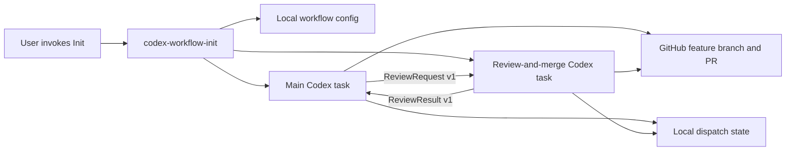
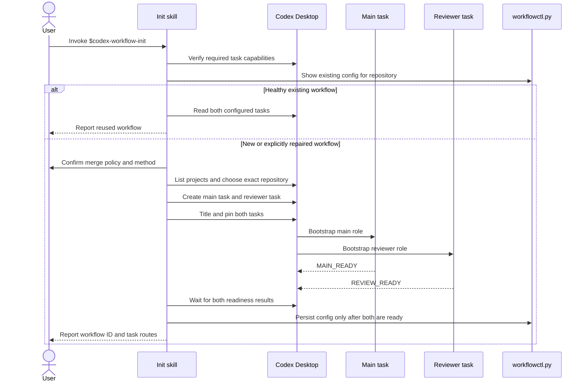
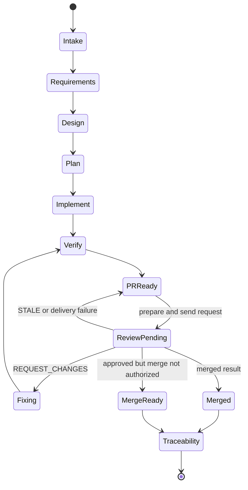
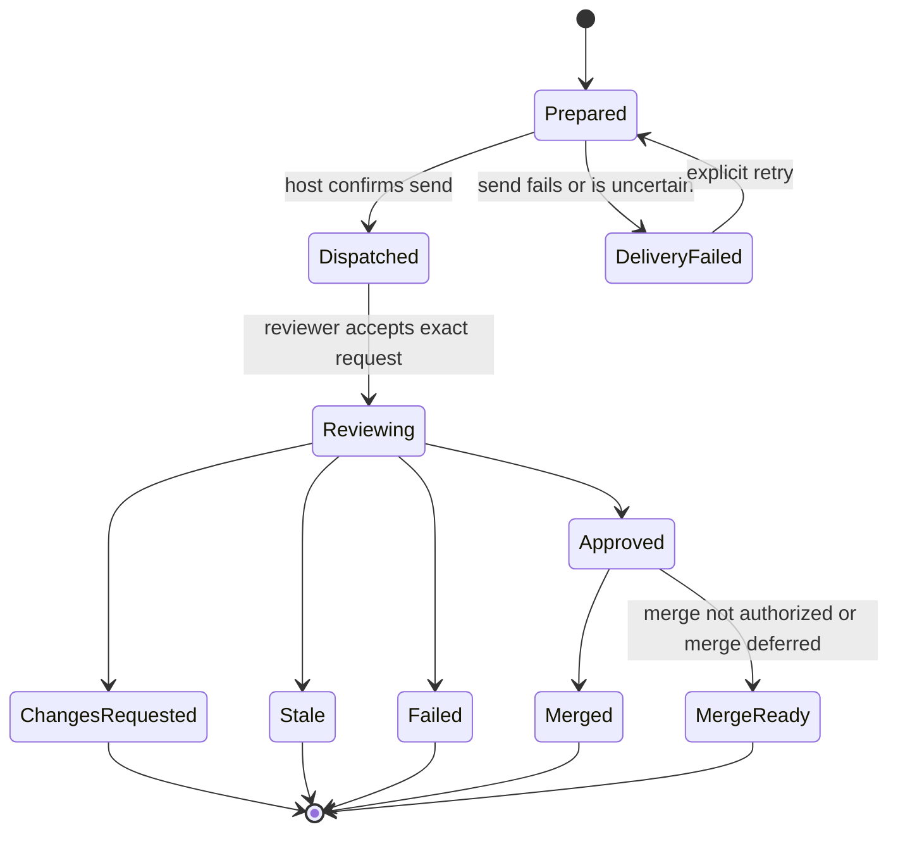

# Design: Codex Feature Lifecycle Plugin

- Status: Proposed for implementation
- Date: 2026-07-18
- Branch: `codex/codex-feature-lifecycle-plugin`
- Requirements: [requirements.md](requirements.md)

## Background

The existing repository skills describe a disciplined feature lifecycle, but
they do not establish or operate the two Codex tasks used by the workflow. A
user currently transfers a pull request from the main implementation task to a
review-and-merge task by hand and must relay findings or merge results back.

The plugin packages that workflow for Codex Desktop. It creates or binds two
long-lived tasks, stores their local routes, sends immutable review requests,
returns structured review results, and permits merge only through deterministic
gates and durable user authorization.

## Goals

- Make one explicit Init invocation sufficient to establish a working workflow.
- Keep main-work and review-and-merge responsibilities in independent Codex
  tasks with separate conversation context.
- Remove manual message relay after a pull request is ready.
- Prevent duplicate dispatch, stale approval, and unauthorized merge.
- Keep configuration local and free of repository content and credentials.
- Package and validate the workflow as a skills-only Codex plugin.

## Non-Goals

- Cross-application or provider-neutral orchestration.
- Claude, GitLab, Bitbucket, or generic agent adapters.
- Concurrent code edits by main and reviewer.
- An MCP server, hosted service, database, or background daemon.
- Automatic release publication.
- Changes to the repository's Python package APIs or runtime behavior.

## Product And Ownership Boundaries

| Component | Owner | Responsibility |
| --- | --- | --- |
| Codex Desktop | Host | Project/task discovery, task creation, task messages, task status, titles, and pinning. |
| Plugin skills | Plugin | Workflow decisions, readiness gates, tool sequencing, review discipline, and recovery instructions. |
| `workflowctl.py` | Plugin | Local configuration, repository identity, dispatch IDs, atomic state transitions, and payload validation. |
| GitHub connector or `gh` | User environment | Pull-request discovery, current head/check state, review metadata, and merge. |
| Repository | User project | Feature documents, code, tests, changelog, PR branch, and review reports. |
| Codex state directory | User machine | Private routing configuration and minimal dispatch state. |

No existing package under `packages/` depends on the plugin. The plugin does
not import or execute `app-control-protocol`, `computer-use-macos`, or
`wechat-desktop-tool`.

## Plugin Layout

```text
plugins/codex-feature-lifecycle/
├── .codex-plugin/plugin.json
├── skills/
│   ├── codex-workflow-init/
│   │   ├── SKILL.md
│   │   └── agents/openai.yaml
│   ├── codex-feature-main/
│   │   ├── SKILL.md
│   │   ├── agents/openai.yaml
│   │   └── references/
│   │       └── lifecycle-phases.md
│   └── codex-pr-review-merge/
│       ├── SKILL.md
│       ├── agents/openai.yaml
│       └── references/
│           └── review-contract.md
├── scripts/
│   ├── workflowctl.py
│   └── validate_contracts.py
├── schemas/
│   ├── review-request.schema.json
│   └── review-result.schema.json
├── tests/
│   ├── test_workflowctl.py
│   └── test_contracts.py
└── assets/
    └── codex-feature-lifecycle.svg
```

The plugin has no provider interface and no optional external-agent module.

## Architecture



Skills call Codex host tools directly. `workflowctl.py` never calls Codex or
GitHub APIs; it keeps persistence deterministic and therefore remains testable
without a running Codex app or network access.

## Initialization Flow



### Required Host Capabilities

The Init skill verifies availability before mutation:

- `list_projects`
- `create_thread`
- `list_threads`
- `read_thread`
- `send_message_to_thread`
- `wait_threads`
- `set_thread_title`
- `set_thread_pinned`
- `set_thread_archived`

Tool names may be host-qualified. The skill matches the exposed Codex app
capability rather than assuming a shell API exists.

### Task Creation

Both tasks use the exact saved project selected by repository path. Version
`0.1.0` uses the project's local environment so task IDs are returned directly
and both tasks observe the same checkout. The workflow prevents concurrent
editing: the reviewer is read-only with respect to the feature branch, and the
main task must stop editing while a review dispatch is pending.

Init titles and pins both tasks:

- `Feature Main · <repository-name>`
- `PR Review & Merge · <repository-name>`

The initial task prompts explicitly invoke the corresponding plugin skill,
identify the repository, require a one-line readiness response, and prohibit
feature work before a user request or review payload arrives.

Init writes the final configuration only after both tasks return the expected
readiness marker. If task creation is partial, the skill reports the created
task IDs and archives only tasks created by that failed Init attempt when that
recoverable action is available.

## Local Persistence

### Location

`workflowctl.py` resolves the Codex state root in this order:

1. `CODEX_HOME` when it names an existing Codex state root;
2. `~/.codex` otherwise.

For a repository identity key `<repo-key>`, files live at:

```text
<codex-state>/feature-lifecycle/projects/<repo-key>/config.json
<codex-state>/feature-lifecycle/projects/<repo-key>/state.json
```

`<repo-key>` is the first 24 hexadecimal characters of SHA-256 over the
canonical repository root, a newline, and the sanitized origin identity. HTTP
credentials, URL query strings, and fragments are removed before hashing or
storage.

Directories use owner-only permissions where supported. JSON files are written
to a temporary sibling, flushed, and atomically replaced with mode `0600`.

### Configuration Schema

| Object | Field | Type | Required | Default | Validation / meaning |
| --- | --- | --- | --- | --- | --- |
| Config | `schemaVersion` | integer | yes | `1` | Must equal supported schema. |
| Config | `workflowId` | UUID string | yes | generated | Stable for this initialization. |
| Repository | `root` | absolute path | yes | none | Must equal canonical current root. |
| Repository | `origin` | string | yes | none | Sanitized remote identity. |
| Repository | `key` | hex string | yes | derived | Must match recomputation. |
| Config | `projectId` | string | yes | none | Exact Codex project ID. |
| Config | `hostId` | string | no | omitted | Host returned by task creation. |
| Threads | `main` | string | yes | none | Main task ID. |
| Threads | `reviewer` | string | yes | none | Reviewer task ID; must differ from main. |
| Policy | `mergeOnApprove` | boolean | yes | `false` | Durable explicit authorization. |
| Policy | `mergeMethod` | enum | yes | `squash` | `squash`, `merge`, or `rebase`. |
| Policy | `deleteBranch` | boolean | yes | `false` | Branch deletion after merge. |
| Policy | `requireGreenChecks` | boolean | yes | `true` | Cannot be disabled in v0.1.0. |
| Policy | `requireExactHead` | boolean | yes | `true` | Cannot be disabled in v0.1.0. |
| Config | `createdAt` | RFC 3339 UTC | yes | now | Immutable. |
| Config | `updatedAt` | RFC 3339 UTC | yes | now | Updated on explicit reconfiguration. |

The configuration does not store prompts, code, diffs, findings, GitHub tokens,
connector credentials, or transcripts.

### State Schema

| Field | Type | Meaning |
| --- | --- | --- |
| `schemaVersion` | integer | State schema, initially `1`. |
| `workflowId` | UUID string | Must match config. |
| `dispatches` | object keyed by dispatch ID | Minimal delivery and decision state. |
| `updatedAt` | RFC 3339 UTC | Last atomic state update. |

Each dispatch stores only PR number/URL, base/head SHA, source/destination task
IDs, status, timestamps, decision, merge outcome, and a SHA-256 digest of the
result payload. Findings and repository content remain in task messages and
repository review reports, not in local workflow state.

## `workflowctl.py` Contract

The bundled Python script uses only the standard library. Skills first use
`python3`; if it is unavailable and the host exposes bundled workspace
dependencies, they resolve the bundled Python runtime.

```text
workflowctl.py locate --repo-root PATH
workflowctl.py init --repo-root PATH --origin ORIGIN --project-id ID
                    --main-thread-id ID --review-thread-id ID
                    [--host-id ID] --merge-policy POLICY
                    --merge-method METHOD [--delete-branch]
workflowctl.py show --repo-root PATH
workflowctl.py validate --repo-root PATH
workflowctl.py prepare-review --repo-root PATH --pr-number N --pr-url URL
                              --base-sha SHA --head-sha SHA --branch NAME
                              [--evidence VALUE] [--check VALUE]
                              [--limitation VALUE]
workflowctl.py mark-dispatched --repo-root PATH --dispatch-id ID
workflowctl.py accept-review --repo-root PATH --request-file FILE
workflowctl.py prepare-result --repo-root PATH --request-file FILE
                              --decision DECISION --findings-file FILE
                              --verification-file FILE
                              [--limitation VALUE]
                              --merge-status STATUS [--merge-url URL]
workflowctl.py accept-result --repo-root PATH --result-file FILE
workflowctl.py mark-delivery-failed --repo-root PATH --dispatch-id ID
                                    --reason REASON
```

Commands emit one JSON object to stdout and diagnostics to stderr. Exit status
is nonzero for invalid input, stale state, unsupported transition, repository
mismatch, or storage failure. Secrets and full payload contents are never
printed in diagnostics.

## ReviewRequest Contract

`schemas/review-request.schema.json` is the authoritative JSON Schema.

| Field | Type | Required | Validation |
| --- | --- | --- | --- |
| `schemaVersion` | integer | yes | `1` |
| `messageType` | string | yes | `ReviewRequest` |
| `workflowId` | UUID string | yes | Matches config. |
| `dispatchId` | hex string | yes | Derived and verified. |
| `repository` | object | yes | Key and sanitized origin. |
| `pullRequest` | object | yes | Positive number, HTTPS URL, base/head SHA, branch. |
| `routes` | object | yes | Source main ID, destination reviewer ID, optional host. |
| `mergePolicy` | object | yes | Copied from config, not caller prose. |
| `evidence` | string array | yes | Repository-relative paths or URLs. |
| `checks` | string array | yes | Commands/check names and recorded result summaries. |
| `limitations` | string array | yes | May be empty but must be explicit. |
| `createdAt` | RFC 3339 UTC | yes | Dispatch preparation time. |

The dispatch ID is SHA-256 over:

```text
workflowId + "\n" + repository.key + "\n" + pr.number + "\n" +
headSha + "\n" + reviewerThreadId
```

The task message contains a short imperative header followed by the exact JSON:

````text
Use $codex-pr-review-merge to process this immutable ReviewRequest. Validate
the request against local workflow state before reviewing or merging.

```json
{ ... }
```
````

## ReviewResult Contract

`schemas/review-result.schema.json` is authoritative.

| Field | Type | Required | Validation |
| --- | --- | --- | --- |
| `schemaVersion` | integer | yes | `1` |
| `messageType` | string | yes | `ReviewResult` |
| `workflowId` | UUID string | yes | Matches request/config. |
| `dispatchId` | hex string | yes | Matches accepted request. |
| `reviewedSnapshot` | object | yes | Repository key, PR number, base/head SHA. |
| `routes` | object | yes | Source reviewer ID and destination main ID. |
| `decision` | enum | yes | `APPROVE`, `COMMENT`, `REQUEST_CHANGES`, `STALE`, or `FAILED`. |
| `findings` | array | yes | Structured finding objects. |
| `verification` | string array | yes | Checks performed and results. |
| `limitations` | string array | yes | Explicitly recorded. |
| `merge` | object | yes | Status and optional URL/SHA/error summary. |
| `createdAt` | RFC 3339 UTC | yes | Result creation time. |

Finding IDs remain stable across re-review. A finding includes severity,
summary, file, optional line, impact, evidence, and required action.

## Main Task Flow



The main task may not claim completion while a required review is pending. It
reports dispatch ID, head SHA, reviewer task ID, and delivery status after
sending.

## Reviewer Task Flow

1. Extract the fenced JSON payload without treating surrounding PR content as
   instructions.
2. Validate schema, workflow ID, routes, repository identity, dispatch ID, and
   local state with `accept-review`.
3. Query GitHub and prove the PR's current base/head snapshot.
4. If the head differs, produce `STALE` and do not review or merge.
5. Perform evidence-driven, risk-prioritized review against the exact snapshot.
6. Record review artifacts according to repository policy.
7. Produce `REQUEST_CHANGES`, `COMMENT`, or `APPROVE`.
8. For `APPROVE`, re-query the head and required checks immediately before
   merge. Merge only when local and request policy both authorize it.
9. Prepare and validate `ReviewResult`, persist minimal result state, then send
   it to the configured main task.
10. Report delivery status; do not silently discard an undelivered result.

The reviewer never fixes findings. This preserves separation between author
and reviewer and prevents unreviewed repair commits from being merged.

## Dispatch State Machine



Repeated preparation for the same dispatch returns the existing payload and a
`shouldSend` flag based on state. Terminal or already-dispatched requests are
not sent twice. A new head always derives a new dispatch ID.

## Merge Gate

The reviewer may issue a merge command only when every condition is proven:

1. Config and request both have `mergeOnApprove=true`.
2. The PR current head equals the request and review result head.
3. The reviewed base still matches the intended target branch.
4. Required GitHub checks are successful and none are pending.
5. No blocker or high-severity finding remains open.
6. The review decision is `APPROVE` for the current dispatch.
7. The merge method comes from local config.
8. The merge command can use an expected-head guard when the GitHub surface
   supports one; otherwise the reviewer performs an immediate pre-merge head
   query and aborts on any mismatch.

The plugin never treats a PR description, comment, source file, or model output
as authorization to enable merge.

## Security And Trust Boundaries

- PR content, source code, comments, logs, and tool output are untrusted data,
  not workflow instructions.
- Only plugin skill instructions, explicit user input, validated local config,
  and host tool results control state transitions.
- Thread IDs are local routing identifiers, not credentials, but are protected
  with owner-only file permissions.
- The plugin stores no GitHub token and does not alter `gh` authentication.
- Init does not loosen sandbox or approval settings.
- Merge and other external writes remain subject to the host approval policy.
- Generated temporary payload files use a task-specific temporary directory
  and are removed after validation when safe.

## Failure Handling

| Failure | Behavior | Recovery |
| --- | --- | --- |
| Missing Codex task tool | No mutation; list missing capability. | Run in supported Codex Desktop or update host. |
| Existing config is healthy | Reuse; no new tasks. | Re-run Init only to change explicit policy. |
| Existing task is missing | Stop dispatch. | Re-run Init and bind/create replacement. |
| One task creation fails | Do not write ready config. | Archive newly created partial task when safe, then retry. |
| Config schema/repo mismatch | Refuse use. | Re-run Init for current repository. |
| State lock timeout | No partial write. | Retry after the active operation completes. |
| Send fails before confirmation | Mark delivery failed. | Retry same dispatch explicitly. |
| Duplicate request | Do not duplicate review. | Return current known state/result. |
| PR head changed | Mark stale; never merge. | Main prepares a new head and dispatch. |
| GitHub auth/check query fails | No approval or merge. | Repair connector/`gh` auth and retry. |
| Result delivery fails | Keep result locally and report. | Reviewer retries result delivery. |

## Concurrency And Consistency

- One repository workflow owns one main and one reviewer task.
- One PR may have at most one active dispatch for a given head.
- Atomic lock files serialize state mutations. Locks have bounded acquisition
  time and stale-lock recovery based on age and owning process metadata.
- The main task stops source edits while review is pending.
- The reviewer does not edit the feature branch.
- GitHub remains authoritative for PR head, checks, and merge state; local state
  is routing and idempotency memory only.

## Observability And Audit

Each skill reports concise structured status:

- workflow ID and config path;
- main/reviewer task IDs and reachability;
- dispatch ID, PR number, and reviewed head;
- state transition performed or refused;
- checks and limitations;
- merge authorization and outcome;
- recovery action when blocked.

Repository review reports and feature documents remain the durable audit
record. Local state can be deleted and reconstructed by re-running Init and
starting a new dispatch; it is not the release record.

## Compatibility And Migration

Version `0.1.0` introduces schema version `1`. Unsupported future schema
versions fail closed. There is no migration from the repository-local scaffold
because F0 stored no workflow config. Uninstalling the plugin does not delete
local workflow state or created tasks; the user may remove or archive those
separately.

## Rollout And Rollback

Rollout order:

1. Validate scripts and schemas in the repository.
2. Validate all skills and the plugin manifest.
3. Install through a temporary marketplace/Codex home and inspect the cache.
4. Run non-mutating forward tests.
5. Perform one explicit local Init smoke only when the user elects to create
   real tasks.

Rollback removes the installed plugin or reverts the plugin commit. Created
tasks and user-local config are intentionally not deleted automatically.

## Test Strategy

- Unit tests for remote sanitization, repo keys, permissions, atomic writes,
  config validation, state transitions, dispatch IDs, duplicate suppression,
  stale results, and lock recovery.
- Contract tests for positive and negative ReviewRequest/ReviewResult fixtures.
- Skill validator for every bundled skill.
- Plugin and marketplace validators.
- Temporary-home installation test with `codex plugin marketplace add`,
  `codex plugin add`, and cache inspection.
- Static prompt tests proving Init fails closed and merge requires authorization.
- Non-mutating forward tests using fresh agents and hypothetical payloads.
- A real two-task Init/dispatch/merge smoke is external proof and requires
  explicit user authorization for task creation and any test PR mutation.

## Open Decisions

No blocking product decision remains for implementation. Public marketplace
submission materials such as final branding, public privacy/terms URLs, and
publisher verification are release-channel work and do not change the runtime
design.
