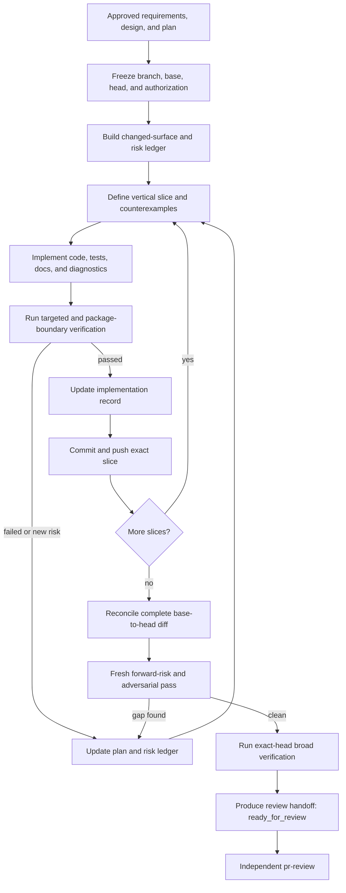
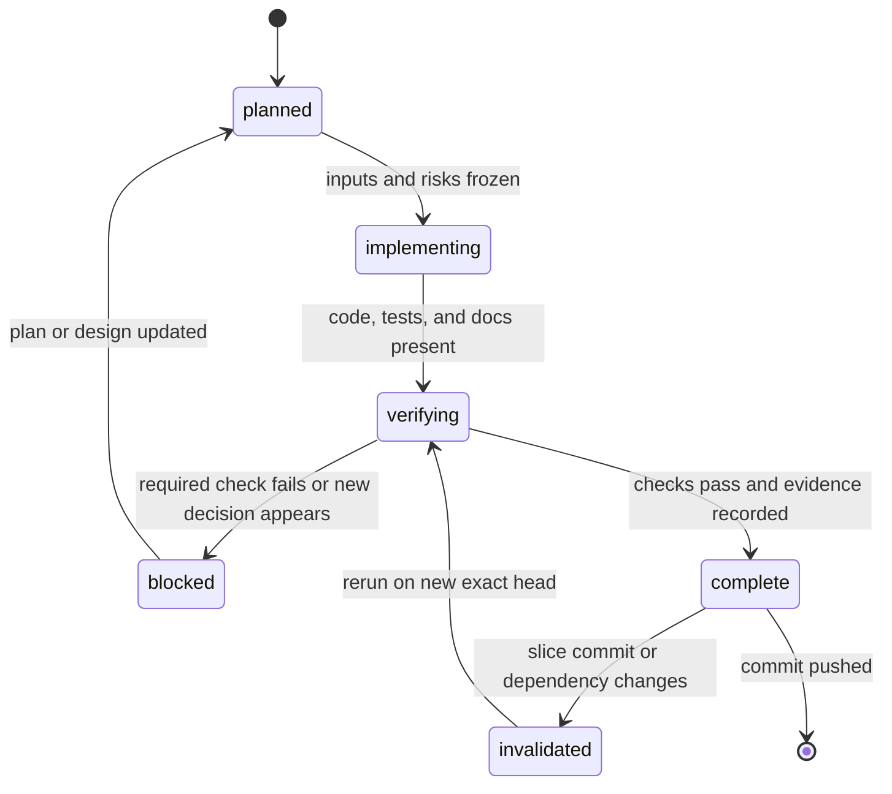

# Implementation Execution Skill Design

## Status

- Feature: `implementation-execution`
- Phase: F2 consumer contract and design
- Branch: `codex/implementation-execution-skill`
- Package API impact: none
- Proposed skill path: `.agents/skills/implementation-execution/`

## Problem

An approved technical plan is necessary but not sufficient for review-ready
implementation. The Accessibility Selector Engine was repeatedly returned
because implementation and verification missed risks that were visible only
across layers: producer/consumer contract propagation, malformed mutation
proof, query truncation, semantic pagination, configuration atomicity,
frontmost-app identity, privacy-safe observability, package installation, and
exact-head review evidence.

The missing capability is a dedicated implementation workflow between
technical planning and formal PR review. It must make risk discovery and
evidence production continuous implementation responsibilities rather than a
late review cleanup.

## Goals

- Convert an approved plan into bounded, independently verifiable slices.
- Discover foreseeable review blockers before code is handed to `pr-review`.
- Keep implementation, tests, docs, and evidence on the same exact head.
- Make every changed file and cross-layer contract accountable to a risk
  surface and verification method.
- Preserve lifecycle phase commits and produce a concise review handoff.

## Non-Goals

- Approve a technical design or PR.
- Guarantee zero review findings.
- Replace package-specific engineering judgment.
- Authorize live mutation, publishing, merging, or release.
- Require machine schemas for every small implementation.

## Skill Boundary

| Skill | Owns | Does not own |
| --- | --- | --- |
| `feature-lifecycle` | Feature phases, branch, phase artifacts, commit/push cadence | Detailed implementation risk analysis |
| `technical-plan-write` | Requirements, design, implementation plan | Code execution or review decision |
| `technical-plan-review` | Architect approval/rejection of the plan | Implementation |
| `implementation-execution` | Slice planning, code/tests/docs, implementation risk gates, exact-head handoff | Formal PR approval, merge, release |
| `pr-review` | Independent findings and merge decision | Authoring the implementation under review |

The new skill may return work to a prior phase when the approved plan lacks a
decision required for safe implementation. It may report `ready_for_review`,
but must never report `APPROVE` or `mergeable=true`.

## Skill Contents

```text
.agents/skills/implementation-execution/
├── SKILL.md
├── agents/
│   └── openai.yaml
└── references/
    └── rejection-patterns.md
```

`SKILL.md` contains the mandatory workflow and stop conditions. The reference
contains the detailed reusable failure patterns and is loaded only when the
change touches the corresponding risk surface.

No deterministic script is proposed in the first version. The record is kept
in normal feature documentation because risk evidence is semantic and cannot
be validated reliably through heading or keyword checks alone. Existing test,
package, release, and PR-result validators remain authoritative for their own
contracts.

## Lifecycle Integration

Update `feature-lifecycle` so F4 invokes `implementation-execution` for
non-trivial implementation, review remediation, public contract changes,
desktop mutation, or cross-package work. Small isolated edits may use its core
gates without producing a large risk ledger, but they must still classify the
diff, run proportional tests, and update the phase artifact.

The lifecycle remains the owner of phase transitions and commit/push cadence.
The new skill owns only the quality and evidence of F4 execution. Returning
`ready_for_review` moves the feature toward F5/F6; `blocked` routes it back to
F1-F3 with the missing decision recorded.

## Conceptual Data Structures

These are required documentation concepts, not new runtime Python classes.

### Implementation Context

| Field | Type | Required | Meaning |
| --- | --- | --- | --- |
| `feature` | string | yes | Feature slug and user scenario |
| `branch` | string | yes | Dedicated feature branch |
| `base_sha` | full Git SHA | yes | Frozen comparison base |
| `starting_head_sha` | full Git SHA | yes | Head before the implementation pass |
| `requirements` | path/list | yes | Approved requirements artifacts |
| `design` | path/list | conditional | Approved technical design and reviews |
| `implementation_plan` | path | yes for non-trivial work | Owning plan |
| `acceptance_criteria` | list | yes | Observable completion conditions |
| `authorization_limits` | list | yes for side effects | Live action, privacy, publishing, and release limits |
| `open_decisions` | list | yes | Must be empty or explicitly non-blocking before code |

### Risk Surface

| Field | Type | Required | Meaning |
| --- | --- | --- | --- |
| `id` | stable string | yes | Local risk identifier |
| `surface` | string | yes | Behavior or contract boundary |
| `triggers` | list | yes | Mutation, public contract, privacy, cache, etc. |
| `affected_paths` | list | yes | Files/modules owned by the surface |
| `behavior_path` | list | yes | Input to producer to consumer/error/output path |
| `invariants` | list | yes | Conditions implementation must preserve |
| `counterexamples` | list | yes | Negative or adversarial cases defined before coding |
| `checks` | list | yes | Tests, build, inspection, or smoke evidence |
| `status` | enum | yes | `planned`, `implemented`, `verified`, `blocked` |

Every changed file must belong to at least one risk surface or be explicitly
classified as low-risk documentation/generated content with a reason.

### Implementation Slice

| Field | Type | Required | Meaning |
| --- | --- | --- | --- |
| `id` | string | yes | Ordered slice identifier |
| `scenario` | string | yes | End-to-end behavior delivered |
| `files` | list | yes | Expected edit boundary |
| `contracts` | list | yes | Public/internal contracts changed |
| `risk_surface_ids` | list | yes | Risks exercised by the slice |
| `positive_cases` | list | yes | Expected supported behavior |
| `negative_cases` | list | risk-based | Missing, malformed, boundary, conflict, timeout, etc. |
| `tests` | list | yes | Target checks and operation-count assertions |
| `docs` | list | yes | Implementation and stable docs to update |
| `rollback` | string | yes | Revert/disable/compatibility approach |
| `commit_sha` | full Git SHA | when complete | Exact pushed slice commit |
| `status` | enum | yes | Lifecycle state below |

### Review Handoff

| Field | Type | Required | Meaning |
| --- | --- | --- | --- |
| `base_sha` / `head_sha` | full Git SHA | yes | Exact review range |
| `commits` | list | yes | Implementation commits in order |
| `changed_files` | list | yes | Complete range output |
| `risk_surfaces` | list | yes | Final statuses and evidence |
| `contract_propagation` | list | conditional | Producer-to-consumer trace for public changes |
| `validation_runs` | list | yes | Exact command, environment, head, result |
| `not_run` | list | yes | Deferred or unavailable proof with reason |
| `limitations` | list | yes | Residual risks without hidden assumptions |
| `review_focus` | list | yes | Highest-risk paths for independent review |

## Workflow



### Slice State Model



## Mandatory Gates

### Gate 1: Input And Scope Freeze

- Confirm dedicated branch, base SHA, starting head, approved artifacts, and
  acceptance criteria.
- Refuse to infer unresolved security, privacy, compatibility, mutation, or
  release decisions.
- Record unrelated dirty files and isolate them before editing.

### Gate 2: Changed-Surface And Risk Ledger

Map anticipated files and complete behavior paths before code. Include the
following surfaces when triggered:

- public API/protocol/config/failure propagation;
- mutation, retry, fallback, timeout, cancellation, and idempotency;
- target identity, permissions, preconditions, stale references, and focus;
- query truncation, limits, cache, pagination, ordering, and concurrency;
- privacy, logs, events, debug/raw output, and release artifacts;
- dependency floors, clean installation, wheels, CI, rollout, and rollback;
- configuration atomicity and old/new version coexistence.

### Gate 3: Counterexamples Before Code

Define discriminating cases before implementation. For high-risk paths, cover:

- missing, empty, malformed, wrong-type, duplicate, and contradictory input;
- minimum, maximum, empty, exact-limit, limit-plus-one, timeout, and truncation;
- stale/reordered/cached state and multiple matching targets;
- transport loss before dispatch, after dispatch, and unknown outcome;
- older dependency, partial configuration, and incompatible producer/consumer;
- private canaries beyond the returned semantic limit.

Tests must assert state, side-effect count, and operation order, not only the
returned status.

### Gate 4: Contract-Execution Parity

If configuration or an API accepts a behavior, runtime must execute it fully.
Otherwise reject it before side effects. Never silently ignore extra selector
steps, unsupported fields, fallbacks, limits, or policy values.

For a public value, trace:

```text
producer -> normalization -> registry/export -> serialization/schema
         -> docs -> consumer/recovery -> package/wheel test
```

Mark a stage not applicable with a reason. An unknown applicable stage blocks
slice completion.

### Gate 5: Safe Failure And Privacy

- Unknown mutation outcome means no replay.
- Retryability must reflect dispatch and effect, not generic timeout labels.
- Structured failure values take precedence over free text.
- Target-app operations require current identity/focus evidence appropriate to
  the risk.
- Normal outputs and logs use semantic allowlists; raw evidence is explicit,
  authorized, and excluded from public/release artifacts.

### Gate 6: Slice Verification And Commit

- Run targeted tests first, then broaden by blast radius.
- Use generated/real production paths where hand-shaped fixtures could hide
  producer/normalizer gaps.
- Update `implementation-notes.md` with exact behavior and evidence.
- Commit and push only when required checks pass or are explicitly deferred by
  the owning plan. Record the slice commit SHA.

### Gate 7: Review Preflight

- Reconcile every commit and changed path from frozen base to current head.
- Perform a second pass that treats the completed diff as untrusted input.
- Use a fresh agent/context when available; otherwise restart from raw diff and
  disclose that the same agent performed the second pass.
- Re-run approval-critical checks on the exact final head.
- Produce `ready_for_review`, never self-approval.

## Stop Conditions

Stop implementation and return to the owning phase when:

- a decision-critical requirement or design choice is missing;
- a package boundary or public compatibility contract is unclear;
- a mutation may replay after an unknown result;
- accepted configuration cannot be implemented faithfully;
- a changed path has no risk classification;
- required tests fail, pass vacuously, or do not exercise production behavior;
- validation belongs to another head or dirty/untracked inputs affect it;
- live mutation, publication, merge, or release lacks explicit authorization.

## Rejection Patterns Reference

`references/rejection-patterns.md` will group the review history into reusable
patterns rather than copy PR-specific findings into the core workflow. Each
pattern will include trigger, implementation gate, required evidence, and the
review failures it is derived from.

## Verification Strategy

### Skill Validation

- Run the official `quick_validate.py` against the skill folder.
- Inspect `agents/openai.yaml` against `SKILL.md` metadata and purpose.
- Verify the body remains below 500 lines and references are one level deep.

### Scenario Dry Runs

1. **Public failure kind:** ensure producer, registry/export, docs, consumer,
   wheel, and old dependency behavior are planned before completion.
2. **Desktop mutation fallback:** require malformed/contradictory/unknown
   outcome cases and operation-count assertions before fallback is accepted.
3. **Selector collection:** catch truncation-before-pick, semantic pagination,
   unsupported configuration, cache staleness, and privacy canaries.
4. **Review remediation:** revalidate old findings while independently
   classifying every remediation diff path and induced risk.

### Repository Validation

- `git diff --check`
- skill file inventory and metadata inspection
- clean branch status after phase commits

## Rollout And Rollback

Roll out by adding the skill without changing package code. Invocation remains
explicit or metadata-triggered. Roll back by reverting the skill and its
workflow docs; no runtime migration is required.

## Open Decisions

None block implementation. A future version may add a structured handoff
schema after enough real implementation records exist to justify stable fields.
