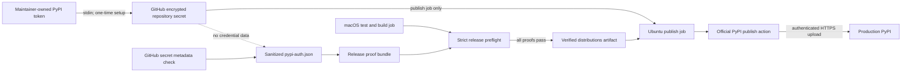
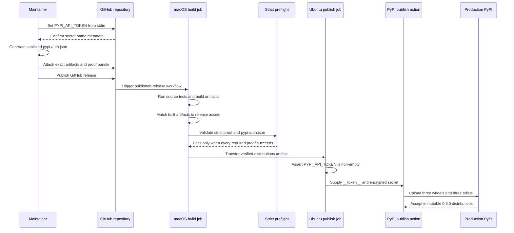

# PyPI Token Publishing Design

## Lifecycle Status

| Field | Value |
| --- | --- |
| Feature | PyPI API-token publishing mode |
| Phase | F2 consumer contract and feature design |
| Source baseline | `1b2c9a53abde68fe1373a7fff21fbb2e87950280` |
| Release target | Coordinated `0.3.0` package release |
| Runtime package API impact | None |
| Release contract impact | Authentication proof and GitHub workflow |

## Problem

The release workflow currently assumes PyPI Trusted Publishing. Its strict
preflight requires a `trusted-publisher.json` report and the workflow requests
GitHub OIDC permission. The maintainer has instead authorized production
publication with an existing PyPI API token.

The token must be usable by GitHub Actions without weakening the existing
artifact, TestPyPI, desktop-smoke, or exact-source release gates. The release
record must identify the chosen authentication mechanism without storing or
deriving any credential material.

## Goals

- Allow the official PyPI publish action to authenticate with a repository
  secret named `PYPI_API_TOKEN`.
- Replace the proof contract's implementation-specific key with a stable
  `pypi_publish_auth` result.
- Validate a sanitized, exact-production-index token-auth report before upload.
- Preserve Trusted Publisher report validation as a compatible alternative for
  a future return to OIDC.
- Fail closed when authentication proof is absent, ambiguous, malformed, or
  inconsistent with the repository and workflow.
- Keep all unrelated strict release proofs and artifact identity checks intact.

## Non-Goals

- Reading, validating, rotating, fingerprinting, or persisting the token value
  in a report or repository file.
- Adding password, `.pypirc`, workflow-input, or local-token-file publication.
- Changing package versions, package APIs, runtime behavior, or TestPyPI proof.
- Treating API-token authentication as equivalent to OIDC Trusted Publishing.

## Component Boundaries

| Component | Responsibility |
| --- | --- |
| GitHub repository settings | Encrypt and expose `PYPI_API_TOKEN` only to the release job. |
| `scripts/pypi_auth_report.py` | Create sanitized metadata asserting that the expected GitHub secret was configured. It never reads a token. |
| `scripts/release_preflight.py` | Validate exactly one supported PyPI authentication report and all other release proofs. |
| `scripts/release_proof_bundle.py` | Copy the exact validated auth report into a release proof bundle and produce the aggregate manifest. |
| `.github/workflows/release.yml` | Validate and build on macOS, transfer verified distributions, then check and use the secret only in a Linux publish job. |
| PyPI publish action | Exchange the secret for authenticated uploads to production PyPI. |

Runtime packages do not depend on these scripts, reports, or credentials.

## Authentication Proof Model

### Stable Aggregate Result

Strict preflight exposes one implementation-neutral external-proof key:

```json
{
  "pypi_publish_auth": true
}
```

The existing `pypi_trusted_publisher` aggregate key is replaced before the
`0.3.0` release. Detailed source reports remain mode-specific. This avoids
claiming that an API-token release used OIDC while allowing the aggregate proof
contract to survive a later authentication-mode change.

### API-Token Report

The checked-in code defines and validates this exact shape; generated reports
are external release assets, not repository files.

```json
{
  "schema": "macos_computer_use.release.pypi_auth.v1",
  "source": "pypi",
  "mode": "api-token",
  "targetRepository": "https://upload.pypi.org/legacy/",
  "credential": {
    "kind": "github-actions-secret",
    "name": "PYPI_API_TOKEN",
    "configured": true
  },
  "publisher": {
    "owner": "zhanghao1903",
    "repository": "macos-computer-use",
    "workflow": "release.yml"
  },
  "verification": "github-secret-metadata",
  "generatedAt": "2026-07-19T00:00:00Z"
}
```

Validation requires:

- the exact schema, source, mode, production upload URL, credential kind,
  secret name, owner, repository, workflow, and verification method;
- `credential.configured` to be the JSON boolean `true`;
- `generatedAt` to be a valid UTC timestamp;
- no unknown top-level or nested fields.

Rejecting unknown fields prevents a future producer from accidentally adding a
token, token fingerprint, local path, or other credential-derived value to the
release asset.

### Trusted Publisher Compatibility

The existing Trusted Publisher report loader remains available and maps a
valid OIDC report to `pypi_publish_auth=true`. Strict preflight and proof
bundling accept exactly one of:

- `--pypi-auth-report <pypi-auth.json>`; or
- `--trusted-publisher-report <trusted-publisher.json>`.

Supplying neither or both is a hard failure. Authentication modes never
override one another based on argument order.

## Command Contracts

Generate a sanitized report only after the operator has confirmed the GitHub
secret metadata:

```bash
python scripts/pypi_auth_report.py \
  --configured \
  --output /private/tmp/pypi-auth.json
```

The command does not accept a token, token file, arbitrary secret name, or
arbitrary target repository. Fixed constants make the report unsuitable as a
credential transport.

Validate a token-auth release proof:

```bash
python scripts/release_preflight.py \
  --strict \
  --pypi-auth-report /private/tmp/pypi-auth.json \
  ...
```

Build the release proof bundle with the same report:

```bash
python scripts/release_proof_bundle.py \
  --pypi-auth-report /private/tmp/pypi-auth.json \
  ...
```

## Data Flow



The credential path and proof path are deliberately separate. The macOS build
job validates source, artifacts, and proofs without receiving the production
secret. Its verified distributions move through a GitHub Actions artifact to a
dependent Ubuntu publish job, because the official publish action is a Docker
action supported only on GNU/Linux runners. The report
states that the expected secret metadata was configured; it cannot authenticate
an upload and contains no material from which the token can be recovered.

## Release Operation Flow



## Failure Model And Recovery

| Failure | Result | Recovery |
| --- | --- | --- |
| Missing or empty GitHub secret | Workflow stops before the publish action. | Configure the secret and rerun only after confirming no partial upload. |
| Missing auth report | Strict preflight fails `pypi_publish_auth`. | Attach the exact generated report and proof bundle. |
| Both auth report modes supplied | Strict preflight fails as ambiguous. | Select the mode used by the workflow and remove the other report. |
| Wrong index, repository, workflow, or secret name | Report validation fails. | Regenerate from fixed repository tooling; do not edit proof manually. |
| Invalid or insufficient-scope token | PyPI rejects authentication/upload. | Inspect all project versions, replace the secret, then safely rerun unchanged artifacts. |
| Partial upload | No automatic rebuild or artifact replacement. | Compare PyPI filenames and hashes before a duplicate-safe rerun. |
| Suspected exposure | Release stops and token is revoked. | Rotate the token, inspect logs/assets, and record the incident before retry. |

## Safety And Audit Boundaries

- Token setup uses stdin and GitHub's encrypted secret store; shell tracing is
  disabled and token values are never printed.
- The release workflow references only `${{ secrets.PYPI_API_TOKEN }}` and
  contains no fallback credential.
- The macOS build/test/proof job cannot access the production token. Only the
  dependent Ubuntu publish job references the secret and publish action.
- The secret non-empty check emits no token content.
- Proof generation never reads the token or a token file.
- Report validation uses exact keys and values and rejects extensions.
- API-token mode removes `id-token: write`; the workflow receives no unused
  OIDC permission.
- Production publication still requires the existing explicit GitHub Release
  publication event and strict proof gate.

## Compatibility And Migration

- No package consumer migration is required.
- Existing detailed Trusted Publisher reports remain accepted by local tooling
  as an alternate mode, but the `0.3.0` workflow selects API-token mode.
- Aggregate proof consumers must use `pypi_publish_auth` instead of
  `pypi_trusted_publisher`; this proof schema has not yet been part of a
  published release.
- Returning to Trusted Publisher requires a reviewed workflow change that
  restores `id-token: write`, removes the password input, and supplies exactly
  the Trusted Publisher report.

## Test Strategy

- Unit-test report generation, exact schema validation, timestamp validation,
  unknown-field rejection, wrong-index and wrong-secret rejection.
- Unit-test strict preflight with token mode, Trusted Publisher compatibility,
  neither-mode failure, and dual-mode ambiguity failure.
- Unit-test proof bundle filenames, aggregate key, and absence of credential
  data.
- Contract-test the release workflow for explicit secret use, pre-upload
  non-empty validation, token username, token-mode proof argument, absence of
  OIDC permission, Linux action compatibility, artifact handoff, and secret
  isolation from the build job.
- Run full repository tests and release preflight.
- Verify GitHub secret name metadata, CI, exact release assets, production PyPI
  project versions, and isolated post-publish installation without recording
  credential values.

## Release Record Impact

The `0.3.0` release record will note that production publishing uses an
encrypted GitHub API-token secret with sanitized authentication proof. It will
also state that package runtime APIs and artifacts are unchanged by this
release-infrastructure feature.
