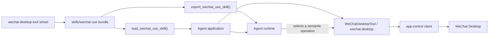
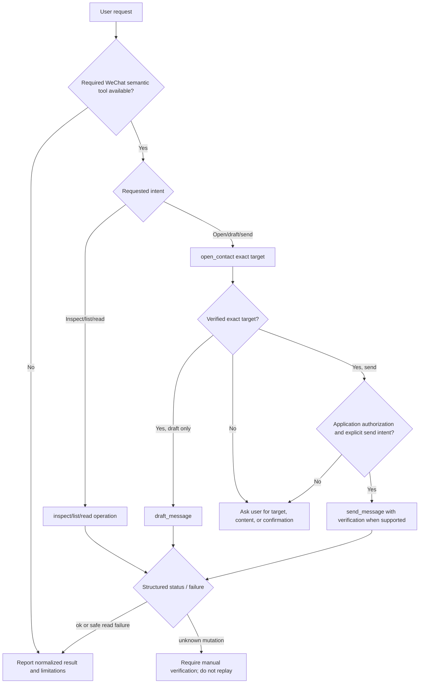
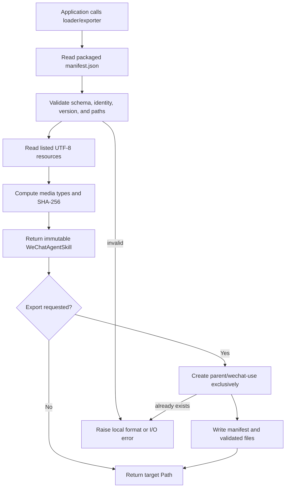

# WeChat Agent Skill Technical Design

## Document Status

| Field | Value |
| --- | --- |
| Feature | `wechat-agent-skill` |
| Lifecycle phase | F2 consumer contract and feature design |
| Status | Complete for implementation planning |
| Branch | `codex/wechat-agent-skill` |
| Requirements | [requirements.md](./requirements.md) |
| Affected package | `wechat-desktop-tool` |
| Public API impact | Additive |

## Summary

Ship a versioned `wechat-use` Agent skill inside the
`wechat-desktop-tool` wheel and sdist. The skill teaches an Agent to select and
sequence existing semantic WeChat operations without exposing raw macOS
Accessibility behavior.

The package will expose two framework-neutral Python functions:

```python
from wechat_desktop_tool import (
    export_wechat_use_skill,
    load_wechat_use_skill,
)

skill = load_wechat_use_skill()
print(skill.name, skill.version, skill.instructions)

skill_dir = export_wechat_use_skill(".agents/skills")
assert skill_dir.name == "wechat-use"
```

`load_wechat_use_skill()` serves runtimes that register skill text through an
API. `export_wechat_use_skill(parent_directory)` serves runtimes that discover a
standard skill directory on disk. Neither function initializes the desktop
client, reads credentials, connects to a service, or performs a WeChat action.

## Problem

The package already offers normalized operations for contacts, conversations,
messages, drafts, and sends. An Agent application still has to invent prompt
instructions for:

- choosing the correct operation;
- distinguishing visible data from complete history;
- resolving an ambiguous contact;
- separating draft intent from send intent;
- obtaining confirmation before a mutation;
- handling unknown send outcomes without replay.

Different applications currently solve this inconsistently. A docs-only answer
does not make the operational contract available to the Agent at runtime and
drifts independently from the package API.

## Goals

- Package one canonical, concise `wechat-use` skill with the Python library.
- Support both in-memory and filesystem-based Agent runtime integration.
- Keep the skill independent of any LLM provider or Agent SDK.
- Describe the existing semantic WeChat operation contract accurately.
- Make safe handling of ambiguous targets and unknown send outcomes mandatory.
- Version, validate, test, and release the skill as a package artifact.
- Preserve all existing APIs and desktop behavior.

## Non-Goals

- Registering Agent tools or constructing an Agent runtime.
- Starting, configuring, or authenticating the app-control service.
- Adding new WeChat desktop operations.
- Teaching raw Accessibility traversal, selectors, or coordinate clicks.
- Supporting media, files, calls, payments, deletion, or administration.
- Guaranteeing delivery, read receipts, exactly-once execution, or complete
  history export.
- Installing directly into a user-wide Agent configuration directory.
- Updating or overwriting an existing exported skill directory in v1.

## Package Boundary



Ownership remains unchanged:

- `wechat-desktop-tool` owns the skill, its loader, and WeChat semantics.
- `app-control-protocol` owns command and observation envelopes.
- `computer-use-macos` owns generic macOS execution.
- the embedding application owns tool registration, authorization,
  confirmation, audit, and data access policy.
- the Agent runtime owns planning and skill activation.

The implementation must not import an Agent or LLM SDK.

## Packaged Layout

```text
packages/wechat-desktop-tool/src/wechat_desktop_tool/
  agent_skill.py
  skills/
    wechat-use/
      manifest.json
      SKILL.md
      agents/
        openai.yaml
      references/
        operations.md
        recovery.md
```

Responsibilities:

| File | Responsibility |
| --- | --- |
| `manifest.json` | Machine-readable skill identity, version, entrypoint, and complete payload file list. |
| `SKILL.md` | Concise Agent workflow, operation-selection rules, safety gates, and links to references. |
| `agents/openai.yaml` | Standard human-facing display metadata for compatible skill discovery UIs. |
| `references/operations.md` | Stable operation names, inputs, result schemas, and bounded usage guidance. |
| `references/recovery.md` | Failure routing, clarification, manual recovery, and no-replay rules. |
| `agent_skill.py` | Manifest validation, immutable public models, package-resource loading, and safe export. |

The skill directory contains no README, changelog, generated smoke output, or
application configuration. Application-developer setup belongs in package docs,
not in Agent context.

## Manifest Contract

`manifest.json` is canonical for application code:

```json
{
  "schema": "wechat.agent-skill.v1",
  "name": "wechat-use",
  "version": "1.0.0",
  "description": "Operate WeChat through registered wechat-desktop-tool semantic operations.",
  "entrypoint": "SKILL.md",
  "files": [
    "SKILL.md",
    "agents/openai.yaml",
    "references/operations.md",
    "references/recovery.md"
  ]
}
```

Validation rules:

- `schema` must equal `wechat.agent-skill.v1`.
- `name` must equal `wechat-use` for this loader.
- `version` uses `MAJOR.MINOR.PATCH` numeric syntax.
- `description` must be non-empty.
- `entrypoint` must equal `SKILL.md` and be present in `files`.
- `files` must be non-empty and contain unique relative POSIX paths.
- absolute paths, empty segments, `.` segments, and `..` segments are rejected.
- every listed resource must exist and decode as UTF-8.
- the manifest itself is always exported but is not listed recursively in
  `files`.

The skill version changes when Agent-visible instructions or operation guidance
changes. It is independent of the Python package version so applications can
cache, allowlist, or audit a precise instruction revision.

Version policy:

- patch: wording or recovery clarification with unchanged operation contract;
- minor: additive workflow or operation guidance;
- major: incompatible instruction, safety, or manifest behavior.

## Public Python Data Model

### Constants

```python
WECHAT_AGENT_SKILL_SCHEMA = "wechat.agent-skill.v1"
WECHAT_USE_SKILL_NAME = "wechat-use"
WECHAT_USE_SKILL_RESOURCE = "skills/wechat-use"
```

### `WeChatAgentSkillFile`

```python
@dataclass(frozen=True)
class WeChatAgentSkillFile:
    path: str
    media_type: str
    content: str
    sha256: str

    def to_dict(self) -> dict[str, str]: ...
```

Invariants:

- `path` is a validated relative POSIX path from the skill root.
- `content` is the exact UTF-8 text shipped in the package.
- `media_type` is deterministic from the supported suffix:
  `.md -> text/markdown`, `.yaml -> application/yaml`.
- `sha256` is the lowercase hexadecimal digest of `content.encode("utf-8")`.

### `WeChatAgentSkill`

```python
@dataclass(frozen=True)
class WeChatAgentSkill:
    schema: str
    name: str
    version: str
    description: str
    entrypoint: str
    files: tuple[WeChatAgentSkillFile, ...]

    @property
    def instructions(self) -> str: ...

    def get_file(self, path: str) -> WeChatAgentSkillFile: ...
    def to_dict(self) -> dict[str, object]: ...
```

`instructions` returns the `content` of the entrypoint file. `get_file` raises
`KeyError` for an absent path. `to_dict()` returns JSON-compatible values:

```json
{
  "schema": "wechat.agent-skill.v1",
  "name": "wechat-use",
  "version": "1.0.0",
  "description": "...",
  "entrypoint": "SKILL.md",
  "files": [
    {
      "path": "SKILL.md",
      "mediaType": "text/markdown",
      "content": "...",
      "sha256": "..."
    }
  ]
}
```

The model does not expose an `importlib.resources` object or installation path;
those are packaging details, not a stable consumer contract.

## Public Functions

### `load_wechat_use_skill`

```python
def load_wechat_use_skill() -> WeChatAgentSkill:
    """Load and validate the packaged WeChat Agent skill."""
```

Behavior:

1. Read `manifest.json` with `importlib.resources.files`.
2. Parse JSON with the standard library.
3. Validate manifest identity, version, entrypoint, and paths.
4. Read every listed text resource as UTF-8.
5. Compute media types and SHA-256 digests.
6. Return an immutable `WeChatAgentSkill`.

Failures:

- invalid package data raises `ValueError` with a field-oriented message;
- missing or unreadable package data propagates `FileNotFoundError`,
  `UnicodeDecodeError`, or the relevant `OSError`;
- loading never falls back to network or local user files.

Package corruption is an installation error. It is not represented as a WeChat
`ToolObservation` because no desktop operation has occurred.

### `export_wechat_use_skill`

```python
def export_wechat_use_skill(
    parent_directory: str | Path,
) -> Path:
    """Create `<parent_directory>/wechat-use` without overwriting files."""
```

Behavior:

1. Call `load_wechat_use_skill()` before creating output.
2. Create `parent_directory` when necessary.
3. Create `<parent_directory>/wechat-use` with `exist_ok=False`.
4. Write the canonical `manifest.json` and each validated payload file.
5. On a write failure, remove only the newly created incomplete skill directory.
6. Return the expanded and resolved absolute `Path` used for the skill
   directory.

The v1 API never overwrites or merges an existing `wechat-use` directory. It
raises `FileExistsError` even when the existing files appear identical. This
keeps updates explicit and prevents an application-owned modification from
being silently destroyed. A future atomic update API would require a separate
design.

## Skill Instruction Contract

The `SKILL.md` frontmatter uses only the standard `name` and `description`
fields. Its description must trigger for requests to inspect WeChat, list or
open contacts and conversations, read visible messages, prepare a draft, or
send a message through registered `wechat-desktop-tool` operations.

The body is imperative, concise, and framework-neutral. It defines:

1. verify that semantic WeChat tools are registered;
2. choose the narrowest operation matching the user's request;
3. preserve exact contact and message text supplied by the user;
4. inspect structured status, failure, and normalized observation fields;
5. request clarification for ambiguous contacts;
6. request application-controlled confirmation before sending;
7. never replay an unknown mutating result;
8. report visible-data limitations accurately;
9. avoid raw Accessibility and coordinate actions.

Detailed operation tables and recovery rules live in references so the main
skill remains below 500 lines and avoids loading unnecessary context.

## Semantic Operation Guidance

The skill documents existing operations; it does not redefine them:

| Intent | Preferred operation | Key input | Agent-visible limitation |
| --- | --- | --- | --- |
| Open WeChat | `open_wechat` | none | Requires configured app and permissions. |
| Inspect current UI | `inspect_window` | `includeRaw=false` | Normalized current window only. |
| List contacts | `list_contacts` | `limit <= 30` | Visible contacts; no continuation token in v1. |
| List recent chats | `list_conversations` | `limit <= 30` | Visible conversation rows only. |
| Open exact target | `open_contact` | `contact` | Ambiguity must be resolved by user. |
| Read current target | `read_contact_messages` | `contact`, `limit <= 30` | Visible, loaded messages only. |
| Read current chat | `read_visible_messages` | `limit <= 30` | Does not switch contacts. |
| Prepare unsent text | `draft_message` | `message` | Must not be reported as sent. |
| Submit existing draft | `submit_draft` | `method` | Mutating and not safe to replay on unknown. |
| Focus, draft, submit | `send_message` | `contact`, `message` | Requires authorization and explicit send intent. |

`focus_contact` remains a compatibility operation. New Agent guidance uses
`open_contact` because its name reflects the verified semantic action.
`execute_action` remains an advanced continuation operation for action refs
returned by normalized APIs and is not the default path for common workflows.

## Agent Operation Flow



## Send Safety Sequence

```mermaid
sequenceDiagram
    participant U as User
    participant A as Agent
    participant P as Application policy
    participant W as wechat.desktop
    participant C as WeChat client

    U->>A: Send exact message to exact contact
    A->>W: open_contact(contact)
    W-->>A: verified target or ambiguity
    alt ambiguous or not found
        A-->>U: Request a precise target
    else verified target
        A->>P: authorize(contact, message, send)
        P-->>A: confirmed or denied
        alt denied or changed content
            A-->>U: Stop or request confirmation
        else confirmed
            A->>W: send_message(contact, message, verifyAfterSubmit=true)
            W->>C: focus, draft, submit, bounded verification
            C-->>W: structured outcome
            W-->>A: ToolObservation
            alt ok
                A-->>U: Report supported success evidence
            else unknown or send_unverified
                A-->>U: Ask for manual verification
                Note over A,W: Never replay automatically
            else deterministic pre-submit failure
                A-->>U: Report failure; a corrected retry may be considered
            end
        end
    end
```

## Failure And Recovery Contract

| Condition | Agent behavior | Automatic retry |
| --- | --- | --- |
| `contact_ambiguous` | Present candidates or ask for a precise name. | No unchanged retry. |
| `contact_not_found` | Ask for a corrected contact. | No unchanged retry. |
| `wechat_not_ready` / login / permission | Explain prerequisite and stop. | Only after prerequisite changes. |
| Read query timeout or transport failure | Report unavailable/partial data. | One bounded retry may be application policy. |
| `wechat_query_truncated` | Report visible partial result and reduce scope. | Optional read-only retry. |
| Invalid input / unsupported operation | Correct the call from registered schema. | No unchanged retry. |
| Deterministic pre-submit failure | Report that no verified send completed. | Only with unchanged authorization and known no-submit evidence. |
| `submit_unknown` / `send_unverified` / `status=unknown` after mutation | Require manual WeChat verification. | Never. |

The skill must not infer retry safety from `retryable=true` alone after a send
attempt. `sendAttempted`, `failedPhase`, status, and failure kind all contribute
to the no-replay decision.

## Load And Export Data Flow



## Security And Privacy

- Skill resources are static package data and never include user data.
- Loading performs no network, token, socket, environment, or desktop access.
- Export writes only manifest-listed, path-validated files beneath the newly
  created `wechat-use` directory.
- Path traversal and absolute manifest paths are rejected before output starts.
- Existing output directories are never merged or overwritten.
- The skill instructs the Agent not to echo message history beyond the user's
  request and application policy.
- The skill never weakens the lower package's app allowlist, action safety, or
  Accessibility restrictions.
- Confirmation remains an application capability; skill text is guidance and
  must not be represented as an authorization mechanism.

## Performance And Context Budget

- Loading is local package I/O only and must not initialize macOS frameworks.
- The complete skill bundle should remain below 64 KiB of UTF-8 text.
- `SKILL.md` should remain below 500 lines and link to references for detailed
  operation and recovery tables.
- The loader reads each manifest-listed file once per call. Applications may
  cache by `(name, version, sha256)`; package-level global caching is deferred
  because loading is not on a desktop action hot path.
- Export complexity is linear in the small static bundle size.

## Packaging And Release Contract

`pyproject.toml` must explicitly include:

```toml
[tool.setuptools.package-data]
wechat_desktop_tool = [
  "py.typed",
  "profiles/*.toml",
  "skills/wechat-use/*.json",
  "skills/wechat-use/*.md",
  "skills/wechat-use/agents/*.yaml",
  "skills/wechat-use/references/*.md",
]
```

Release preflight must require every skill file in both wheel and sdist. The
wheel install smoke must import and load the skill from the installed artifact,
not from the source checkout.

This additive consumer feature is eligible for the next minor package-suite
release. The exact package version and tag remain an F7 release decision.

## Test Strategy

### Unit Tests

- load the packaged manifest and all resources;
- validate public model fields, hashes, media types, `instructions`, and
  `to_dict()` output;
- reject malformed schema, name, version, duplicate paths, absolute paths,
  traversal paths, missing entrypoint, and missing resources;
- export the complete directory into a temporary parent;
- reject an existing target without modifying it;
- clean up a newly created partial target after a simulated write failure;
- assert loading/exporting does not construct or invoke an app-control client;
- assert skill guidance contains every required operation and no-replay failure
  kinds.

### Package Contract Tests

- verify package-data patterns include all skill directories;
- verify public names are exported from `wechat_desktop_tool.__init__`;
- verify package boundaries contain no Agent SDK import;
- verify source and installed-wheel loading return the same skill identity.

### Skill Validation

- run the standard skill `quick_validate.py` against the source skill folder;
- assert `SKILL.md` frontmatter name and description agree with the manifest;
- forward-test representative read, ambiguity, draft-only, confirmed-send, and
  unknown-send prompts without a live desktop mutation.

### Release And Manual Proof

- run package unit tests and repository tests;
- run `scripts/release_preflight.py`;
- build wheel and sdist, inspect required contents, install into a clean
  environment, and call `load_wechat_use_skill()`;
- run the application integration example against a stub tool registry;
- live WeChat send is not required to validate static skill packaging; any live
  send proof remains separately authorized and audited.

## Compatibility And Migration

The change is additive. Existing applications do nothing and retain current
behavior. Applications opting in can either:

```python
skill = load_wechat_use_skill()
agent.register_skill(
    name=skill.name,
    description=skill.description,
    instructions=skill.instructions,
    resources={item.path: item.content for item in skill.files},
)
```

or export the directory into their runtime's project-local skill root. The
actual `register_skill` signature is illustrative and remains application-owned.

No operation, observation, failure kind, selector profile, permission, or local
service migration is introduced.

## Alternatives Considered

### Documentation Only

Rejected because docs are not automatically present in Agent context, have no
runtime identity/version, and cannot be validated as wheel content.

### Expose Only An Installation Path

Rejected because package resources are not guaranteed to be ordinary stable
paths across installers and import mechanisms. It would also leak packaging
layout as public API.

### Bind To One Agent SDK

Rejected because it violates the package boundary and excludes applications
using other runtimes or a generic protocol tool.

### Generate Instructions Dynamically From Python APIs

Rejected for v1. Operation signatures alone cannot encode ambiguity,
confirmation, privacy, and unknown-result recovery semantics. A reviewed static
skill is easier to audit and version.

### Allow In-Place Overwrite During Export

Rejected for v1 because it can destroy application-owned changes and creates
partial-update and rollback requirements. Explicit replacement can be designed
later if consumers need managed upgrades.

## Design Decision

Proceed with a static, versioned `wechat-use` skill bundle, an immutable Python
model, a package-resource loader, and a no-overwrite filesystem exporter inside
`wechat-desktop-tool`. Keep all desktop execution and Agent framework concerns
outside the loader. Treat explicit confirmation and no replay after unknown send
outcomes as normative skill behavior.
