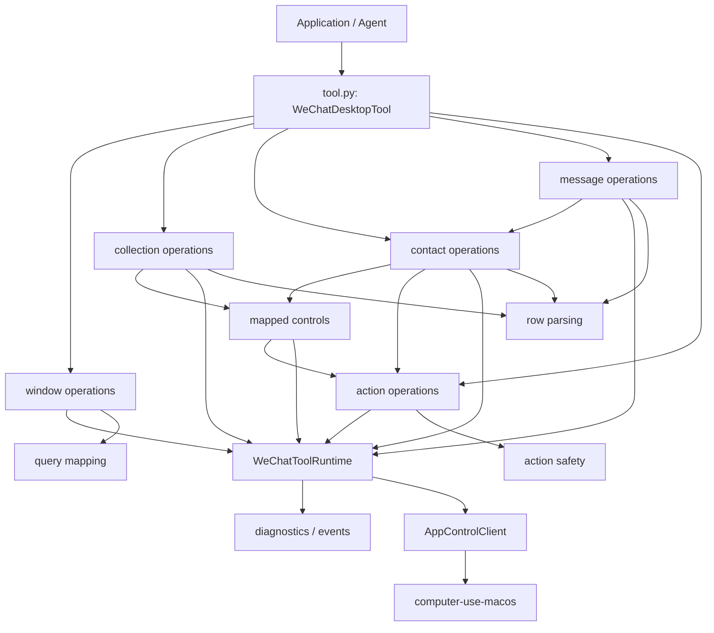

# Technical Design: WeChat Tool Internal Modularization

## Status

| Field | Value |
| --- | --- |
| Feature | WeChat Tool Internal Modularization |
| Branch | `codex/wechat-tool-modularization` |
| Lifecycle phase | F2 technical design |
| Affected package | `wechat-desktop-tool` |
| Public behavior | Unchanged |
| Protocol or config impact | None |
| Design state | Proposed for implementation |

## Background

`wechat_desktop_tool.tool` currently owns the public facade, command dispatch,
thirteen semantic workflows, app-control transport calls, Accessibility query
construction, mapped-control execution, action replay protection, result
normalization, failure conversion, event emission, timing, and redaction. The
module is 6979 lines and contains most of the package implementation.

The code has deterministic coverage, but a single ownership boundary makes
otherwise local changes difficult to review. This design separates those
responsibilities without changing any externally observable behavior.

The requirements and behavior-preservation constraints are defined in
[`requirements.md`](./requirements.md). They are normative for this design.

## Goals

- Keep `WeChatDesktopTool` as the public entry point and make `tool.py` a thin
  facade and dispatcher.
- Give window, collection, contact, message, and action workflows explicit
  module owners.
- Isolate pure query mapping, row parsing, mutation proof, and diagnostics so
  they can be tested without a desktop client.
- Establish an acyclic internal dependency graph.
- Preserve command sequences, payloads, phase names, event ordering, failures,
  redaction, timeouts, and mutation safety exactly.
- Make every extraction slice independently testable and revertible.

## Non-Goals

- No public API, protocol schema, operation, configuration, selector profile,
  control-map, failure-kind, dependency, or supported-version change.
- No selector tuning, faster query strategy, altered retry, new caching, or
  additional app-control round trip.
- No opportunistic bug fix or wording cleanup.
- No conversion of WeChat semantics into generic `computer-use-macos`
  behavior.

## Current And Desired Behavior

The desired runtime behavior is identical to the current behavior. Only source
ownership changes.

| Surface | Current behavior | Desired behavior |
| --- | --- | --- |
| Construction | `WeChatDesktopTool` validates config and loads selector assets | Same constructor and exception behavior; state is held by an internal runtime |
| Public methods | Build a `ToolCommand` and call `run_command` | Unchanged |
| Dispatch | `_execute` selects one of thirteen operation workflows | Same explicit operation mapping in the facade |
| Desktop calls | Private methods construct and send app-control commands | A runtime module owns the same construction and calls |
| Results | Helpers normalize observations and failures | Cohesive pure modules perform the same normalization |
| Events | Started, phase, and final events are emitted in order | Unchanged ordering, sequence, content, and redaction |
| Mutations | Action proof gates fallback and replay | Same proof functions in a dedicated safety module |

## Package Boundary

Only private modules under `wechat_desktop_tool` are added. The package still
depends on `app-control-protocol` and the public selector-profile model from
`computer-use-macos`; it does not import a backend implementation. Neither
upstream package changes.

The stable package architecture document will be updated after implementation
to describe the final component map. This feature document remains the detailed
migration record.

## Public Contract Impact

There is no public data or API change.

| Contract | Change | Compatibility requirement |
| --- | --- | --- |
| `wechat_desktop_tool.WeChatDesktopTool` | None | Import path, constructor, methods, signatures, and return types remain identical |
| `wechat_desktop_tool.tool.WeChatDesktopTool` | None | Direct import remains valid |
| Command builders and recipes | None | Command ids, operations, input keys, defaults, and timeout behavior remain identical |
| `ToolObservation` payloads | None | Status, summary, data, evidence, errors, retryability, risk, and timing remain identical |
| `ToolEvent` streams | None | Event type, order, sequence number, summary, and redaction remain identical |
| WeChat models and schemas | None | No fields or schema versions change |
| Config and selector assets | None | Paths, defaults, loading, and validation remain identical |
| Private helper imports | Internal move | Tests move to the new owner; private names are not a consumer contract |

No migration is required for application developers.

## Internal Architecture

### Module Map

| Module | Responsibility | Must not own |
| --- | --- | --- |
| `tool.py` | Public facade, public convenience methods, lifecycle timing, explicit operation dispatch | Workflow implementation, AX parsing, mutation proof |
| `_runtime.py` | Immutable runtime dependencies, app-control command construction, target/open input builders, bounded generic query calls, phase event bridge | WeChat row semantics, contact/message orchestration |
| `_window_operations.py` | Open/focus readiness and `inspect_window` workflow | Contact, message, or mutation fallback logic |
| `_collection_operations.py` | `list_contacts`, `list_conversations`, mapped collection reads and pagination assembly | Contact search or message submission |
| `_mapped_controls.py` | Control-map navigation, mapped-region resolution, mapped collection/target queries, navigation postconditions | Public dispatch or domain result formatting |
| `_contact_operations.py` | `open_contact`, `focus_contact`, search focus, result verification, disambiguation | Message drafting/submission |
| `_message_operations.py` | Observe/read messages, read-contact composition, draft, submit, and send orchestration | Low-level AX action proof |
| `_action_operations.py` | `execute_action`, node click, actionRef execution, coordinate/selector fallback routing | Policy changes or message/contact semantics |
| `_query_mapping.py` | Pure selector/query payload normalization, window/navigation/element/actionRef construction, frame and node helpers | Transport calls or event emission |
| `_row_parsing.py` | Pure contact, conversation, search-candidate, and visible-message extraction and pagination helpers | Desktop actions |
| `_action_safety.py` | Pure actionRef expiry/identity validation, dispatch/effect proof reconciliation, fallback and no-replay decisions | Executing the fallback itself |
| `_diagnostics.py` | Semantic failure builders, safe evidence/envelope projection, redaction, input extraction, timing, event helpers | Operation orchestration or selector traversal |

Module names begin with `_` because none are new supported import surfaces.
There is no generic `utils.py`; each helper moves to the module that owns its
reason to change.

### Runtime Object

`_runtime.py` introduces one private `WeChatToolRuntime` object. It replaces the
five independent implementation fields currently held by the facade as the
dependency container used by operation functions.

| Object | Field | Type | Required | Default | Owner | Validation | Compatibility |
| --- | --- | --- | --- | --- | --- | --- | --- |
| `WeChatToolRuntime` | `app_control` | `AppControlClient` | Yes | None | Facade constructor | Existing protocol behavior | Same client object, no wrapper call added |
| `WeChatToolRuntime` | `config` | `WeChatDesktopConfig` | Yes | Existing default config | Facade constructor | Existing helper-backend rejection | Same exception type and text |
| `WeChatToolRuntime` | `selector_assets` | Existing selector asset type | Yes | Packaged profile | Runtime factory | Existing loader validation | Loaded once at the same lifecycle point |
| `WeChatToolRuntime` | `control_map` | `WeChatControlMap` | Yes | From selector assets | Runtime factory | Existing profile validation | Same object exposed through private facade alias during migration |
| `WeChatToolRuntime` | `selector_profile` | Existing profile type | Yes | From selector assets | Runtime factory | Existing profile validation | Same object exposed through private facade alias during migration |

This is an internal dependency object, not a new domain model or serialized
schema. It is created once per `WeChatDesktopTool` instance, has no mutable
workflow state, is never persisted, and expires with the facade instance.

The facade keeps read-only private compatibility aliases for `_app_control`,
`_config`, `_selector_assets`, `_control_map`, and `_selector_profile` while the
tests and modules migrate. They resolve to the runtime values and do not create
duplicate state.

### Operation Function Contract

Each operation module exposes package-private functions with this shape:

```python
def list_contacts(
    runtime: WeChatToolRuntime,
    command: ToolCommand,
    *,
    phase_events: PhaseEventCollector | None = None,
) -> ToolObservation:
    ...
```

Functions receive all command-scoped state explicitly. Evidence remains a
local dictionary passed through the same call chain. Operation functions do
not retain state between commands.

The public facade uses an explicit operation-to-handler table. It does not use
dynamic attribute lookup, plugin registration, or reflection; unsupported
operations therefore keep the current deterministic failure behavior.

### Dependency Rules

The internal import graph is directional:

1. `tool.py` may import operation modules, `_runtime`, and `_diagnostics`.
2. `_message_operations` may compose `_contact_operations` and read helpers.
3. `_contact_operations` and `_collection_operations` may use
   `_mapped_controls` and `_action_operations`.
4. Operation modules may use `_runtime`, `_query_mapping`, `_row_parsing`,
   `_action_safety`, and `_diagnostics`.
5. `_mapped_controls` may use `_runtime`, `_action_operations`, query mapping,
   and diagnostics.
6. `_action_operations` may use `_runtime`, `_action_safety`, query mapping,
   and diagnostics.
7. Pure mapping, parsing, safety, and diagnostic modules never import the
   facade or operation modules.
8. `_runtime` never imports the facade or operation modules.



CI adds an import-boundary test that rejects facade/operation imports from the
low-level modules and rejects direct backend imports from the package.

## Data Flow

The refactor does not change runtime data movement.

```mermaid
flowchart LR
    Call["Public method or ToolCommand"] --> Coerce["Coerce command"]
    Coerce --> Start["Emit STARTED"]
    Start --> Dispatch["Explicit operation dispatch"]
    Dispatch --> Workflow["Domain operation function"]
    Workflow --> Runtime["Runtime builds identical app-control command"]
    Runtime --> Client["AppControlClient.run_command"]
    Client --> Raw["ToolObservation"]
    Raw --> Safe["Safe evidence projection"]
    Raw --> Normalize["Pure semantic normalization"]
    Safe --> Result["WeChat ToolObservation"]
    Normalize --> Result
    Result --> Timing["Attach timing"]
    Timing --> Final["Emit final OBSERVATION"]
```



### Mutating Action Sequence

Mutation ordering and replay decisions are intentionally unchanged.

```mermaid
sequenceDiagram
    participant Caller
    participant Facade as WeChatDesktopTool
    participant Op as Contact/Message Operation
    participant Action as Action Operation
    participant Safety as Action Safety
    participant Runtime as WeChatToolRuntime
    participant Client as AppControlClient

    Caller->>Facade: send_message / execute_action
    Facade->>Op: dispatch(command, phase_events)
    Op->>Action: execute verified actionRef
    Action->>Safety: validate expiry, identity, preconditions
    Safety-->>Action: allowed or semantic failure
    Action->>Runtime: accessibility_action command
    Runtime->>Client: run_command(exact existing payload)
    Client-->>Runtime: observation + dispatch/effect proof
    Runtime-->>Action: observation
    Action->>Safety: may fallback without replay?
    Safety-->>Action: yes only for existing definite-safe cases
    alt Existing safe fallback is allowed
        Action->>Runtime: existing selector or validated-frame click
        Runtime->>Client: run_command(fallback)
        Client-->>Runtime: observation
    else Mutation dispatched or result unknown
        Action-->>Op: fail closed; do not replay
    end
    Op-->>Facade: semantic observation
    Facade-->>Caller: timed result and events
```

## Object Lifecycle And State

| Object | Creation | Mutable state | Persistence | End of life | Observable effect |
| --- | --- | --- | --- | --- | --- |
| `WeChatDesktopTool` | Application construction | None beyond existing dependency references | None | Application releases it | Public API owner |
| `WeChatToolRuntime` | During facade construction | None | None | With facade | Owns dependency access only |
| `PhaseEventCollector` | Once per `run_command` or `run_stream` | Sequence and in-memory phase events | None | At command completion | Existing event ordering |
| Evidence dictionary | Once per operation | Existing phase entries | Included in result only | At result release | Existing diagnostics |
| Selector query runner | During selector-backed operation | Query counter | None | At operation completion | Existing phase suffixes |
| `actionRef` | Existing query mapping | Immutable serialized value | Caller-owned observation | Existing TTL | Existing action validation |

No cache, worker, global registry, thread, file, or durable state is introduced.

## Failure, Retry, And Idempotency

- Existing exception scope remains limited to `TypeError` and `ValueError` at
  dispatch; unexpected programming errors are not converted silently.
- Every existing `failureKind`, message, recovery hint, status, nested error,
  and `retryable` value is preserved.
- Transport, permission, timeout, truncation, malformed query, identity,
  ambiguity, input focus, readiness, and submit verification paths keep their
  current branches.
- Read operations remain retryable only where currently marked retryable.
- Mutating actions remain non-replayable when dispatch or effect is unknown.
- No new automatic retry is introduced by module delegation.

Golden command-trace tests compare the ordered app-control commands before and
after extraction, including command id, tool, operation, input, timeout, and
metadata. Golden observation/event tests compare serialized output after
removing only wall-clock values that are expected to vary.

## Safety, Privacy, And Authorization

- `send_message`, draft submission, clicks, key presses, and text insertion
  retain their current explicit operations and evidence.
- The action-safety extraction moves proof code as a unit before action
  orchestration moves. Proof keys and conservative reconciliation are not
  rewritten during extraction.
- Coordinate fallback still requires the same validated current AX frame and
  policy approval. No raw coordinate is introduced into a new path.
- Message/contact inputs remain redacted in safe evidence and event summaries.
- Raw Accessibility data remains available only through existing explicit
  debug options.
- The package still does not make business authorization decisions for an
  Agent application.

## Performance And Concurrency

The facade delegates with ordinary in-process calls. There is no serialization,
copy of large AX payloads, subprocess, socket, lock, or asynchronous boundary
between the facade and operation modules.

Performance invariants:

- identical app-control call count and order for every branch;
- identical query depth, limit, attributes, root, and time budget;
- identical operation timeout and fallback timeout;
- selector assets loaded once per tool construction;
- no additional full-tree normalization or evidence copy;
- existing live semantic API target remains 3000 ms.

The public tool retains its current concurrency semantics: it does not promise
thread safety, does not serialize callers, and stores no cross-command mutable
workflow state. The refactor adds no shared mutable state.

## Observability

- Existing command ids, phase suffixes, metadata, summaries, evidence keys,
  event sequence, timing attachment, and rawdata behavior remain unchanged.
- Module names are not added to public payloads or logs.
- Tests may use module-local pure functions directly, but production
  observations remain the proof source.
- Verification records baseline and final test counts, source sizes, command
  traces, and any live smoke that is run.

## Migration Strategy

Implementation is extraction-first. A slice moves complete functions without
semantic edits, updates imports, and runs the package suite before the next
slice.

1. Extract diagnostics/event and pure parsing helpers. Keep temporary private
   aliases in `tool.py` only where existing tests require them.
2. Extract action safety as a complete proof unit and add focused truth-table
   tests.
3. Introduce `WeChatToolRuntime`; preserve facade private aliases and verify
   exact command envelopes.
4. Extract action and mapped-control orchestration.
5. Extract window and collection workflows.
6. Extract contact workflows.
7. Extract message workflows and leave the public facade/dispatcher.
8. Split tests by the same ownership boundaries, remove temporary aliases that
   are no longer needed, and update stable architecture documentation.

Each slice is one scoped implementation commit followed by a push. No slice
mixes a behavioral fix with movement.

## Rollout And Rollback

The refactor ships through the normal package release with an `Internal`
changelog entry. There is no feature flag because two implementations would
increase divergence risk and no public behavior is selectable.

Rollback is commit-based:

- revert only the failing extraction slice;
- retain earlier slices whose full checks passed;
- do not add compatibility shims that change command behavior;
- if deterministic output differs and the reason is not a known time field,
  stop the migration and treat the old implementation as authoritative.

Wheel and sdist contents are verified before release so all new private modules
are packaged.

## Test Strategy

### Unit And Contract Tests

- Preserve all 172 baseline package tests.
- Add direct tests for query mapping, row parsing, action proof, diagnostics,
  and runtime command construction.
- Add facade dispatch tests for every supported and unsupported operation.
- Add exact command-trace and serialized observation/event equivalence tests
  for successful, failed, truncated, ambiguous, and response-loss paths.
- Add import-boundary and public-export tests.
- Split `test_tool.py` by operation domain while preserving assertions and
  shared fakes in a private test-support module.

### Repository And Packaging Checks

- `wechat-desktop-tool` package test suite after every slice.
- Root, `app-control-protocol`, and `computer-use-macos` suites before merge.
- Repository-configured ruff and mypy checks.
- `scripts/release_preflight.py` against source.
- Wheel/sdist build plus isolated import/API smoke before release.
- `git diff --check` and module-size/import-cycle checks.

### Live Proof

The refactor does not require a live mutation smoke for every movement commit.
Before the next release, the supported macOS environment should rerun existing
read-only semantic smokes and the explicitly authorized send smoke, recording
the existing safety assertions and sub-3000 ms API timings. A live result is
not substituted for deterministic equivalence tests.

## Risks And Mitigations

| Risk | Mitigation |
| --- | --- |
| Helper move subtly changes branch order | Move complete functions, add exact trace/output equivalence, avoid cleanup in extraction commits |
| Circular imports appear between workflows | Enforce the dependency graph and test imports in a clean interpreter |
| Runtime wrapper changes payload identity | Compare complete ordered `ToolCommand.to_dict()` traces |
| Action proof is separated from execution incorrectly | Extract proof as one unit and test no-replay truth tables before moving execution |
| Private tests conceal consumer regressions | Run public export, recipes, CLI, package-boundary, and built-artifact checks |
| New modules omitted from distribution | Inspect wheel/sdist contents and run isolated package smoke |
| Test split drops cases | Compare test ids and total inventory before and after split |

## Design Decisions

| Decision | Outcome | Reason |
| --- | --- | --- |
| Public facade retained | Yes | Preserves all supported imports and call sites |
| Internal runtime object | Yes | Provides one explicit dependency boundary without new I/O or state |
| Multiple-inheritance mixins | No | They hide cross-module dependencies and complicate ownership |
| Dynamic plugin dispatcher | No | It adds behavior and weakens unsupported-operation determinism |
| Feature flag / dual implementation | No | It doubles safety-critical paths without consumer value |
| Generic utility module | No | It would recreate the same mixed ownership under a new filename |

## Open Decisions

No product, protocol, safety, or compatibility decision remains open. Exact
helper placement may be adjusted during extraction only when the dependency
rules and per-module size limits still hold; such adjustments are recorded in
implementation notes and do not change behavior.
